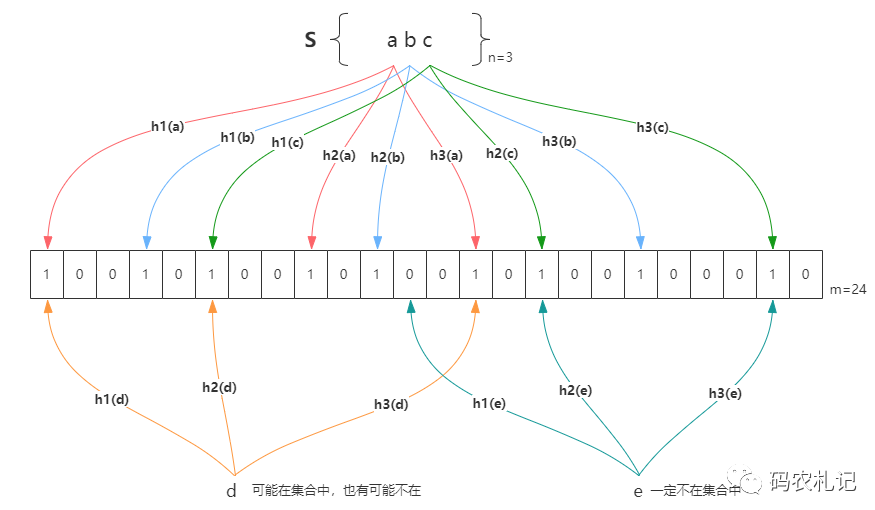

## 什么布隆过滤器

缓存穿透故障、幂等性判断、今日头条，抖音的推荐，相信很多小伙伴在预览的时候，头条会根据的你喜好，为你推荐一些图文信息供你阅读，比如：你喜欢汽车、喜欢美女，它就会经常推荐一些美女图或者汽车文章供你阅读。

我们今天讲的内容不是推荐算法，而是：已读去重算法。
就是推荐引擎给你推荐文章的适合，要`过滤`你已经阅读过的，不然就会`导致重复给你推荐`。比如你阅读了一篇文章，如果你已经阅读了，如果没有已读去重，明天又给你推荐。你会烦死去，把APP卸载了。故为了达到更好的体验效果必须把你读过的内容下`去重`。

到这种`已读去重`的技术解决方案，一般的开发者会想到的就是数据库存储。这种方案对于一线互联网公司来说是有问题的。像今日头条这种高并发的场景，每次推荐都去数据库查询，必定`导致数据库扛不住`。所有肯定是Redis缓存来处理的。

**既然用到了Redis，同学们想一想用什么数据结构？**
大部分的人会想到Set。

Set是一种很不错的去重数据结构，对于小量数据可以实现，但是对于大数据，例如：几个月的已读历史数据的存储，Set就不太适合了。业界的做法一般是使用`布隆过滤器`来是实现。

### RedisBloom（探讨RedisBloomFilter器）



通过Bloomfilter 命令可以分配内存的数量，每个格子是可以存储相同key对应value的值，如果是相同的话，就会把对应的key存储到相同的格子中。BloomFilter是没有删除命令，只有添加和判断是否存在的命令。


## 安装

Redis本身是没有布隆过滤器的。它是Redis开发的一个插件，需要进行集成和配置才可以使用，具体如下：

下载地址（Redis官网下载即可）：https://github.com/RedisLabsModules/redisbloom/

开发文档：https://github.com/RedisBloom/JRedisBloom

### 下载RedisBloom

```sh
wget https://github.com/RedisLabsModules/rebloom/archive/v1.1.1.tar.gz
tar -zxvf v1.1.1.tar.gz
```

### 插件编译

```sh
cd RedisBloom-1.1.1
make
```

`成功后可看到目录下有个.so文件`

### Redis整合RedisBloom

1、在redis.conf配置文件里加入如下引入配置

```properties
#redis集群每个配置文件都需要加入这一行
loadmodule /data/br/base/RedisBloom-1.1.1/rebloom.so
```

2、添加完配置后重启redis

```sh
cd redis的安装目录
ps -ef | grep redis
kill redispid
src/redis-server ./redis.conf
```

3、通过客户端连接redis服务

```sh
src/redis-cli
auth mkxiaoer
OK
bf.add filter 2
(integer) 1
```

## RedisBloom的命令

### 容错率

```sh
BF.RESERVE {key} {error_rate} {capacity}
```

- error_rate：错误率，允许布隆过滤器的错误率。这个值越低。过滤器的位数组的大小越大，占用空间也就越大。
- capacity：存储的元素个数，当实际存储的元素个数超过这个值之后，过滤器的准确率会下降。

>[!Danger]注意
必须在add之前使用`bf.reserve`命令显示的创建。
如果对应的key,已经存在，bf.reserve会报错。
如果不使用`bf.reserve`, 默认的error_rate是0.0001。默认的capacity是10000。

```sh
bf.reserve filter 0.01 100
OK
bf.add filter 1
(integer) 1
bf.exists filter 1
(integer) 1
bf.madd filter 1
1) (integer) 0
bf.madd filter 1 2 3 4 5 6
1) (integer) 0
2) (integer) 1
3) (integer) 1
4) (integer) 1
5) (integer) 1
6) (integer) 1
bf.madd filter 1 2 3 4 5 6 
1) (integer) 0
2) (integer) 0
3) (integer) 0
4) (integer) 0
5) (integer) 0
6) (integer) 0
bf.madd filter 1 2 3 4 5 6 7 6
1) (integer) 0
2) (integer) 0
3) (integer) 0
4) (integer) 0
5) (integer) 0
6) (integer) 0
7) (integer) 1
8) (integer) 0
bf.mexists filter 1 2 3 4 5 6 7 6
1) (integer) 1
2) (integer) 1
3) (integer) 1
4) (integer) 1
5) (integer) 1
6) (integer) 1
7) (integer) 1
8) (integer) 1
```

## 使用布隆过滤器解决缓存穿透


### 增加布隆过滤器的依赖包

```xml
<dependency>
    <groupId>com.redislabs</groupId>
    <artifactId>jrebloom</artifactId>
    <version>2.1.0</version>
</dependency>
```

### 配置封装

```yaml
redis:
  bloom:
    host: 47.115.94.78
    port: 6379
    capacity: 100
    password: mkxiaoer1986.
    rate: 0.01
```

### 布隆过滤的配置类

```java

@Configuration
@Slf4j
public class KsdRedisBloomConfiguration {
    // host地址
    @Value("${redis.bloom.host}")
    private String host;
    // host地址
    @Value("${redis.bloom.password}")
    private String password;
    // 端口
    @Value("${redis.bloom.port}")
    private Integer port;
    // 基数
    @Value("${redis.bloom.capacity}")
    private Integer capacity;
    // 错误率
    @Value("${redis.bloom.rate}")
    private Double rate;

    @Bean
    public JedisPool jedisPool() {
        JedisPoolConfig poolConfig = new JedisPoolConfig();
        poolConfig.setMaxIdle(8);
        poolConfig.setMaxTotal(8);
        poolConfig.setMaxWaitMillis(5 * 1000);
        JedisPool jp = new JedisPool(poolConfig, host, port,
                3 * 1000, password, 0);
        return jp;
    }

    @Bean
    public Client rebloomClient(JedisPool pool) {
        Client client = new Client(pool);
        try {
            client.createFilter("redis:bloom:filter", capacity, rate);
        } catch (Exception ex) {
            log.info("bloom过滤器已经存在，异常信息是：{}", ex.getMessage());
        }
        return client;
    }
}
```

### 初始化数据到布隆中

```java
import io.rebloom.client.Client;
import org.springframework.beans.factory.annotation.Autowired;
import org.springframework.stereotype.Service;
import org.springframework.util.CollectionUtils;

import javax.annotation.PostConstruct;
import java.util.ArrayList;
import java.util.List;
import java.util.stream.Collectors;

@Service
public class CategoryServiceImpl extends ServiceImpl<CategoryMapper, Category> implements CategoryService {

    @Autowired
    private Client rebloomClient;

    /**
     * 把需要进行过滤的数据进行放入到布隆过滤器中
     */
    @PostConstruct
    public void initBloomData(){
        List<Category> categroies = this.findCategroies(0);
        if(!CollectionUtils.isEmpty(categroies)){
            // 把对应一级分类的id放入到bloomfilter中
            String[] ids = new String[categroies.size()];
            for (int i = 0; i < categroies.size(); i++) {
                ids[i] = categroies.get(i).getId()+"";
            }
            // bf.madd
            rebloomClient.addMulti("redis:bloom:category",ids);
        }
    }

}

```

问题：如果后面的元素要追加布隆过滤器中，如何追加?
- 使用定时任务
- 直接重启服务（一定灰度发布），比如你三台服务器，停止一台，启动一台，然后在停一台在启动一台。以此类推
- 直接把数据添加到布隆过滤器中
- 可以考虑用MQ去同步。


### 布隆过滤器解决缓存穿透的问题

```java

@RestController
public class CategoryController {

    private final static Logger log = LoggerFactory.getLogger(CategoryController.class);

    @Autowired
    private CategoryService categoryService;
    @Autowired
    private RedisTemplate redisTemplate;

    @Autowired
    private Client rebloomClient;


    @GetMapping("/findcategory/{cid}")
    public List<Category> findCategorys(@PathVariable("cid") Integer cid) {
        KAssert.isEmpty(cid, 401, "分类不存在");
        // 1：进行布隆过滤 bf.madd redis:bloom:category “1” "2" "3" "4" "5"
        // 2: 进行布隆过滤 bf.mexists redis:bloom:category “1”
        boolean[] booleans = rebloomClient.existsMulti("redis:bloom:category", cid + "");
        // 3：如果你的cid没有在布隆器中，说明你数据不存在，直接返回
        if (!booleans[0]) {
            throw new ValidationException(401, "分类不存在");
        }

        List<Category> categoryList = new ArrayList<>();
        String categories = (String) redisTemplate.opsForValue().get("subcid:" + cid);
        if (StringUtils.isEmpty(categories)) {
            log.info("db去查询了........");
            categoryList = categoryService.findCategroies(cid);
            if (CollectionUtils.isEmpty(categoryList)) {
                redisTemplate.opsForValue().set("subcid:" + cid, JsonUtil.obj2String(categoryList), 5 * 60, TimeUnit.SECONDS);
            } else {
                redisTemplate.opsForValue().set("subcid:" + cid, JsonUtil.obj2String(categoryList));
            }
        } else {
            categoryList = JsonUtil.string2Obj(categories, List.class, Category.class);
        }
        return categoryList;
    }

}

```


## 布隆过滤器的问题和使用场景

- 因为布隆过滤器存在一定的误判率，如果你的业务场景是严格要求的话，是不适合使用布隆过滤器的。
- 黑名单
- 抖音、今日头条数据已读去重过滤

