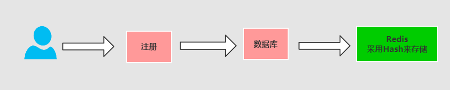
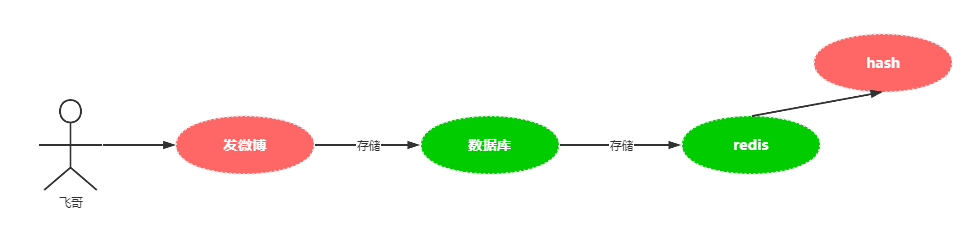

# SpringBoot+Redis+Hash注册案例

Redis在现在的互联网公司中，使用的范围越来越广，因为redis天生拥有高并发的特征，使用的Redis最好的公司也属新浪。Redis技术覆盖了微博的每个领域和应用场景，比如：抢红包、粉丝数、用户数、点赞数、转评数、评论、广告、黑名单以及排行榜等等。使用了Redis以后，微博能够快速支撑日活跃用户达到1~2亿。每日的访问量能够达到百万甚至千万上亿的访问。而且微博的redis集群规模可以存储数据100T。10000+redis个业务节点的集群。

## 用户注册

整个的流程是

1：首先注册用户填写用户信息，先写入到db中

2：然后在存储数据到Redis的Hash结构中 key=”reg:user:id”




### 定义一个user实体

```java
public class User implements java.io.Serializable{

    private Integer id;
    // 昵称
    private String nickname;
    // 密码
    private String password;
    // 性别 0女 1男 2保密
    private Integer sex;
    // 删除状态 0 未删除 1删除
    private Integer isdelete;

    public Integer getId() {
        return id;
    }

    public void setId(Integer id) {
        this.id = id;
    }

    public String getNickname() {
        return nickname;
    }

    public void setNickname(String nickname) {
        this.nickname = nickname;
    }

    public String getPassword() {
        return password;
    }

    public void setPassword(String password) {
        this.password = password;
    }

    public Integer getSex() {
        return sex;
    }

    public void setSex(Integer sex) {
        this.sex = sex;
    }

    public Integer getIsdelete() {
        return isdelete;
    }

    public void setIsdelete(Integer isdelete) {
        this.isdelete = isdelete;
    }
}

```

### 定义一个注册的RegController

```java
@RestController
public class RegController {

    @Autowired
    private RedisTemplate redisTemplate;


    @PostMapping("reguser")
    @ApiOperation("用户注册")
    public R regUser(User user) throws IllegalAccessException {
        // 1: 先把用户注册到DB中
        //userService.saveOrUpdate(user);
        // 2： 然后查询最新的用户信息放入到redis的hash重
        //User user1 = userService.getById(user.getId());
        // 1: 将对象转换map
        Map<String, Object> map = ObjectUtils.objectToMap(user);
        // 3: 准备用存入的key，将用户信息存入到redis的hash中
        String key = RedsConstants.REG_HASH_USER + user.getId();
        redisTemplate.opsForHash().putAll(key, map);
        // 4: 设置key的失效时间一个月
        redisTemplate.expire(key, 30, TimeUnit.DAYS);

        return R.success(user);
    }
}

```

核心代码：

```java
Map<String, Object> map = ObjectUtils.objectToMap(user);
// 3: 准备用存入的key，将用户信息存入到redis的hash中
String key = RedsConstants.REG_HASH_USER + user.getId();
redisTemplate.opsForHash().putAll(key, map);

```

分析代码

```java
 // 4: 设置key的失效时间一个月
redisTemplate.expire(key, 30, TimeUnit.DAYS);
```

>[!danger]注意
设置过期时间的作用：防止用户注册以后不使用任何服务，也就是所谓僵尸粉。比如用户：1000W。写入redis的hash数据结构中，其中有600W。不使用的。如果这里不设置过期时间。那么可能就造成内存的浪费。其实没有必要的。


## 发送微博



### 定义实体

```java
public class Content {
    // 发送的用户
    private Integer id;
    // 发送的用户
    private Integer userId;
    // 用户昵称
    private String nickname;
    // 用户头像
    private String avatar;
    // 发送内容
    private String content;
    // 发送时间
    private Long sendtime;

    public Integer getId() {
        return id;
    }

    public void setId(Integer id) {
        this.id = id;
    }

    public Integer getUserId() {
        return userId;
    }

    public void setUserId(Integer userId) {
        this.userId = userId;
    }

    public String getNickname() {
        return nickname;
    }

    public void setNickname(String nickname) {
        this.nickname = nickname;
    }

    public String getAvatar() {
        return avatar;
    }

    public void setAvatar(String avatar) {
        this.avatar = avatar;
    }

    public String getContent() {
        return content;
    }

    public void setContent(String content) {
        this.content = content;
    }

    public Long getSendtime() {
        return sendtime;
    }

    public void setSendtime(Long sendtime) {
        this.sendtime = sendtime;
    }
}

```

### 定义注册ContentController

```java
@RestController
public class ContentController {

    @Autowired
    private RedisTemplate redisTemplate;


    @PostMapping("saveContent")
    public R saveContent(Content content) throws IllegalAccessException {
        //contentService.saveOrUpdate(content);
        //Content cont = contentService.getById(content.getId());
        // 1: 将对象转换map
        Map<String, Object> map = ObjectUtils.objectToMap(content);
        // 3: 准备用存入的key，将用户信息存入到redis的hash中
        String key = RedsConstants.INSERT_HASH_CONTENT + content.getId();
        redisTemplate.opsForHash().putAll(key, map);
        // 4: 设置key的失效时间一个月
        redisTemplate.expire(key, 30, TimeUnit.DAYS);
        return R.success(content);
    }
}

```

### 查看存储信息

```sh
hgetall insert:content:hash:1
 1) "nickname"
 2) "\"\xe5\xad\xa6\xe7\x9b\xb8\xe4\xbc\xb4\xe9\xa3\x9e\xe5\x93\xa5\""
 3) "id"
 4) "1"
 5) "avatar"
 6) "\"11\""
 7) "sendtime"
 8) "20201212"
 9) "userId"
10) "1"
11) "content"
12) "\"\xe4\xbb\x8a\xe5\xa4\xa9\xe5\xa4\xa9\xe6\xb0\x94\xe4\xb8\x8d\xe9\x94\x99\""
```