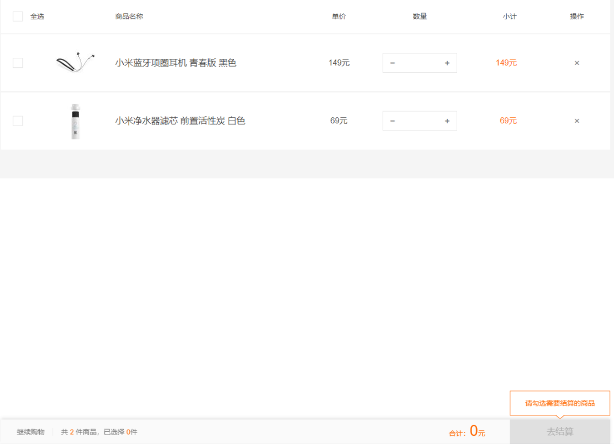
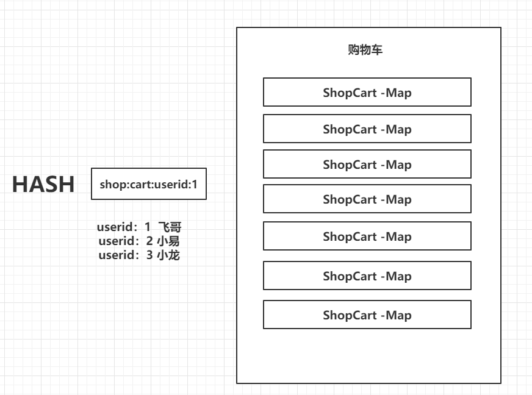
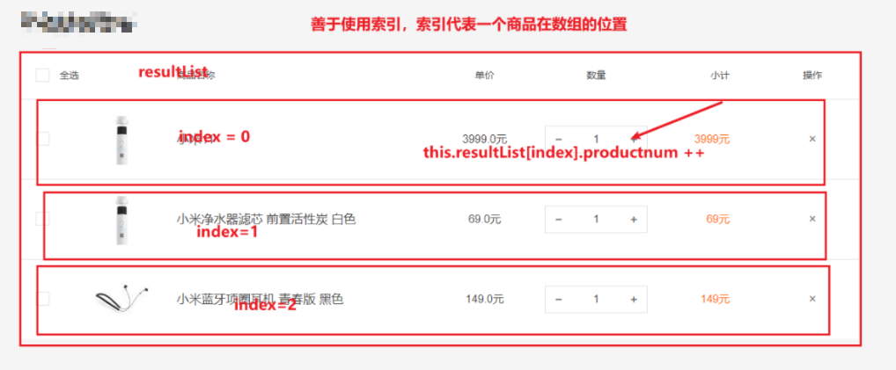

# SpringBoot+Redis+Hash购物车案例


## 需求

- 商品的添加购物车
- 购物车商品的数量的递增和递减
- 商品的删除
- 商品的总计和小计


具体效果如下：



## 具体实现


### 添加相关依赖

```xml
<dependency>
    <groupId>org.springframework.boot</groupId>
    <artifactId>spring-boot-starter-web</artifactId>
</dependency>

<dependency>
    <groupId>org.springframework.boot</groupId>
    <artifactId>spring-boot-starter-thymeleaf</artifactId>
</dependency>

<dependency>
    <groupId>org.springframework.boot</groupId>
    <artifactId>spring-boot-starter-aop</artifactId>
</dependency>

<dependency>
    <groupId>org.springframework.boot</groupId>
    <artifactId>spring-boot-starter-test</artifactId>
    <scope>test</scope>
</dependency>

<!--这里就是redis的核心jar包-->
<dependency>
    <groupId>org.springframework.boot</groupId>
    <artifactId>spring-boot-starter-data-redis</artifactId>
</dependency>

<dependency>
    <groupId>com.fasterxml.jackson.dataformat</groupId>
    <artifactId>jackson-dataformat-avro</artifactId>
    <version>2.10.0</version>
</dependency>
<dependency>
    <groupId>org.apache.commons</groupId>
    <artifactId>commons-lang3</artifactId>
    <version>3.6</version>
</dependency>

<!-- Swagger -->
<dependency>
    <groupId>io.springfox</groupId>
    <artifactId>springfox-swagger-ui</artifactId>
    <version>2.9.2</version>
</dependency>
<dependency>
    <groupId>io.springfox</groupId>
    <artifactId>springfox-swagger2</artifactId>
    <version>2.9.2</version>
</dependency>
<!-- 文档 -->
<dependency>
    <groupId>io.springfox</groupId>
    <artifactId>springfox-swagger2</artifactId>
    <version>2.9.2</version>
    <exclusions>
        <exclusion>
            <groupId>io.swagger</groupId>
            <artifactId>swagger-models</artifactId>
        </exclusion>
        <exclusion>
            <groupId>com.google.guava</groupId>
            <artifactId>guava</artifactId>
        </exclusion>
    </exclusions>
</dependency>
<dependency>
    <groupId>io.swagger</groupId>
    <artifactId>swagger-models</artifactId>
    <version>1.5.21</version>
</dependency>
<dependency>
    <groupId>io.springfox</groupId>
    <artifactId>springfox-swagger-ui</artifactId>
    <version>2.9.2</version>
</dependency>
<dependency>
    <groupId>com.github.xiaoymin</groupId>
    <artifactId>swagger-bootstrap-ui</artifactId>
    <version>1.8.5</version>
</dependency>
```

### 导入静态资源

- 准备素材shopcart.html
- css
- js
  - vue.min.js
  - axios.min.js

这些素材必须把css/js放入到java springboot工程中的resource/static目录下，shopcart.html放入到resource/templates目录下即可。

在shopcart.html页面中，引入对应js、css相关文件

```css
<link href="css/main.css" rel="stylesheet" />
```

```js
<script src="js/vue.min.js"></script>
<script src="js/axios.min.js"></script>

<script>
    var vue = new Vue({
        el:"#app",
        data:{
            title:"购物车"
        }
    })
</script>
```

### 配置redis和thymeleaf模板配置

```yaml
server:
  port: 8080
spring:
  main:
    allow-bean-definition-overriding: true
  thymeleaf:
    cache: false
    prefix: classpath:/templates/
    mode: HTML
    encoding: UTF-8
    suffix: .html
  jackson:
    date-format: yyyy-MM-dd HH:mm:ss
    time-zone: GMT+8
    locale: zh_CN
    # 解决json返回过程中long的精度丢失问题
    generator:
      write-numbers-as-strings: true
      write-bigdecimal-as-plain: true
  # 配置redis
  redis:
    database: 0
    password: mkxiaoer
    host: 47.115.94.78
    port: 6379
```

### 定义controller跳转到shopcart页面

```java
@Controller
public class ShopCartController {

    @GetMapping("/shopindex")
    public String shopcart(){
        return "shopcart";
    }

}
```

>[!tip]启动SpringBoot单体项目，浏览器输入访问路径
http://localhost:8080/shopindex


## 使用Redis的Hash数据结构实现购物车功能

### 准备一个购物车的实体

```java
public class ShopCart {
    // 购买用户
    private Long userid;
    // 产品标题
    private String producttitle;
    // 购买产品
    private Long productid;
    // 产品的封面
    private String productimg;
    // 产品数量
    private Integer productnum;
    // 产品价格
    private Double productprice;
    // 购买时间
    private Date createTime;

    public Long getUserid() {
        return userid;
    }

    public void setUserid(Long userid) {
        this.userid = userid;
    }

    public Long getProductid() {
        return productid;
    }

    public void setProductid(Long productid) {
        this.productid = productid;
    }

    public String getProductimg() {
        return productimg;
    }

    public void setProductimg(String productimg) {
        this.productimg = productimg;
    }

    public String getProducttitle() {
        return producttitle;
    }

    public void setProducttitle(String producttitle) {
        this.producttitle = producttitle;
    }

    public Integer getProductnum() {
        return productnum;
    }

    public void setProductnum(Integer productnum) {
        this.productnum = productnum;
    }

    public Double getProductprice() {
        return productprice;
    }

    public void setProductprice(Double productprice) {
        this.productprice = productprice;
    }

    public Date getCreateTime() {
        return createTime;
    }

    public void setCreateTime(Date createTime) {
        this.createTime = createTime;
    }
}

```

### 图解




### 编写商品添加的接口

```java
@Controller
public class ShopCartController {

    @Autowired
    private RedisTemplate redisTemplate;


    private final static String SHOP_CART_KEY = "shopcart:user:";

    @GetMapping("/shopindex")
    public String shopcart(){
        return "shopcart";
    }

    // 1: 添加商品到购物车中
    @ResponseBody
    @PostMapping("/hash/shopcart/add")
    public ShopCart addShopCart(ShopCart shopCart) throws IllegalAccessException {
        // 1: 定义每个用户的购物车的 key
        String shopcartKey = SHOP_CART_KEY+shopCart.getUserid();
        // 2: 获取一个操作hash的数据对象
        HashOperations hashOperations = redisTemplate.opsForHash();
        // 3：判断一个商品是否已经添加到购物车中 HEXISTS shopcart:user:1 4 判断一个商品是否以及存在购物车中
        Boolean hasKey = hashOperations.getOperations().hasKey(shopCart.getProductid().toString());
        if(hasKey) {
            // 4: 然后把shopCart商品添加到redishash中
            shopCart.setProductnum(shopCart.getProductnum() + 1);
            Map<String, Object> map = ObjectUtils.objectToMap(shopCart);
            // 做功能增强：你可靠如果是相同的商品的把数量进行递增+1
            // 5：如果不存在，就直接覆盖最新的数据进去&设置过期时间30天
            hashOperations.put(shopcartKey, shopCart.getProductid().toString(), map);
            // 6: 设置购物车的过期时间
            this.redisTemplate.expire(shopcartKey, 30, TimeUnit.DAYS);
        }else{
            // 参数1： shopcartKey 这个是redis操作的key，其实就购物车
            // 参数2： shopCart.getProductid().toString() 这个是hash数据结构map的key,也就是商品的id
            // 参数3： map 对应的是具体的商品
            // 一句话：就把指定的shopCart.getProductid()添加到指定的用户的shopcartKey购物车中，具体的详细内容是map
            // 4: 然后把shopCart商品添加到redishash中
            Map<String, Object> map = ObjectUtils.objectToMap(shopCart);
            hashOperations.put(shopcartKey, shopCart.getProductid().toString(), map);
        }
        // 7 :添加成功返回即可
        return shopCart;
    }
}

```

### 编写商品修改数量的接口

```java

// 2: 修改购物车的数量
@ResponseBody
@PostMapping("/hash/shopcart/update")
public R updateShopcartnum(ShopCart shopCart) {
    // 1: 存储购物车的缓存key
    String key = "shopcart:user:" + shopCart.getUserid();
    // 2：修改购物车的数量
    this.redisTemplate.opsForHash().put(key, shopCart.getProductid().toString(), R.beanToMap(shopCart));
    return R.ok();
}

```

### 编写购物车查询商品接口

```java
// 4: 查询购物车中所有的数据信息
@ResponseBody
@GetMapping("/hash/shopcart/selectall")
public Map<String,Object> selectshopcart(Long userid) {
    // 1: 购物车的缓存key
    String shopcartKey = SHOP_CART_KEY + userid;
    // 2：从redis中获取购物车中的数量  hlen shopcart:user:1
    Long size = this.redisTemplate.opsForHash().size(shopcartKey);
    // 3：从redis中获取购物车中所有的商品 获取到hgetall shopcartKey  2 map 1 map 3 map
    Map<String, Map<String, Object>> entries = this.redisTemplate.opsForHash().entries(shopcartKey);
    // 4: 计算总金额
    double totalmoney = 0d;
    List<Map<String,Object>> resultList = new ArrayList<>();
    // 5：把hash数据结构中的商品全部循环迭代出来
    for (Map.Entry<String, Map<String, Object>> entry : entries.entrySet()) {
        resultList.add(entry.getValue());
        totalmoney += Integer.parseInt(String.valueOf(entry.getValue().get("productnum"))) *
                Double.parseDouble(String.valueOf(entry.getValue().get("productprice")));
    }
    // 6 : 返回购物车的数据信息
    Map<String,Object> map = new HashMap<>();
    // 总计
    map.put("totalPrice",totalmoney);
    // 这个商品的个数
    map.put("totalCount",size);
    // 具体商品的数据
    map.put("resultList",resultList);
    return map;
}
```

### 购物车商品删除接口

```java
// 3： 删除购物车的某个商品
@ResponseBody
@PostMapping("/hash/shopcart/del")
public String delshopcart(Long userid, Long productid) {
    // 1: 存储购物车的缓存key
    String shopcartKey = SHOP_CART_KEY + userid;
    // 2：修改购物车的数量
    this.redisTemplate.opsForHash().delete(shopcartKey, productid.toString());

    return "success";
}
```

构成Ctroller完整代码如下：

```java
@Controller
public class ShopCartController {

    @Autowired
    private RedisTemplate redisTemplate;

    private final static String SHOP_CART_KEY = "shopcart:user:";

    @GetMapping("/shopindex")
    public String shopcart() {
        return "shopcart";
    }

    // 1: 添加商品到购物车中
    @ResponseBody
    @PostMapping("/hash/shopcart/add")
    public ShopCart addShopCart(ShopCart shopCart) throws IllegalAccessException {
        // 1: 定义每个用户的购物车的 key
        String shopcartKey = SHOP_CART_KEY + shopCart.getUserid();
        // 2: 获取一个操作hash的数据对象
        HashOperations hashOperations = redisTemplate.opsForHash();
        // 3：判断购物车是否存在
        Boolean hasKey = hashOperations.getOperations().hasKey(shopcartKey);
        // 如果购物车存在
        if (hasKey) {
            Map<String, Object> map = ObjectUtils.objectToMap(shopCart);
            // 做功能增强：你可靠如果是相同的商品的把数量进行递增+1
            // 5：如果不存在，就直接覆盖最新的数据进去&设置过期时间30天
            // Object o = hashOperations.get(shopcartKey, shopCart.getProductid());
            hashOperations.put(shopcartKey, shopCart.getProductid().toString(), map);
            // 6: 设置购物车的过期时间
            this.redisTemplate.expire(shopcartKey, 30, TimeUnit.DAYS);
        } else {
            // 参数1： shopcartKey 这个是redis操作的key，其实就购物车
            // 参数2： shopCart.getProductid().toString() 这个是hash数据结构map的key,也就是商品的id
            // 参数3： map 对应的是具体的商品
            // 一句话：就把指定的shopCart.getProductid()添加到指定的用户的shopcartKey购物车中，具体的详细内容是map
            // 4: 然后把shopCart商品添加到redishash中
            Map<String, Object> map = ObjectUtils.objectToMap(shopCart);
            hashOperations.put(shopcartKey, shopCart.getProductid().toString(), map);
        }
        // 7 :添加成功返回即可
        return shopCart;
    }


    // 2: 修改购物车的数量
    @ResponseBody
    @PostMapping("/hash/shopcart/update")
    public ShopCart updateShopcartnum(ShopCart shopCart) throws IllegalAccessException {
        // 1: 存储购物车的缓存key
        String shopcartKey = SHOP_CART_KEY + shopCart.getUserid();
        // 2：修改购物车的数量、
        Map<String, Object> map = ObjectUtils.objectToMap(shopCart);
        this.redisTemplate.opsForHash().put(shopcartKey, shopCart.getProductid().toString(), map);
        return shopCart;
    }


    // 3： 删除购物车的某个商品
    @ResponseBody
    @PostMapping("/hash/shopcart/del")
    public String delshopcart(Long userid, Long productid) {
        // 1: 存储购物车的缓存key
        String shopcartKey = SHOP_CART_KEY + userid;
        // 2：修改购物车的数量
        this.redisTemplate.opsForHash().delete(shopcartKey, productid.toString());

        return "success";
    }


    // 4: 查询购物车中所有的数据信息
    @ResponseBody
    @GetMapping("/hash/shopcart/selectall")
    public Map<String,Object> selectshopcart(Long userid) {
        // 1: 购物车的缓存key
        String shopcartKey = SHOP_CART_KEY + userid;
        // 2：从redis中获取购物车中的数量  hlen shopcart:user:1
        Long size = this.redisTemplate.opsForHash().size(shopcartKey);
        // 3：从redis中获取购物车中所有的商品 获取到hgetall shopcartKey  2 map 1 map 3 map
        Map<String, Map<String, Object>> entries = this.redisTemplate.opsForHash().entries(shopcartKey);
        // 4: 计算总金额
        double totalmoney = 0d;
        List<Map<String,Object>> resultList = new ArrayList<>();
        // 5：把hash数据结构中的商品全部循环迭代出来
        for (Map.Entry<String, Map<String, Object>> entry : entries.entrySet()) {
            resultList.add(entry.getValue());
            totalmoney += Integer.parseInt(String.valueOf(entry.getValue().get("productnum"))) *
                    Double.parseDouble(String.valueOf(entry.getValue().get("productprice")));
        }

        // 6 : 返回购物车的数据信息
        Map<String,Object> map = new HashMap<>();
        // 总计
        map.put("totalPrice",totalmoney);
        // 这个商品的个数
        map.put("totalCount",size);
        // 具体商品的数据
        map.put("resultList",resultList);
        return map;
    }

}

```

## 使用Vue和axios异步完成接口的调用

### 商品索引的规则妙用



### 完整的接口调用代码

```html
<!DOCTYPE html>
<html lang="en">
<head>
    <meta charset="UTF-8" />
    <meta name="viewport" content="width=device-width, user-scalable=no, initial-scale=1.0, maximum-scale=1.0, minimum-scale=1.0" />
    <meta http-equiv="X-UA-Compatible" content="ie=edge" />
    <title>我的购物车-小米商城</title>
    <link href="css/main.css" rel="stylesheet" />
</head>
<body>
<div id="app">
    <div class="mi-cart page-main">
        <div class="container">
            <div class="cart-container">
                <div class="container-main">
                    <h1>{{title}}</h1>
                    <div class="cart-wrap">
                        <div class="cart-goods-list">
                            <div class="list-head clearfix">
                                <div class="col col-check">
                                    <i class="iconfont icon-checkbox">√</i>全选
                                </div>
                                <div class="col col-img">
                                    &nbsp;
                                </div>
                                <div class="col col-name">
                                    商品名称
                                </div>
                                <div class="col col-price">
                                    单价
                                </div>
                                <div class="col col-num">
                                    数量
                                </div>
                                <div class="col col-total">
                                    小计
                                </div>
                                <div class="col col-action">
                                    操作
                                </div>
                            </div>
                            <div class="list-body">
                                <div class="list-item" v-for="(item,index) in resultList">
                                    <div class="item-box">
                                        <div class="item-table">
                                            <div class="item-row clearfix">
                                                <div class="col col-check">
                                                    <i class="iconfont icon-checkbox icon-checkbox">√</i>
                                                </div>
                                                <div class="col col-img">
                                                    <a href="javascript:void(0)"></a>
                                                </div>
                                                <div class="col col-name">
                                                    <div class="tags"></div>
                                                    <div class="tags"></div>
                                                    <h3 class="name"><a href="javascript:void(0)">{{item.producttitle}}</a></h3>
                                                </div>
                                                <div class="col col-price">
                                                    {{item.productprice}}元
                                                    <p class="pre-info"> </p>
                                                </div>
                                                <div class="col col-num">
                                                    <div class="change-goods-num clearfix">
                                                        <!--递增-->
                                                        <a href="javascript:void(0)" @click="mius(index)"><i class="iconfont"></i></a>
                                                        <input type="text" autocomplete="off" class="goods-num" v-model="item.productnum"/>
                                                        <!--递减-->
                                                        <a href="javascript:void(0)" @click="plus(index)"><i class="iconfont"></i></a>
                                                    </div>
                                                </div>
                                                <div class="col col-total">
                                                    {{item.productprice * item.productnum}}元
                                                    <p class="pre-info"> </p>
                                                </div>
                                                <div class="col col-action">
                                                    <a href="javascript:void(0);" @click="del(index)" title="删除" class="del"><i class="iconfont"></i></a>
                                                </div>
                                            </div>
                                        </div>
                                    </div>
                                </div>
                            </div>
                        </div>
                        <div class="raise-buy-box"></div>
                        <div class="cart-bar clearfix cart-bar-fixed">
                            <div class="section-left">
                                <a href="//www.mi.com/0" class="back-shopping">继续购物</a>
                                <span class="cart-total">共 <i>{{totalCount}}</i> 件商品，已选择 <i>0</i>件</span>
                            </div>
                            <span class="total-price">合计：<em>{{totalPrice}}</em>元<a href="javascript:void(0);" class="btn btn-a btn-disabled">去结算</a></span>
                            <div class="no-select-tip">
                                请勾选需要结算的商品
                                <i class="arrow arrow-a"></i>
                                <i class="arrow arrow-b"></i>
                            </div>
                        </div>
                    </div>
                </div>
            </div>
        </div>
    </div>
</div>

<script src="js/vue.min.js"></script>
<script src="js/axios.min.js"></script>

<script>
    var vue = new Vue({
        el:"#app",
        data:{
            title:"购物车",
            // 模拟飞哥的购物车
            userid:1,
            // 购物车总计
            //totalPrice:0,
            // 购物车商品的数量
            totalCount:0,
            // 购物车商品的数据
            resultList:[]
        },
        created:function(){
          // 1： 加载购物车的数据信息
          this.loadShopcart();
        },
        computed:{
            // 购物车总计
            totalPrice:function(){
                var total = 0;
                for (var i = 0; i <  this.resultList.length; i++) {
                    var product =  this.resultList[i];
                    total += product.productnum * product.productprice;
                }
                return total;
            }
        },
        methods:{
            loadShopcart:function(){
                // 2： es6的语法
                axios.get("/hash/shopcart/selectall?userid="+this.userid).then(res => {
                    var {totalPrice,totalCount,resultList} = res.data;
                    this.totalCount = totalCount;
                    this.resultList = resultList;
                })
            },

            // 商品的数量递增
            plus:function(index){
               this.resultList[index].productnum++;
            },

            // 商品的数量递减
            mius:function(index){
                this.resultList[index].productnum--;
            },

            // 删除商品
            del:function(index){
                // 商品id
                var productid = this.resultList[index].productid;
                // 用户id
                var userid = this.userid;
                if(confirm("你确定抛弃它吗？")) {
                    // 执行异步请求，去删除缓存中的用户购物车的商品
                    axios.post("/hash/shopcart/del?userid=" + userid + "&productid=" + productid).then(res => {
                        // 删除成功
                        if (res.data == "success") {
                            // 删除指定index上的元素
                            this.resultList.splice(index, 1);
                        }
                    })
                }
            }

        }
    })
</script>
</body>
</html>
```