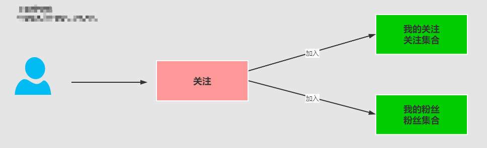

# 基于Redis Set实现关注和粉丝列表的分析

## 概述

基于Redis的Set实现关注和粉丝的分析


## 具体实现分析



>[!tip]比如：小王关注了小卡
小王（id为2）的关注列表中：小卡<br/>
小李（id为3）的关注列表中：小卡<br/>
小卡（id为1）的粉丝列表中：小王、小李

>[!info]从上面可以分析得到结论
每个用户都会有两个集合：<br/>
follower:user:set:1  小卡的关注列表 <br/>
follower:user:set:2  小王的关注列表中有1 <br/>
follower:user:set:3  小李的关注列表中有1 <br/>
followee:user:set:1  小卡的粉丝列表中有2 3 <br/>


## 具体实现

### 定义相关的关注逻辑、我的关注列表、我的粉丝列表

```java
@Service
public class FollowerServicee {
    @Autowired
    private RedisTemplate redisTemplate;

    // 关注列表
    public static final String FOLLOWEE_SET_KEY = "followee:user:";
    // 粉丝列表
    public static final String FOLLOWER_SET_KEY = "follower:user:";


    /**
     * 小王 = 2 关注小卡 = 1
     * 小李 = 3 关注小卡 = 1
     * userid = 1 ， followid=1
     *
     * @param userid=小王
     * @param followid=小李
     */
    public void follow(Integer userid, Integer followid) {
        // 1: 获取redis的集合对象
        SetOperations<String, Integer> setOperations = redisTemplate.opsForSet();
        // 2: 在小卡的粉丝集合列表中，把小王和小李加入到集合中
        setOperations.add(FOLLOWER_SET_KEY + followid, userid);
        // 3: 小王的和小李关注集合列表中，增加小卡的信息
        setOperations.add(FOLLOWEE_SET_KEY + userid, followid);
    }


    /**
     * 查询我的关注
     * @param userid
     */
    public Set<Integer> listMyfollowee(Integer userid) {
        // 1: 获取redis的集合对象
        SetOperations<String, Integer> setOperations = redisTemplate.opsForSet();
        // 2: 通过members方法，将关注列表的信息查询出来
        Set<Integer> members = setOperations.members(FOLLOWEE_SET_KEY + userid);
        return members;
    }

    /**
     * 我的粉丝列表
     *
     * @param userid
     */
    public Set<Integer> listMyfollower(Integer userid) {
        // 1: 获取redis的集合对象
        SetOperations<String, Integer> setOperations = redisTemplate.opsForSet();
        // 2: 通过members方法，将关注列表的信息查询出来
        Set<Integer> members = setOperations.members(FOLLOWER_SET_KEY + userid);
        return members;
    }

}
```

### 定义controller进行测试

```java
@RestController
public class FollowerController {


    @Autowired
    private FollowerServicee followerServicee;


    /**
     * 小王 = 2 关注小卡 = 1
     * 小李 = 3 关注小卡 = 1
     * userid = 1 ， followid=1
     */
    @PostMapping("/user/follow")
    public String follow(Integer userid, Integer followid) {
        followerServicee.follow(userid, followid);
        return "用户:" + userid + "关注:" + followid + "成功!";
    }


    /**
     * 查询我的关注
     */
    @PostMapping("/user/followee")
    public Set<Integer> listMyfollowee(Integer userid) {
        return followerServicee.listMyfollowee(userid);
    }

    /**
     * 我的粉丝列表
     */
    @PostMapping("/user/fanslist")
    public Set<Integer> listMyfollower(Integer userid) {
        return followerServicee.listMyfollower(userid);
    }

}

```

## 完整代码

```java
@Service
public class FollowerServicee {
    @Autowired
    private RedisTemplate redisTemplate;

    // 关注列表
    public static final String FOLLOWEE_SET_KEY = "followee:user:";
    // 粉丝列表
    public static final String FOLLOWER_SET_KEY = "follower:user:";


    /**
     * 小王 = 2 关注小卡 = 1
     * 小李 = 3 关注小卡 = 1
     * userid = 1 ， followid=1
     */
    public void follow(Integer userid, Integer followid) {
        // 1: 获取redis的集合对象
        SetOperations<String, Integer> setOperations = redisTemplate.opsForSet();
        // 2: 在小卡的粉丝集合列表中，把小王和小李加入到集合中
        setOperations.add(FOLLOWEE_SET_KEY + userid, followid);
        // 3: 在小卡的粉丝集合列表中，把小王和小李加入到集合中
        setOperations.add(FOLLOWER_SET_KEY + followid, userid);
    }


    /**
     * 查询我的关注
     */
    public List<User> listMyfollowee(Integer userid) {
        // 1: 获取redis的集合对象
        SetOperations<String, Integer> setOperations = redisTemplate.opsForSet();
        // 2: 通过members方法，将关注列表的信息查询出来
        Set<Integer> members = setOperations.members(FOLLOWEE_SET_KEY + userid);

        return getUserInfos(members);
    }

    /**
     * 我的粉丝列表
     */
    public List<User> listMyfollower(Integer userid) {
        // 1: 获取redis的集合对象
        SetOperations<String, Integer> setOperations = redisTemplate.opsForSet();
        // 2: 通过members方法，将关注列表的信息查询出来
        Set<Integer> members = setOperations.members(FOLLOWER_SET_KEY + userid);
        return getUserInfos(members);
    }


    /**
     * 把集合和前面的hash集合起来
     *
     * @param userinfos
     * @return
     */
    private List<User> getUserInfos(Set<Integer> userinfos) {
        // 1：创建用户集合
        List<User> userList = new ArrayList<>();
        // 2: 需要从hash中获取的那些属性
        List<String> hasKeys = new ArrayList<>();
        hasKeys.add("id");//list.get(0)
        hasKeys.add("nickname");//list.get(1)
        hasKeys.add("password");//list.get(2)
        hasKeys.add("sex");//list.get(3)

        // 3: 定义一个hash数据操作对象
        HashOperations opsForHash = this.redisTemplate.opsForHash();
        // 2：循环关注列表的用户ID信息
        for (Integer userId : userinfos) {
            // 3：获取用户在hash中的注册完整信息对应的key
            String hkey = "reg:user:hash:" + userId;
            // 4：把"reg:user:hash:1" 的信息从hash数据结构中获取获取，获取id，nickname，password,sex
            List<Object> list = opsForHash.multiGet(hkey, hasKeys);
            // 5：如果在缓存中没有找到对应的用户信息
            if (list.get(0) == null && list.get(1) == null) {
                // 6 :从数据库中根据用户id去查询
                User user = this.getUserDbCache(userId);
                userList.add(user);
            } else {
                User user = new User();
                user.setId(Integer.valueOf(list.get(0).toString()));
                user.setNickname(list.get(1).toString());
                user.setPassword(list.get(2).toString());
                user.setSex(Integer.parseInt(list.get(3).toString()));
                userList.add(user);
            }
        }
        return userList;
    }

    /**
     * 从数据库去获取用户信息，并且把获取的用户新放入缓存HASH数据结构中
     *
     * @param userid
     * @return
     * @throws IllegalAccessException
     */
    public User getUserDbCache(Integer userid) {
        // 1： 然后查询最新的用户信息放入到redis的hash重
       User user1 = this.getOne(userid);
       Map<String, Object> map = ObjectUtils.objectToMap(user1);
       // 3: 准备用存入的key，将用户信息存入到redis的hash中
       String key = "reg:user:" + user1.getId();
       redisTemplate.opsForHash().putAll(key, map);
       // 4: 设置key的失效时间一个月
       redisTemplate.expire(key, 30, TimeUnit.DAYS);
       return user1;
    }
}
```

```java
@RestController
public class FollowerController {


    @Autowired
    private FollowerServicee followerServicee;


    @PostMapping("/user/follow")
    public String follow(Integer userid, Integer followid) {
        followerServicee.follow(userid, followid);
        return "用户:" + userid + "关注:" + followid + "成功!";
    }


    /**
     * 查询我的关注
     */
    @PostMapping("/user/followee")
    public List<User> listMyfollowee(Integer userid) {
        return followerServicee.listMyfollowee(userid);
    }

    /**
     * 我的粉丝列表
     */
    @PostMapping("/user/fanslist")
    public List<User> listMyfollower(Integer userid) {
        return followerServicee.listMyfollower(userid);
    }

}

```