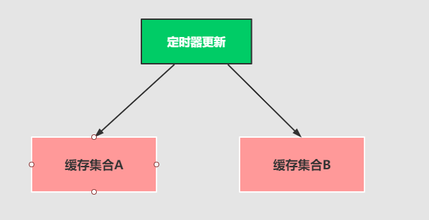

# 基于Redis的List实现特价商品列表-缓存击穿


## 解决商品列表存在的缓存击穿问题

```java
 /**
 * 查询产品信息
 * @param pageNo
 * @param pageSize
 * @return
 */
@GetMapping("/findproducts")
public R findProducts(int pageNo, int pageSize) {
    // 1: 计算分页的起始页
    int start = (pageNo - 1) * pageSize;
    // 2：计算分页的结束页
    int end = start + pageSize - 1;
    try {
        // 3: 查询列表中对应的产品信息进行返回
        List<Product> productList = this.redisTemplate.opsForList().range("product:list", start, end);
        // 4: 如果缓存查询不到就去数据库查询
        if (CollectionUtils.isEmpty(productList)) {
            //todo: 查询数据库，存在缓存击穿的情况，大量的并发请求进来，可能把数据库冲跨
            productList = productListService.findProductsDB();
        }
        // 5: 查询产品集合
        return R.ok().data("products", productList);
    } catch (Exception ex) {
        return R.error().message("服务器忙!!!");
    }
}
```

## 如何引起的缓存击穿的情况

```java
public void runCourse() {
    while (true) {
        // 1：从数据库中查询出特价商品
        List<Product> productList = this.findProductsDB();
        // 2：删除原来的特价商品
        this.redisTemplate.delete("product:hot:list");
        // 3：把特价商品添加到集合中 需要时间
        this.redisTemplate.opsForList().leftPushAll("product:hot:list", productList);
        try {
            // 4: 每隔一分钟执行一遍
            Thread.sleep(1000 * 60);
            log.info("定时刷新特价商品....");
        } catch (Exception ex) {
            ex.printStackTrace();
        }
    }
}
```

>[!tip]缓存击穿的出现原因
>1、就是以因为特价商品的数据更换需要时间。刚好特价商品还没有放入到redis缓存中。<br/>
>2、这个时候，查询特价商品的并发量非常大，可能程序还正在写入特价商品到缓存中，这个时候查询缓存根本就没有数据，就会直接冲入数据库里面去查询特价商品。可能造成数据库冲垮。这个就叫做：缓存击穿


## 解决方案

针对这种定时更新的特定场景，解决方案是：采用主从轮询的原理来实现。



可以开辟两块Redis的集合空间A和B。定时器在更新缓存的时候，`先更新B缓存`。然后在`更新A缓存`。记得一定要按照这个特定顺序来处理。

一句话：新老更替
