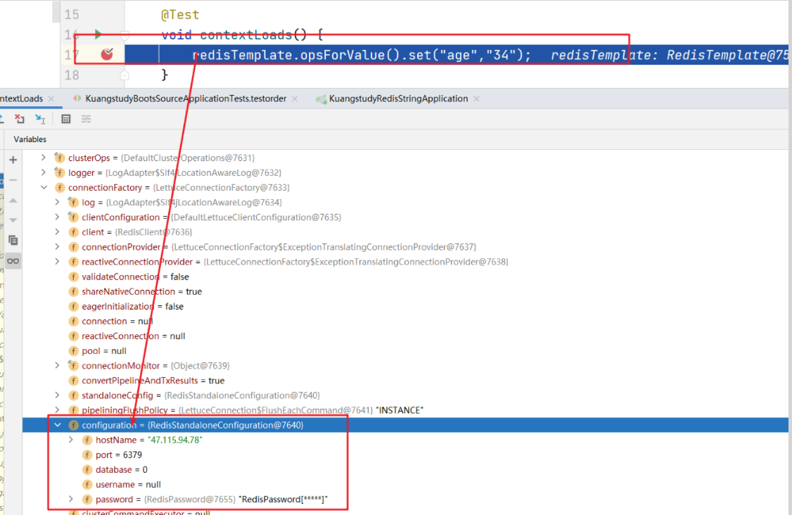

## 准备工作

- Redis环境服务的安装
- Redis服务器防火墙端口的开放
- Redis配置文件redis.conf中bind修改

## 具体流程

### 添加相关依赖

```xml
<dependency>
    <groupId>org.springframework.boot</groupId>
    <artifactId>spring-boot-starter-web</artifactId>
</dependency>

<!--mybatis-plus-->
<dependency>
    <groupId>com.baomidou</groupId>
    <artifactId>mybatis-plus-boot-starter</artifactId>
    <version>3.4.0</version>
</dependency>

<dependency>
    <groupId>org.springframework.boot</groupId>
    <artifactId>spring-boot-starter-test</artifactId>
    <scope>test</scope>
</dependency>

<!--这里就是redis的核心jar包-->
<dependency>
    <groupId>org.springframework.boot</groupId>
    <artifactId>spring-boot-starter-data-redis</artifactId>
</dependency>

<dependency>
    <groupId>mysql</groupId>
    <artifactId>mysql-connector-java</artifactId>
    <version>5.1.10</version>
</dependency>

<!--模板引擎-->
<dependency>
    <groupId>org.springframework.boot</groupId>
    <artifactId>spring-boot-starter-thymeleaf</artifactId>
</dependency>
<dependency>
    <groupId>org.projectlombok</groupId>
    <artifactId>lombok</artifactId>
    <version>1.18.12</version>
</dependency>
<dependency>
    <groupId>com.fasterxml.jackson.dataformat</groupId>
    <artifactId>jackson-dataformat-avro</artifactId>
    <version>2.10.0</version>
</dependency>
<dependency>
    <groupId>org.apache.commons</groupId>
    <artifactId>commons-lang3</artifactId>
    <version>3.6</version>
</dependency>
<!--guava限流-->
<dependency>
    <groupId>com.google.guava</groupId>
    <artifactId>guava</artifactId>
    <version>23.0</version>
</dependency>
<dependency>
    <groupId>com.google.zxing</groupId>
    <artifactId>core</artifactId>
    <version>3.3.0</version>
</dependency>
<!-- Swagger -->
<dependency>
    <groupId>io.springfox</groupId>
    <artifactId>springfox-swagger-ui</artifactId>
    <version>2.9.2</version>
</dependency>
<dependency>
    <groupId>io.springfox</groupId>
    <artifactId>springfox-swagger2</artifactId>
    <version>2.9.2</version>
</dependency>
<!-- 文档 -->
<dependency>
    <groupId>io.springfox</groupId>
    <artifactId>springfox-swagger2</artifactId>
    <version>2.9.2</version>
    <exclusions>
        <exclusion>
            <groupId>io.swagger</groupId>
            <artifactId>swagger-models</artifactId>
        </exclusion>
        <exclusion>
            <groupId>com.google.guava</groupId>
            <artifactId>guava</artifactId>
        </exclusion>
    </exclusions>
</dependency>
<dependency>
    <groupId>io.swagger</groupId>
    <artifactId>swagger-models</artifactId>
    <version>1.5.21</version>
</dependency>
<dependency>
    <groupId>io.springfox</groupId>
    <artifactId>springfox-swagger-ui</artifactId>
    <version>2.9.2</version>
</dependency>
<dependency>
    <groupId>com.github.xiaoymin</groupId>
    <artifactId>swagger-bootstrap-ui</artifactId>
    <version>1.8.5</version>
</dependency>
```

### 配置文件

```yaml
server:
  port: 8080
spring:
  main:
    allow-bean-definition-overriding: true
  thymeleaf:
    cache: false
    prefix: classpath:/templates/
    mode: HTML
    encoding: UTF-8
  jackson:
    date-format: yyyy-MM-dd HH:mm:ss
    time-zone: GMT+8
    locale: zh_CN
    # 解决json返回过程中long的精度丢失问题
    generator:
      write-numbers-as-strings: true
      write-bigdecimal-as-plain: true
  # 配置redis
  redis:
    database: 0
    password: mkxiaoer
    host: 47.115.94.78
    port: 6379
  # 数据库连接配置
  datasource:
    type: com.zaxxer.hikari.HikariDataSource
    driver-class-name: com.mysql.jdbc.Driver
    url: jdbc:mysql://127.0.0.1:3306/ksd-state-db?serverTimezone=GMT%2b8&useUnicode=true&characterEncoding=utf-8&useSSL=false
    username: root
    password: mkxiaoer
    hikari:
      connection-timeout: 60000
      validation-timeout: 3000
      idle-timeout: 60000
      login-timeout: 5
      max-lifetime: 60000
      maximum-pool-size: 400
      minimum-idle: 100
      read-only: false
# mybatis-plus配置
mybatis-plus:
  configuration:
    log-impl: org.apache.ibatis.logging.stdout.StdOutImpl
  mapper-locations: classpath*:/mapper/*.xml
  type-aliases-package: com.kuangstudy.entity
```

### Swagger配置

```java

@SpringBootConfiguration
@EnableSwagger2
public class SwaggerConfiguration {
    /**
     * 在完成上述配置之后，其实就已经可以产生帮助文档了，但是这样的文档主要针对请求本身，而描述主要来源于函数等命名产生。
     * 对用户体验不好，我们通常需要自己增加一些说明来丰富文档内容。
     *
     * @ApiIgnore 忽略暴露的 api
     * @ApiOperation(value = "查找", notes = "根据用户 ID 查找用户")
     *
     * 其他注解添加说明：
     * @Api ：用在类上，说明该类的作用
     * @ApiImplicitParams ：用在方法上包含一组参数说明
     * @ApiResponses ：用于表示一组响应
     *
     * 完成上述之后，启动springboot程序，
     * 旧访问：http://localhost:8080/swagger-ui.html
     * 新访问：http://localhost:8080/doc.html
     *
     * @ApiOperation() 用于方法；表示一个http请求的操作
     * value用于方法描述
     * notes用于提示内容
     * tags可以重新分组（视情况而用）
     *
     * @ApiParam() 用于方法，参数，字段说明；表示对参数的添加元数据（说明或是否必填等）
     * name–参数名
     * value–参数说明
     * required–是否必填
     *
     * @ApiModel()用于类 ；表示对类进行说明，用于参数用实体类接收
     * value–表示对象名
     * description–描述
     * 都可省略
     *
     * @ApiModelProperty()用于方法，字段； 表示对model属性的说明或者数据操作更改
     * value–字段说明
     * name–重写属性名字
     * dataType–重写属性类型
     * required–是否必填
     * example–举例说明
     * hidden–隐藏
     *
     * @ApiIgnore()用于类或者方法上，可以不被swagger显示在页面上 比较简单, 这里不做举例
     * @ApiImplicitParam() 用于方法
     * 表示单独的请求参数
     *
     * @ApiImplicitParams() 用于方法，包含多个 @ApiImplicitParam
     * name–参数ming
     * value–参数说明
     * dataType–数据类型
     * paramType–参数类型
     * example–举例说明
     */
    @Bean
    public Docket createRestApi() {
        return new Docket(DocumentationType.SWAGGER_2)
                .apiInfo(getApiInfo())
                .select()
                .apis(RequestHandlerSelectors.basePackage("com.kuangstudy.controller"))
                .paths(PathSelectors.any())
                .build();
    }
    private ApiInfo getApiInfo() {
        return new ApiInfoBuilder()
                .title("项目数据接口")
                .description("项目数据接口，在线体验文档")
                .termsOfServiceUrl("https://api.kuangstudy.com/api")
                .contact("超神")
                .version("1.0")
                .build();
    }
}
```

#### 证明redis服务是否连接成功

```java
package com.kuangstudy;

import org.junit.jupiter.api.Test;
import org.springframework.beans.factory.annotation.Autowired;
import org.springframework.boot.test.context.SpringBootTest;
import org.springframework.data.redis.core.RedisTemplate;
import org.springframework.web.client.RestTemplate;

@SpringBootTest
class KuangstudyRedisStringApplicationTests {

    @Autowired
    private RedisTemplate redisTemplate;

    @Test
    void contextLoads() {
        redisTemplate.opsForValue().set("age","34");
    }

}

```




### Redis默认情况下，key是对象状态key前面会有前缀

通过客户端连接以后：

```java
> src/redis-cli
> auth mkxiaoer
> get age
null
```

你会发现是空的。其实并不是没存进去，是因为redistemplate默认情况下：key和value 都会对象的方式序列化存在到redis服务器中。

```properties
127.0.0.1:6379> keys *
1) "\xac\xed\x00\x05t\x00\x03age"
2) "name"
127.0.0.1:6379> get "\xac\xed\x00\x05t\x00\x03age"
"\xac\xed\x00\x05t\x00\x0234"

```

以上并不是上面错误，只不过不理解。而不友好。有没有办法去解决这个问题？可以

通过修改RedisTemplate的对key和value的序列化就可以进行修改。

### 面试题：Redis能够存储java对象吗？

答案：是可以，但是你对象必须要序列化。

```java
@SpringBootTest
class KuangstudyRedisStringApplicationTests {

    @Autowired
    private RedisTemplate redisTemplate;

    @Test
    void contextLoads() {
        redisTemplate.opsForValue().set("age","34");
        Object age = redisTemplate.opsForValue().get("age");
        System.out.println(age);
    }

    @Test
    void saveUserToRedis() {
        User user = new User();
        user.setId(1);
        user.setNickname("yykk");
        user.setPassword("123456");
        // 存储一个java对象
        redisTemplate.opsForValue().set("user"+user.getId(),user);
    }

}

```

通过测试会报错：

```properties

org.springframework.data.redis.serializer.SerializationException: Cannot serialize; nested exception is org.springframework.core.serializer.support.SerializationFailedException: Failed to serialize object using DefaultSerializer; nested exception is java.lang.IllegalArgumentException: DefaultSerializer requires a Serializable payload but received an object of type [com.kuangstudy.entiy.User]

```

Redis没有办法把一个没有序列化的对象存储到Redis中。

```java

import lombok.Data;

public class User implements java.io.Serializable{

    private Integer id;
    private String nickname;
    private String password;

    public Integer getId() {
        return id;
    }

    public void setId(Integer id) {
        this.id = id;
    }

    public String getNickname() {
        return nickname;
    }

    public void setNickname(String nickname) {
        this.nickname = nickname;
    }

    public String getPassword() {
        return password;
    }

    public void setPassword(String password) {
        this.password = password;
    }
}

```

通过序列化以后，确实可以讲java的对象存储到redis服务中、存储的格式如下：

```properties
127.0.0.1:6379> keys *
1) "\xac\xed\x00\x05t\x00\x03age"
2) "name"
3) "\xac\xed\x00\x05t\x00\x05user1"
127.0.0.1:6379> get "\xac\xed\x00\x05t\x00\x05user1"
"\xac\xed\x00\x05sr\x00\x19com.kuangstudy.entiy.Userz\xba\x88\xd3/\xc6u\x90\x02\x00\x03L\x00\x02idt\x00\x13Ljava/lang/Integer;L\x00\bnicknamet\x00\x12Ljava/lang/String;L\x00\bpasswordq\x00~\x00\x02xpsr\x00\x11java.lang.Integer\x12\xe2\xa0\xa4\xf7\x81\x878\x02\x00\x01I\x00\x05valuexr\x00\x10java.lang.Number\x86\xac\x95\x1d\x0b\x94\xe0\x8b\x02\x00\x00xp\x00\x00\x00\x01t\x00\x04yykkt\x00\x06123456"

```

分析

- key = "\xac\xed\x00\x05t\x00\x05user1"
- value = "\xac\xed\x00\x05sr\x00\x19com.kuangstudy.entiy.Userz\xba\x88\xd3/\xc6u\x90\x02\x00\x03L\x00\x02idt\x00\x13Ljava/lang/Integer;L\x00\bnicknamet\x00\x12Ljava/lang/String;L\x00\bpasswordq\x00~\x00\x02xpsr\x00\x11java.lang.Integer\x12\xe2\xa0\xa4\xf7\x81\x878\x02\x00\x01I\x00\x05valuexr\x00\x10java.lang.Number\x86\xac\x95\x1d\x0b\x94\xe0\x8b\x02\x00\x00xp\x00\x00\x00\x01t\x00\x04yykkt\x00\x06123456"


上面的逻辑是正确，如果你不考虑他阅读和操作复杂度话，其实是可以不用修改的。但是我们开发者追求一定想象的要一致。怎么优化呢？优化方案是：

- key – 一定string类型，是什么就是什么
- value - json进行存储，


### RedisTemplate序列化（重点）

默认情况下RedisTemplate使用的是JackSerializationRedisSerializer 会出现两个问题

- 需要存储的对象必须实现`java.io.Serializable`接口

```java
public class User implements java.io.Serializable
```

- 被序列化的对象的key会出现乱码问题，导致key和value可读性很差

```
127.0.0.1:6379> keys *1) "\xac\xed\x00\x05t\x00\x06user:1"127.0.0.1:6379> get "\xac\xed\x00\x05t\x00\x06user:1""\xac\xed\x00\x05sr\x00\x1acom.kuangstudy.entity.User\x8f\xx00\x00\x01y\x88&\xd9pxsr\x00\x11java.lang.Integer\x12\xe2\xa0\xa4\xf7\x81\x878\x02\x00\x01I\x00\x05valuexr\x00\x10java.lang.Number\x86\xac\x95\x1d\x0b\x94\xe0\x8b\x02\x00\x00xp\x00\x00\x00\x01pt\x00\x11\xe5\xad\xa6\xe7\x9b\xb8\xe4\xbc\xb4\xe7\x94\xa8\xe6\x88\xb7_0t\x00\a1234560sq\x00~\x00\a\x00\x00\x00\x00sq\x00~\x00\x05w\b\x00\x00\x01y\x88&\xd9px"
```

### 解决方案

```java

@Configuration
public class RedisConfiguration {

    @Bean
    public RedisTemplate<String, Object> redisTemplate(RedisConnectionFactory redisConnectionFactory) {
        RedisTemplate<String, Object> redisTemplate = new RedisTemplate<>();
        redisTemplate.setConnectionFactory(redisConnectionFactory);
        // 创建一个json的序列化方式
        GenericJackson2JsonRedisSerializer jackson2JsonRedisSerializer = new GenericJackson2JsonRedisSerializer();
        // 设置value用jackjson进行处理
        redisTemplate.setValueSerializer(jackson2JsonRedisSerializer);
        // 设置key用string序列化方式
        redisTemplate.setKeySerializer(new StringRedisSerializer());
        redisTemplate.setHashKeySerializer(new StringRedisSerializer());
        redisTemplate.setHashValueSerializer(jackson2JsonRedisSerializer);
        redisTemplate.afterPropertiesSet();
        return redisTemplate;
    }
}
```