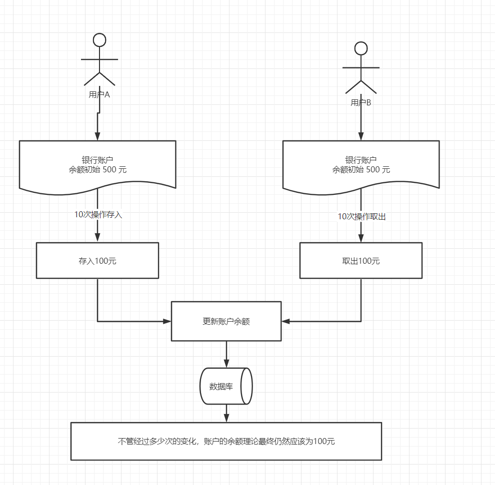
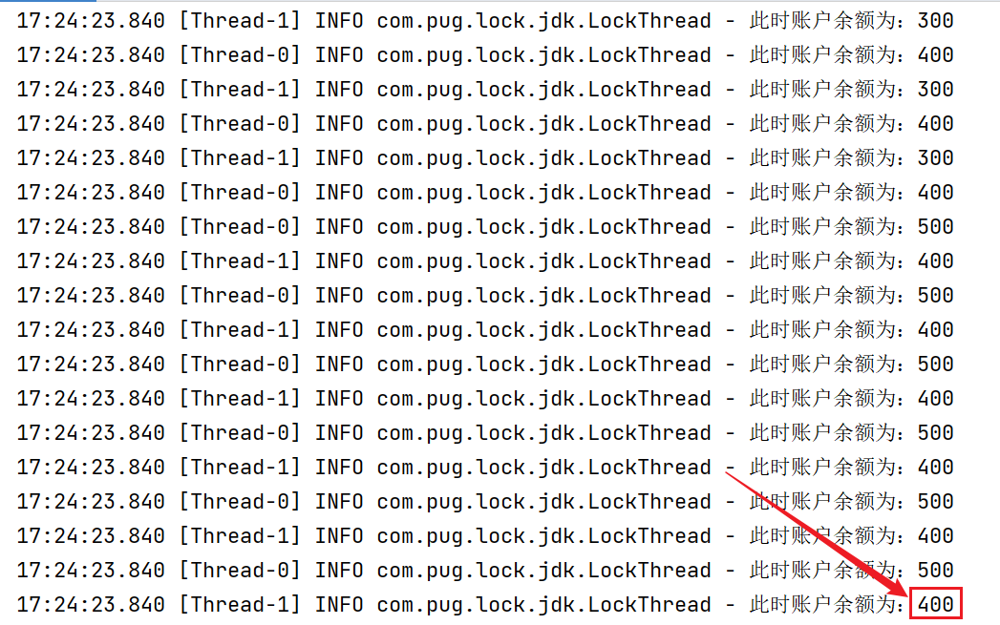
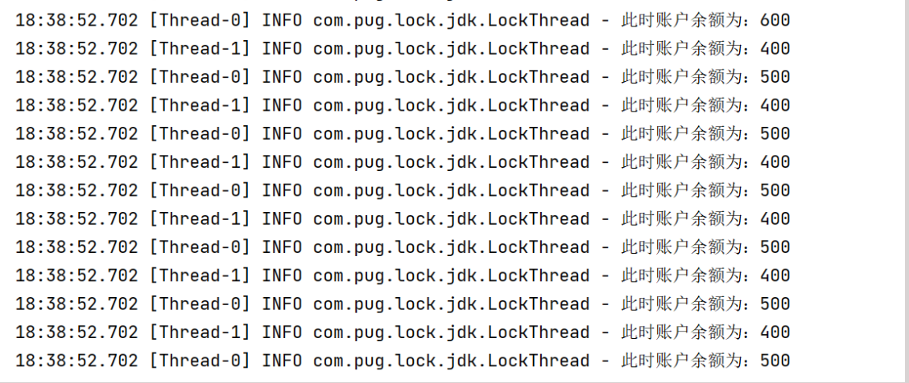
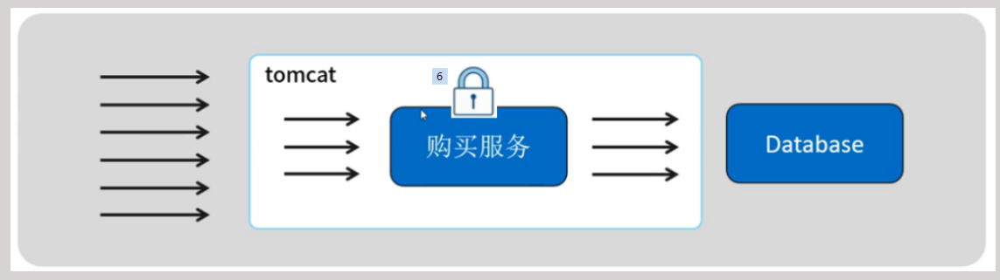
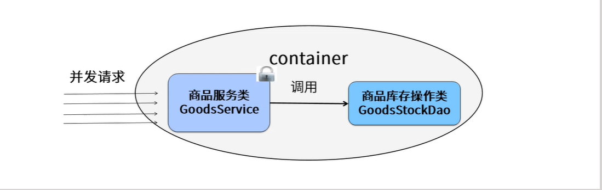
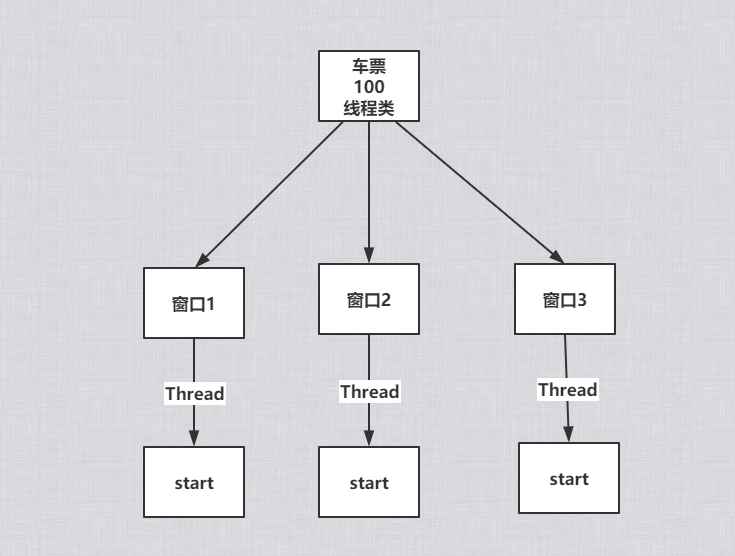
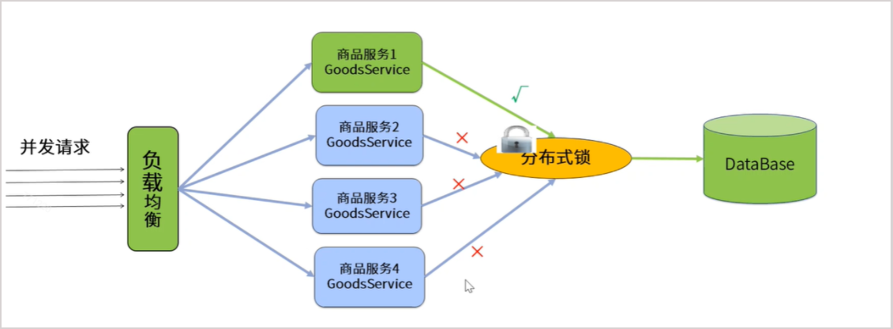
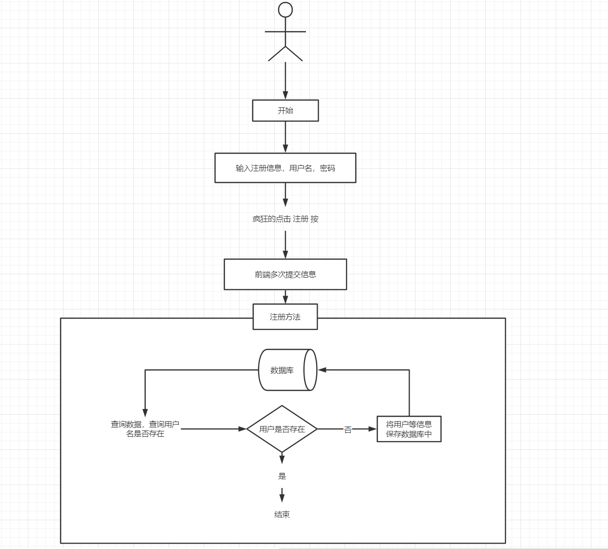
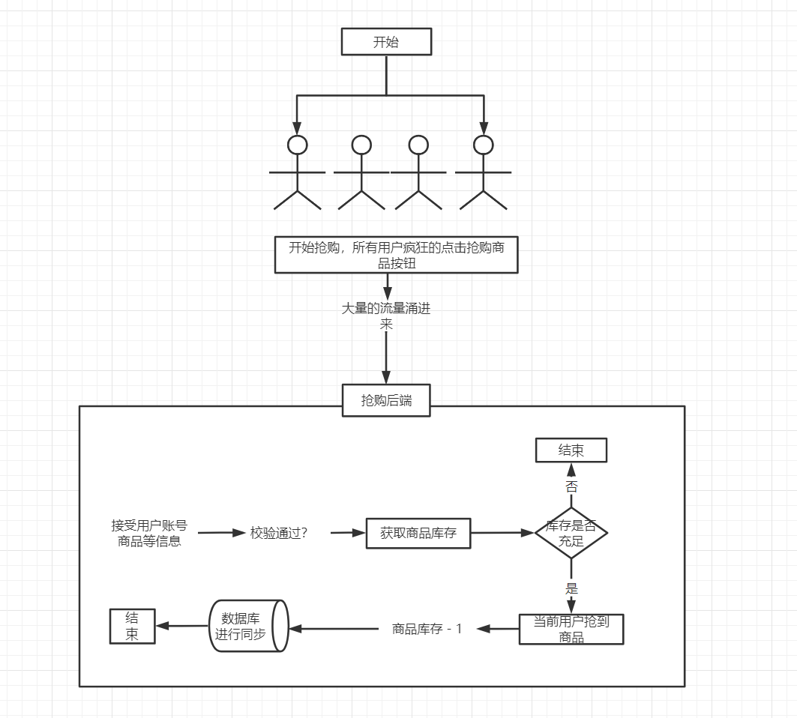

## 概述

集群下个定义：有多个物理节点组合而成，共同协作完成一件事。(具备：高并发和高可用和高可扩)

在互联网，移动互联网的时代，企业应用系统大多采用集群，分布式的方式进行部署，将“业务高度集中”的传统企业级应用按照业务拆分成多个子系统，并进行独立部署，而为了应对某些业务场景下产生的高并发请求，通常一个子系统会部署多分实例，并采用某个均衡机制“分摊”处理前端用户的请求，此种方式俗称：“集群”。

事实证明，此种分布式，集群部署的方式确实功能给企业级的系统应用带来性能和效率的提升，从而给企业业务规模带来课扩展的可能性。

然而，任何事务都并非十全十美，正如服务集群，分布式系统架构一样，虽然可以给企业应用系统带来性能，质量和效率上的提升，但也由此带来了一些棘手的问题，其中比如典型的问题就是：高并发场景下多个线程并发访问，造成共享资源泄露的问题。会造成数据的不一致现象。针对这个问题，普遍的采取的方式是用：“分布式锁”，加以解决。

主要针对分布式锁，出现的背景，以及使用场景进行说明和实战。

## 分布式锁的概述

在传统的单体架构的时代，“并发访问，操作共享资源“的场景并不少见，由于那个时期还没有：”分布式“的概念，故而当多个线程并发访问，操作共享资源时，往往通过加同步互斥锁进行控制，这种方式在很长的一段时间内确实能起到一定的作用。

但是随着用户，数据量的增长，企业为了使用，不得不对单一的应用系统进行拆分并作分布式部署。而这个时候分布式系统架构部署方案的实现带来性能和效率上的提升的同时，也带来了一些问题，即传统枷锁的方式将不再器作用。这是因为集群，分布式部署的服务实列一般是部署在不同服务器上的。在分布式系统架构下，此种资源共享将不再是传统的线程共享，而是跨JVM进程的资源共享，因此为了解决这个问题，我们引入了：“分布式锁”进行控制。

## 传统的锁机制

在单体应用时代，传统企业应用未了解决资源共享造成数据不一致问题，通常的解决方案是利用JDK自身提供的锁关键字或者JUC并发工具类，如：Synchronized、Lock、RetreenLock等加以实现，这种访问控制机制被业界普通认为：“锁”，不可否认的是，在很长一段时间内确实起到了作用，但是在分布式和集群环境下就会失去其意义和价值。

## 什么是共享资源

共享资源是指：可以被多个线程，进程同时访问进行操作的数据或者代码块。

比如春运期间抢购的火车票，在电商平台抢购的商品，秒杀活动的商品等都属于典型可供多个用户获取、操作甚至共享的东西，这些东西称之为：“共享资源”。

- 更新操作，这个时候很久特别的注意。

我怎么判别会造成资源泄露：
 -  select
 -  insert —- 重复提交，幂等性问题----锁 --- 重复提交
 -  update — 可能就引发幂等性和超卖问题-- 锁---超卖问题 —-

幂等性是指：在实际开发和操作中，你执行和处理一个业务无论你执行多次(n次)你产生的结果应该和预期的是一致。那么久你业务就遵循幂等性。一句话：不论你执行的多次你最终的结果都是一样的。

- 举例子：用户注册，用户不论疯狂点击还是用程序轮询攻击，在那一时刻一个用户就只能有一条，
- 举例子：用户下单，用户不论疯狂点击还是用程序轮询攻击，在那一时刻一个用户就只能有一个订单。

## 锁应用的场景

- 重复提交
  - 银行存储和取钱
  - 用户注册
  - 网银体现
  - 微信支付体现
  - 抢红包
  - 抢优惠券
- 超卖问题
  - 下单
  - 抢购
  - 秒杀
  - 抢红包

## JDK提供的锁

- <Badge type="tip" text="Synchronized" /> 和 <Badge type="tip" text="Lock" />  ，仅限于单体架构，如果你的项目没有集群部署可以使用。
- 如果你项目是集群部署。这种jdk自带的锁就失去意义和价值。
- 你只能通过：数据库乐观锁，悲观锁，redis的锁，zookeeper锁，redssion的锁解决。

## 单体架构：银行存钱和取钱的并发问题

“银行ATM存钱和取钱” ，比如：小王银行卡的余额是：500元，小王和他媳妇同时分别在不同的ATM机上进行银行账号10次的存钱和取钱操作，其中小王每次的操作都是存入100元，而她媳妇每次的操作都是取出100元，从理论上讲，这个银行账号不管经过多少次：“存入和取出100元”操作，该账户的余额始终都是：500才对。

在该业务中，共享资源即为：”银行账户的余额“，而不同线程发起的共享访问操作包括：”存钱入银行账户“ 和”从该银行账户取钱“。

想象大部分都是美好的，而现实是骨感和丰满的。在程序中如果用多线程并发操作的时候，如果不进行处理，可能资源的不一致，从而银行或者客户都会带来”灾难性“的结果，比如：银行资金流失，客户总账不对等问题。



### Java实现多线程

- 无返回值实现接口<Badge type="tip" text="Runnable" />
- 继承类 <Badge type="tip" text="Thread" /> （不推荐，java是多实现，单一继承）
- 有返回值：<Badge type="tip" text="Callabled" />

#### 无锁版本

```java
//模拟锁机制的线程类
class LockThread implements Runnable {
    private static final Logger log = LoggerFactory.getLogger(LockThread.class);

    //定义成员变量-用于接收线程初始化时提供的金额-代表取/存的金额
    private int count;

    //构造方法
    public LockThread(int count) {
        this.count = count;
    }

    /**
     * 线程操作共享资源的方法体-不加同步锁
     */
    @Override
    public void run() {
        try {
            //执行10次访问共享的操作
            for (int i = 0; i < 10; i++) {
                //通过传进来的金额(可正、可负)执行叠加操作
                SysConstant.amount = SysConstant.amount + count;
                //打印每次操作完账户的余额
                log.info("此时账户余额为：{}", SysConstant.amount);
            }
        } catch (Exception e) {
            //有异常情况时直接进行打印
            e.printStackTrace();
        }
    }
}


public class LockOne {
    private static final Logger log = LoggerFactory.getLogger(LockOne.class);

    public static void main(String args[]) {
        // 存钱
        Thread tAdd = new Thread(new LockThread(100));
        // 取钱
        Thread tSub = new Thread(new LockThread(-100));
        tAdd.start();
        tSub.start();
    }
}

```

结果



出现不一致情况，因为此时我们并没有加：“同步访问呢”的控制机制，导致：“账户余额”这一共享资源最终出现了数据不一致情况。可能会多，可能会少。

在传统的单体架构应用时代，针对并发访问共享资源出现数据不一致，即并发安全的问题的时候，一般都是使用<Badge type="tip" text="Synchronized" />或者<Badge type="tip" text="Lock" />关键字来解决。如下：

#### Synchronized锁版本

```java
package com.pug.lock.jdk; /**
 * Created by Administrator on 2019/4/14.
 */

import org.slf4j.Logger;
import org.slf4j.LoggerFactory;

/**
 * 锁机制
 *
 * @Author:debug (yykk)
 * @Date: 2022/4/07 18:23
 **/
public class LockOne {
    private static final Logger log = LoggerFactory.getLogger(LockOne.class);

    public static void main(String args[]) {
        Thread tAdd = new Thread(new LockThread(100));
        Thread tSub = new Thread(new LockThread(-100));
        tAdd.start();
        tSub.start();
    }
}

//模拟锁机制的线程类
class LockThread implements Runnable {
    private static final Logger log = LoggerFactory.getLogger(LockThread.class);

    //定义成员变量-用于接收线程初始化时提供的金额-代表取/存的金额
    private int count;

    //构造方法
    public LockThread(int count) {
        this.count = count;
    }

    /**
     * 线程操作共享资源的方法体-加同步锁
     */
    @Override
    public void run() {
        //执行10次访问共享的操作
        for (int i = 0; i < 100; i++) {
            //加入 synchronized 关键字,控制并发线程对共享资源的访问
            synchronized (SysConstant.amount) {
                //通过传进来的金额(可正、可负)进行叠加
                SysConstant.amount = SysConstant.amount + count;
                //打印每次操作完账户的余额
                log.info("此时账户余额为：{}", SysConstant.amount);
            }
        }
    }
}
```

不论你执行多少次，都不会存在资源和数据的不一致情况。如下：



都属于正常的状况。当然采用Synchronized关键词实现同步锁的方式，在实际生产环境中仍然是又一些缺陷的。

## 火车站的售票窗口抢票

比如：火车站的售票窗口还有100张票，这个时候三个黄牛同时在抢票，或者N个用户在抢票。看会发生什么问题？





```java
package com.mzy.lock;

public class SellTicket implements Runnable{

 private int ticket = 100;

 @Override
 public void run() {
  while(ticket > 0 ) {
   if(ticket > 0 ) {
    try {
     Thread.sleep(100);
    } catch (InterruptedException e) {
     e.printStackTrace();
    }
    System.out.println(Thread.currentThread().getName()+"正在出售第："+ticket--+"张票!");
   }
  }
 }

}

```


测试用例：

```java
package com.itheima.lock2;

public class SellTicketTest  {


    public static void main(String[] args){

        // 买票测试
        SellTicket sellTicket = new SellTicket();
        for (int i = 1  ; i <=3 ; i++) {
            new Thread(sellTicket,"窗口-"+i).start();
        }
    }

}

```

运行结果如下：

```properties
Thread-0正在出售第：100张票!
Thread-1正在出售第：99张票!
Thread-2正在出售第：98张票!
Thread-2正在出售第：97张票!
Thread-0正在出售第：95张票!
Thread-1正在出售第：96张票!
Thread-2正在出售第：94张票!
Thread-1正在出售第：93张票!
Thread-0正在出售第：92张票!
Thread-2正在出售第：91张票!
Thread-1正在出售第：90张票!
Thread-0正在出售第：90张票!
Thread-2正在出售第：89张票!
Thread-0正在出售第：88张票!
Thread-1正在出售第：89张票!
Thread-2正在出售第：87张票!
Thread-1正在出售第：85张票!
Thread-0正在出售第：86张票!
Thread-1正在出售第：84张票!
Thread-0正在出售第：83张票!
Thread-2正在出售第：84张票!
Thread-2正在出售第：82张票!
Thread-1正在出售第：81张票!
Thread-0正在出售第：82张票!
Thread-1正在出售第：80张票!
Thread-2正在出售第：80张票!
Thread-0正在出售第：80张票!
Thread-1正在出售第：79张票!
Thread-0正在出售第：78张票!
Thread-2正在出售第：79张票!
Thread-1正在出售第：77张票!
Thread-0正在出售第：76张票!
Thread-2正在出售第：76张票!
Thread-2正在出售第：75张票!
Thread-0正在出售第：74张票!
Thread-1正在出售第：73张票!
Thread-2正在出售第：72张票!
Thread-0正在出售第：72张票!
Thread-1正在出售第：72张票!
Thread-2正在出售第：71张票!
Thread-0正在出售第：71张票!
Thread-1正在出售第：71张票!
Thread-2正在出售第：70张票!
Thread-0正在出售第：70张票!
Thread-1正在出售第：70张票!
Thread-1正在出售第：69张票!
Thread-0正在出售第：68张票!
Thread-2正在出售第：67张票!
Thread-1正在出售第：66张票!
Thread-0正在出售第：65张票!
Thread-2正在出售第：65张票!
Thread-2正在出售第：64张票!
Thread-1正在出售第：63张票!
Thread-0正在出售第：63张票!
Thread-2正在出售第：62张票!
Thread-1正在出售第：62张票!
Thread-0正在出售第：62张票!
Thread-2正在出售第：61张票!
Thread-0正在出售第：60张票!
Thread-1正在出售第：59张票!
Thread-0正在出售第：58张票!
Thread-2正在出售第：56张票!
Thread-1正在出售第：57张票!
Thread-0正在出售第：55张票!
Thread-2正在出售第：55张票!
Thread-1正在出售第：55张票!
Thread-1正在出售第：54张票!
Thread-0正在出售第：52张票!
Thread-2正在出售第：53张票!
Thread-2正在出售第：51张票!
Thread-1正在出售第：50张票!
Thread-0正在出售第：50张票!
Thread-0正在出售第：49张票!
Thread-2正在出售第：48张票!
Thread-1正在出售第：48张票!
Thread-0正在出售第：47张票!
Thread-2正在出售第：45张票!
Thread-1正在出售第：46张票!
Thread-1正在出售第：44张票!
Thread-0正在出售第：43张票!
Thread-2正在出售第：43张票!
Thread-2正在出售第：42张票!
Thread-0正在出售第：41张票!
Thread-1正在出售第：41张票!
Thread-1正在出售第：40张票!
Thread-2正在出售第：39张票!
Thread-0正在出售第：38张票!
Thread-2正在出售第：37张票!
Thread-1正在出售第：37张票!
Thread-0正在出售第：37张票!
Thread-2正在出售第：36张票!
Thread-1正在出售第：36张票!
Thread-0正在出售第：36张票!
Thread-1正在出售第：35张票!
Thread-0正在出售第：34张票!
Thread-2正在出售第：34张票!
Thread-1正在出售第：33张票!
Thread-0正在出售第：31张票!
Thread-2正在出售第：32张票!
Thread-0正在出售第：30张票!
Thread-1正在出售第：28张票!
Thread-2正在出售第：29张票!
Thread-1正在出售第：27张票!
Thread-2正在出售第：25张票!
Thread-0正在出售第：26张票!
Thread-1正在出售第：24张票!
Thread-2正在出售第：23张票!
Thread-0正在出售第：23张票!
Thread-2正在出售第：22张票!
Thread-0正在出售第：21张票!
Thread-1正在出售第：22张票!
Thread-0正在出售第：20张票!
Thread-2正在出售第：18张票!
Thread-1正在出售第：19张票!
Thread-0正在出售第：17张票!
Thread-1正在出售第：16张票!
Thread-2正在出售第：16张票!
Thread-2正在出售第：15张票!
Thread-1正在出售第：14张票!
Thread-0正在出售第：14张票!
Thread-1正在出售第：13张票!
Thread-0正在出售第：11张票!
Thread-2正在出售第：12张票!
Thread-0正在出售第：10张票!
Thread-2正在出售第：8张票!
Thread-1正在出售第：9张票!
Thread-1正在出售第：7张票!
Thread-0正在出售第：6张票!
Thread-2正在出售第：6张票!
Thread-0正在出售第：5张票!
Thread-1正在出售第：5张票!
Thread-2正在出售第：5张票!
Thread-0正在出售第：4张票!
Thread-1正在出售第：2张票!
Thread-2正在出售第：3张票!
Thread-1正在出售第：1张票!
Thread-0正在出售第：-1张票!
Thread-2正在出售第：0张票!

Process finished with exit code 0

```

出现了超买的的现象，如果解决这个问题呢？用锁来解决 线程具有重入性（执行完毕以后才可以继续争抢cpu资源继续处理），无序性（谁先抢到CPU就谁执行），不会阻塞。

### synchronized版本

在Java中，可以使用synchronized关键字来标记**一个方法或者代码块**，当某个线程调用该对象的synchronized方法或者访问synchronized代码快时，这个线程便获得了该对象的锁，**其他线程暂时无法访问这个方法**，只有等待这个方法执行完毕或者代码快执行完毕，这个线程才会释放该对象的锁，其他线程才能执行这个方法或者代码块。

```java
package com.mzy.lock;

/**
 * 模拟多线程环境下资源竞争的问题
 */
public class SellTicket_Sync implements Runnable{
 private int ticket = 100;
 
 @Override
 public void run() {
  while(ticket > 0 ) {
   synchronized (this) {
    if(ticket > 0 ) {
     try {
      Thread.sleep(100);
     } catch (InterruptedException e) {
      e.printStackTrace();
     }
     System.out.println(Thread.currentThread().getName()+"正在出售第："+ticket--+"张票!");
    }
   }
  }
 }
}

```

测试

```java
package com.mzy.lock;

/**
 * SellTicketTest<br/>
 * 时间：2019年1月14日-下午4:43:24 <br/>
 * @version 1.0.0<br/>
 * 
 */
public class SellTicketTest {

 public static void main(String[] args) {

  //使用Synchronized锁来解决线程安全问题 
        SellTicket_Sync sellTicket = new SellTicket_Sync();
  //模拟三个窗口售票
  for (int i = 1; i <= 3; i++) {
   new Thread(sellTicket).start();
  }
 }
}

```

结果

```properties
Thread-0正在出售第：100张票!
Thread-0正在出售第：99张票!
Thread-2正在出售第：98张票!
Thread-2正在出售第：97张票!
Thread-2正在出售第：96张票!
Thread-1正在出售第：95张票!
Thread-1正在出售第：94张票!
Thread-1正在出售第：93张票!
Thread-1正在出售第：92张票!
Thread-2正在出售第：91张票!
Thread-2正在出售第：90张票!
Thread-2正在出售第：89张票!
Thread-2正在出售第：88张票!
Thread-0正在出售第：87张票!
Thread-0正在出售第：86张票!
Thread-2正在出售第：85张票!
Thread-2正在出售第：84张票!
Thread-2正在出售第：83张票!
Thread-1正在出售第：82张票!
Thread-1正在出售第：81张票!
Thread-2正在出售第：80张票!
Thread-2正在出售第：79张票!
Thread-0正在出售第：78张票!
Thread-0正在出售第：77张票!
Thread-0正在出售第：76张票!
Thread-0正在出售第：75张票!
Thread-0正在出售第：74张票!
Thread-0正在出售第：73张票!
Thread-0正在出售第：72张票!
Thread-0正在出售第：71张票!
Thread-0正在出售第：70张票!
Thread-0正在出售第：69张票!
Thread-0正在出售第：68张票!
Thread-0正在出售第：67张票!
Thread-0正在出售第：66张票!
Thread-2正在出售第：65张票!
Thread-2正在出售第：64张票!
Thread-2正在出售第：63张票!
Thread-1正在出售第：62张票!
Thread-1正在出售第：61张票!
Thread-1正在出售第：60张票!
Thread-1正在出售第：59张票!
Thread-1正在出售第：58张票!
Thread-1正在出售第：57张票!
Thread-2正在出售第：56张票!
Thread-2正在出售第：55张票!
Thread-2正在出售第：54张票!
Thread-2正在出售第：53张票!
Thread-2正在出售第：52张票!
Thread-2正在出售第：51张票!
Thread-2正在出售第：50张票!
Thread-2正在出售第：49张票!
Thread-2正在出售第：48张票!
Thread-2正在出售第：47张票!
Thread-2正在出售第：46张票!
Thread-2正在出售第：45张票!
Thread-0正在出售第：44张票!
Thread-0正在出售第：43张票!
Thread-0正在出售第：42张票!
Thread-0正在出售第：41张票!
Thread-0正在出售第：40张票!
Thread-0正在出售第：39张票!
Thread-0正在出售第：38张票!
Thread-0正在出售第：37张票!
Thread-0正在出售第：36张票!
Thread-0正在出售第：35张票!
Thread-0正在出售第：34张票!
Thread-0正在出售第：33张票!
Thread-2正在出售第：32张票!
Thread-2正在出售第：31张票!
Thread-2正在出售第：30张票!
Thread-2正在出售第：29张票!
Thread-2正在出售第：28张票!
Thread-2正在出售第：27张票!
Thread-2正在出售第：26张票!
Thread-2正在出售第：25张票!
Thread-2正在出售第：24张票!
Thread-1正在出售第：23张票!
Thread-2正在出售第：22张票!
Thread-2正在出售第：21张票!
Thread-2正在出售第：20张票!
Thread-2正在出售第：19张票!
Thread-2正在出售第：18张票!
Thread-2正在出售第：17张票!
Thread-2正在出售第：16张票!
Thread-2正在出售第：15张票!
Thread-2正在出售第：14张票!
Thread-2正在出售第：13张票!
Thread-2正在出售第：12张票!
Thread-2正在出售第：11张票!
Thread-2正在出售第：10张票!
Thread-2正在出售第：9张票!
Thread-2正在出售第：8张票!
Thread-2正在出售第：7张票!
Thread-2正在出售第：6张票!
Thread-2正在出售第：5张票!
Thread-2正在出售第：4张票!
Thread-2正在出售第：3张票!
Thread-2正在出售第：2张票!
Thread-2正在出售第：1张票!

Process finished with exit code 0
```

:::tip
小结 使用 synchronized 的方式解决商品的超卖问题，**系统级别的锁，只能jvm去维护，如果你单一的synchronized 修饰方法和代码块的时候是不会出现死锁的问题。并且它无法去控制和销毁完全都是jvm去控制**
:::

### lock锁版本

掌握lock的使用方法和存在的问题、java.util.concurrent.简称： J.U.C

Lock(轻量级)和synchronized同步块一样，是一种线程同步机制，但比java的synchronized同步块更复杂。自Java5开始，在java.util.concurrent.locks包中包含了一些锁的实现，它们可以帮助我们解决进程内多线程并发时的数据一致性问题。

Lock是一个接口，里面的方法有：

- lock()  获取锁，如果锁被占用，其他的线程全部等待。（其他的线程全部阻塞，排它性）

```java
try{
  // A, B,C
  lock.lock(); //排他
   //写业务
}catch(ex){

} finally{
   lock.unLock()
}
```

- tryLock()   如果获取锁的时候，锁被占用就返回false,否则返回true （获取到锁的就执行，获取不到的就等待）

```java
try{
   // A, B,C
   boolean flag = lock.tryLock();// b == true //排他
   if(flag){
      // 也业务
   }else{
       return "非常抱歉，你请稍后再试一试";
   }
}catch(ex){

} finally{
   lock.unLock()
}
```

- tryLock(long time,TimeUnit unit) 如果获取锁的时候，锁被占用就返回false,否则返回true 并且释放时间
- unLock() 释放锁（如果不锁就会出现死锁）
- lockInterruptibly() 用该锁的获得方式，如果线程在获取锁的阶段进入等待，那么可以中断次线程，先去做别的事情。

```java
package com.mzy.lock;

import java.util.concurrent.locks.Lock;
import java.util.concurrent.locks.ReentrantLock;

/**
 * 
 * 模拟多线程环境下资源竞争的问题
 * @version 1.0.0<br/>
 * 
 */
public class SellTicket_Lock implements Runnable{
 
 //定义锁
 private Lock lock = new ReentrantLock();
 //票数
 private int ticket = 100;
 
 @Override
 public void run() {
  while(ticket > 0 ) {
   lock.lock();//加锁
   try {
    if(ticket > 0 ) {
     try {
      Thread.sleep(100);
     } catch (InterruptedException e) {
      e.printStackTrace();
     }
     System.out.println(Thread.currentThread().getName()+"正在出售第："+ticket--+"张票!");
    }
    
   } finally {
    lock.unlock();//一定要释放锁
   }
  }
 }
}

```

测试

```java
package com.mzy.lock;

/**
 * 
 * SellTicketTest<br/>
 * 创建人:mofeng<br/>
 * 时间：2019年1月14日-下午4:43:24 <br/>
 * @version 1.0.0<br/>
 * 
 */
public class SellTicketTest {

 public static void main(String[] args) {
  SellTicket_Lock  sellTicket = new SellTicket_Lock();
  //模拟三个窗口售票
  for (int i = 1; i <= 3; i++) {
   new Thread(sellTicket).start();
  }
 }
}

```

结果也不会超卖

### 小结

**到底哪个好？**

- 两者在某种程度上来来说，没有太大的区别了。在后续oracle公司已经对synchronized进行优化了，性能几乎和lock差不多
- 所以不用纠结到底用lock还是sync，但是推荐大家使用：Lock
- 自己命运能够自己掌握，就绝不交给别人，所以使用Lock

**synchronized和lock的区别：**

- Lock是接口，而synchronized是Java的关键字
- synchronized不会导致死锁现象发生，而Lock可能会造成死锁现象
- Lock可以让等待锁的线程中断，而synchronized却不行
- 通过Lock可以指定又没有成功获取锁，而synchronized却无法办到
- Lock可以提高多线程进行读操作的效率
- 在性能上来说，如果竞争不激烈，两者的性能是差不多的，而当竞争资源非常激烈的时候，此时Lock的性能要远远优于synchronized，所以说在使用时，要根据适当情况选择。

## 分布式锁登场

在分布式系统中，常常需要去协调他们的动作。如果不同的系统或是同一个系统的不同主机之间共享了一个或一组资源，那么访问这些资源的时候，往往需要互斥来防止彼此干扰来保证一致性，在这种情况下，便需要使用到分布式锁。

然而，不管是采用Synchronized关键字还是Lock的方式控制”共享资源“的访问，终归只适合单体应用或者单一部署的服务实例。而对分布式部署的系统或者集群部署的服务实例，此种方式将显得有点力不从心。这是因为这种方式的：”锁“很大程度上需要依赖应用系统所在的JDK，比如Synchronized，Lock都是Java提供给开发者的。

而在分布式系统时代，许多服务实例或者系统是分开部署的，他们将拥有自己独立的主机Host，独立的JDK，导致应用系统在分布式部署的情况下，这种控制：“并发线程访问共享资源”的机制将不在起作用。故而使用：“分布式锁”来解决这个问题。

### 何为分布式锁

分布式锁也是一种锁机制，只不过专门应对分布式环境而出现的，它并不是一种全新的中间件或者组件，而是一种机制，一种实现方式，甚至可以说是一种解决方案。它指的是在分布式部署的环境下，通过锁机制让多个客户端或者多个服务进程互斥地对共享资源进行访问，从而避免出现并发安全，数据不一致等问题。或者这样理解
:::tip
分布式锁：是控制分布式系统之间同步访问共享资源的一种方式。在分布式系统中，常常需要协调他们的动作。如果不同的系统或是同一个系统的不同主机之间共享了一个或一组资源，那么访问这些资源的时候，往往需要互斥来防止彼此干扰来保证一致性，在这种情况下，便需要使用到分布式锁。
:::

分布式锁是：**控制分布式系统之间同步访问共享资源的一种方式**



### 分布式锁需要具备那些条件

- **互斥性（排它性）**：和我们本地锁一样互斥性是最基本的。和单体应用时代是一个道理，即需要保证在分布式部署，服务集群部署的环境下，被共享的资源（数据或者代码块）在同一时刻只能被一台服务器上的线程访问。其他的都被等待。
- **避免死锁：** 指的是当前线程获取锁之后，经过一段有限的时间（该时间一般用于执行实际的业务逻辑），一定要释放锁（正常情况和异常情况都要释放锁）。
- **高可用性：** 高可用是指获取和释放锁的机制必须高可用和集群且性能极佳。
- **可重入性：** 是指该分布式锁最好是一把可重入锁，即当前机器的当前线程在彼时如果没有获取到锁，那么在等待一定的时间后要保证可用获取该锁。
- **公平锁(可选)：** 这个非硬性要求，指的是不同服务器的不同线程获取锁的概率最好保证是一样的。即应当保证来自不同服务器的并发线程可用公平获取锁。

### 常见的分布式锁的解决方案有

- 基于数据库级别的
  - 乐观锁
    - 基于数据库级别的乐观锁，主要是通过在查询，操作共享数据记录时带上一个标识字段(version)，通过version来控制每次对数据记录执行的更新操作。
  - 悲观锁
    - 基于数据级别的悲观锁，这里以MYSQL的innodb为例，它主要通过在访问共享的数据记录时加上<Badge type="tip" text="for update" />关键词，表示该共享的数据记录已经被当前线程锁住了，（行级锁，表级别锁，间隙锁），只有当该线程操作完成并提交事务之后，才会释放该锁，从而其他线程才能访问该数据记录。
- 基于Redis的原子操作
  - setnx + expire原子操作（时间问题）
    - 主要是通过Redis提供的原子操作setnx + expire来实现，setnx表示只有当key在redis不存在时才能设置成功，通过这个key需要设置为与共享的资源有联系，用于间接地当做锁，并采用expire操作释放获取的锁。
- 基于Zookeeper的互斥排它锁
  - 主要通过创建有序节点 + Watch机制
    - 主要是通过zk指定的标识字符串（通常这个标识字符串需要设置为与共享资源有联系，即可以间接地当作：“锁”）下维护一个临时有序的节点列表NodeList，并保证同一时刻并发线程访问共享资源是只能有一个最小序号的节点，（即代表获取到锁的线程）。该节点对应的线程即可执行访问共享资源的操作。
- 基于Redisson的分布式锁

  - 推荐（内置时间狗）

### 分布式锁的应用场景

- 重复提交

  - 资源冗余

- 超卖资源泄露

  - 商城高并发抢购
  - 商城高并发秒杀
  - 抢红包
  - 抽奖

这些场景都有共同的特征就是：资源少，请求大，除了用分不锁来解决以外，还必须加：限流才能够稳定的处理。

#### 重复提交

在实际开发中我们经常开发注册功能，大概流程是这样：

- 用户在前端输入相关的用户信息（比如用户名，密码等）之后，
- 疯狂地点击“注册”按钮，
- 此时前端可能会做一些 “按钮置灰”，节流、防抖等功能，
- 但是仍然存在有一些不可避免的不可控因素，导致前端提交了多次重复的，
- 相同的用户信息到系统后端，系统后端后端相关接口在执行：“查询用户名是否存在” 和 “将用户信息插入到数据库”，

由于“来不及” 处理线程并发的情况，最终导致在用户的数据库表中，存在2条甚至多条相同的用户信息记录。



这个时候，不难发现：“查询用户名是否存在”的操作存在问题，当多个线程比如：A,B,C同时到达后端接口时，很有可能同时执行”查询用户名是否存在“ 的操作，而由于用户是首次注册，用户数据此时还没有数据记录。故而A,B,C三个线程很有可能同时得到：”查询用户名是否存在“的结果，导致3个线程同时执行了：”将用户信息插入数据库“的操作，最终导致数据重复出现的现象。

因此我们可以使用：“分布式锁” 来进行解决这个问题。

#### 商城高并发秒杀或者抢购

对于大型的：“商城系统高并发的秒杀和抢购”的业务场景，是非常常见的，在前面我们可以使用RabbitMQ的方式进行接口的限流，异步解耦通信，实现抢购时：“高并发限流”，“流量削峰”，但是在真实的场景中，远不止这么简单，特别是在：“库存超卖”的问题上，是非常负载和难啃的。



抢购活动开始，前端大量的流量涌入，后端首先会：“查看商品当前的库存”，如果库存充足，则代表用户可以抢购该商品，同时：“商品库存减去1”，并最终同步和更新到商品库存表中。理论上业务是这样进行中，但是现实真的是这样吗？

> [!NOTE]
> 假设商品库存是1，有A,B,C三个线程，在高并发情况下，A,B,C三个线程同时查询到：“查看商品当前的库存” 三个线程获取的库存都是1，都> 认为库存是充足的，最终三个线程执行了库存减去1的操作，最终数据变为负数，即出现库存超卖的现象。

由此可见，“查库存”和“判断库存是否充足”和“库存减去1”是一个综合操作，是整个：”商城系统中高并发抢购“的核心业务逻辑，也是多个并发线程访问的：”共享资源“，故而为了控制线程的并发问题，避免最终出现库存超卖现象，我们需要在操作之前加入：”分布式锁“，确保高并发的情况下，同一时刻只能有一个线程获取分布式锁，并执行核心的业务逻辑。

### 小结

“高并发下并发访问共享资源”，在实际生产环境中是很常见的，此种业务场景在某种程度上虽然可以给企业带来收益，但是同时也给应用系统带来了诸多问题，“数据不一致 和脏数据”便是其中典型的一种。

在传统的单体应用中遇到此种情况是用：“锁的机制”来解决，主要利用的是JDK自身提供的关键字Synchronized和Lock来解决，然而，在服务集群，系统分布式部署的环境下，传统单体应用的“锁”机制却显得有点力不从心，因此分布式锁出现了。

分布式锁主要用于在分布式系统架构下控制并发线程访问共享资源的方式，
