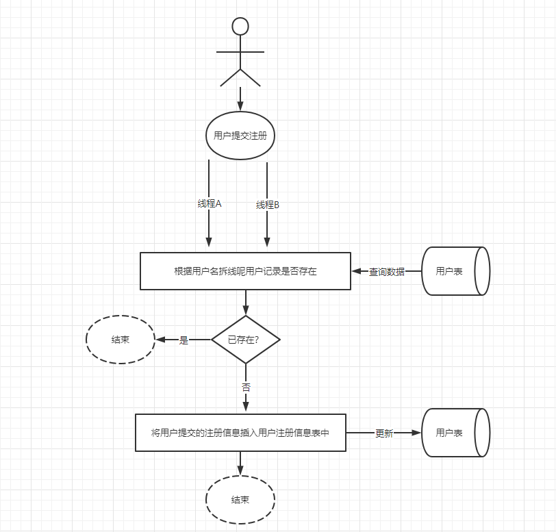

# 基于Redis的方式分布式锁案例


## 概述

分布式锁处理可以采用基于数据库级别的：“乐观锁” 和“悲观锁”实现之外，还可以采用业界比较流行的的方式比如：<Badge type="tip" text="Redis的原子操作实现分布式锁，以及Zookeeper的临时节点和Watcher机制实现分布式锁。"/>

* Redisson (企业级)
* curator 分布式锁(企业级)

参考官方文档 [官方文档](!https://redis.io/docs/modules/)

## Redis的典型应用场景

>[!NOTE]
>* 热点数据的存储和展示，即大部分频繁访问的数据
>* 最近访问的数据存储和展示，即用户访问的最新足迹
>* 消息已读，未读，收藏，浏览数，足迹
>* 好友关注，粉丝，互关，共同好友
>* 限流，黑白名单，抢红包
>* 并发访问控制，分布式锁机制
>* 排行榜：用来代替传统基于数据库的order by
>* 队列机制，基于主题式的发布和订阅，原生的
>* 地理定位GEO
>* 布隆过滤等


## Redis实现分布式锁  — 幂等性问题

<Badge type="tip" text="幂等性：就是用户对于同一操作发起的一次请求或者多次请求的结果是一致的，不会因为多次点击而产生了副作用"/>

在Redis中，可以实现分布式锁的原子操作主要是Set和Expire操作。从redis的2.6x开始，提供了set命令如下：

```sh
set key value [EX seconds] [PX milliseconds] [NX|XX]
```

在改命令中，对应key和value，给为应该很熟悉了。

>[!TIP]
>- EX 是指key的存活时间秒单位
>- PX 是指key的存活时间毫秒单位
>- NX是指当Key不存在的时候才会设置key值
>- XX是指当Key存在时才会设置key的值

从该操作命令不难看出，<Badge type="danger" text="NX机制其实就是用于实现分布式锁的核心"/>，即所谓的SETNX操作，但是在使用setnx实现分布式锁需要注意以下几点：`java setIfAbsent === redis-cli setnx`
获取锁1 ,获取不到就是0

- 使用setnx命令获取：“锁”时，如果操作结果返回0.（表示key已经对应的锁）已经不存在，即当前已被其他的线程获取了锁，则获取：“锁”失败，反之获取成功
- 为了防止并发线程在获取锁之后，程序出现异常的情况，从而导致其他线程在调用setnx命令时总是返回1而进入死锁状态，需要为key设置一个“合理”的过期时间
- 当成功获取：“锁”并执行完成相应的操作之后，需要释放该“锁”，可以通过执行del命令讲“锁”删除，而在删除的时候还需要保证所删除的锁，是当前线程所获取的，从而避免出现误删除的情况。


## 图解




能够实现分布式锁，源自于Redis提供了所有操作的命令均是原子性的，所谓的：“原子性”指的是一个操作要么全部完成，要么全部不完成，每个操作和命令如同一个整体，不可能进行分割。

## 实现用户注册，使用redis分布式锁解决重复注册问题

### 依赖

```xml
<!-- redis -->
<dependency>
    <groupId>org.springframework.boot</groupId>
    <artifactId>spring-boot-starter-data-redis</artifactId>
    <exclusions>
        <exclusion>
            <groupId>io.lettuce</groupId>
            <artifactId>lettuce-core</artifactId>
        </exclusion>
    </exclusions>
</dependency>
<dependency>
    <groupId>redis.clients</groupId>
    <artifactId>jedis</artifactId>
    <version>3.8.0</version>
</dependency>
```

### 配置

```yaml
#redis
spring.redis.host=120.77.34.190
spring.redis.port=6379
spring.redis.password=xxxxx
spring.redis.database=15
spring.redis.timeout=5000
spring.redis.jedis.pool.max-active=20
spring.redis.jedis.pool.max-wait=-1
spring.redis.jedis.pool.max-idle=30
spring.redis.jedis.pool.min-idle=3

```

### sql脚本

```sql
-- ----------------------------
-- Table structure for user_reg
-- ----------------------------
DROP TABLE IF EXISTS `user_reg`;
CREATE TABLE `user_reg` (
  `id` int(11) NOT NULL AUTO_INCREMENT,
  `user_name` varchar(255) NOT NULL COMMENT '用户名',
  `password` varchar(255) NOT NULL COMMENT '密码',
  `create_time` datetime DEFAULT NULL COMMENT '创建时间',
  PRIMARY KEY (`id`)
) ENGINE=InnoDB AUTO_INCREMENT=78 DEFAULT CHARSET=utf8 COMMENT='用户注册信息表';

-- ----------------------------
-- Records of user_reg
-- ----------------------------
INSERT INTO `user_reg` VALUES ('53', 'linsen', '123456', '2019-04-20 23:01:08');
INSERT INTO `user_reg` VALUES ('54', 'debug', '123456', '2019-04-20 23:36:42');
INSERT INTO `user_reg` VALUES ('55', 'debug', '123456', '2019-04-20 23:36:42');
INSERT INTO `user_reg` VALUES ('56', 'jack', '123456', '2019-04-20 23:36:42');
INSERT INTO `user_reg` VALUES ('57', 'sam', '123456', '2019-04-20 23:36:42');
INSERT INTO `user_reg` VALUES ('58', 'jack', '123456', '2019-04-20 23:36:42');
INSERT INTO `user_reg` VALUES ('59', 'jack', '123456', '2019-04-20 23:36:42');
INSERT INTO `user_reg` VALUES ('60', 'sam', '123456', '2019-04-20 23:36:42');
INSERT INTO `user_reg` VALUES ('61', 'sam', '123456', '2019-04-20 23:36:42');
INSERT INTO `user_reg` VALUES ('62', 'database', '123456', '2019-04-20 23:59:41');
INSERT INTO `user_reg` VALUES ('63', 'rabbitmq', '123456', '2019-04-20 23:59:41');
INSERT INTO `user_reg` VALUES ('64', 'lock', '123456', '2019-04-20 23:59:41');
INSERT INTO `user_reg` VALUES ('65', 'java', '123456', '2019-04-20 23:59:41');
INSERT INTO `user_reg` VALUES ('66', 'redis', '123456', '2019-04-20 23:59:41');
INSERT INTO `user_reg` VALUES ('71', 'luohou', '123456', '2019-04-21 21:51:05');
INSERT INTO `user_reg` VALUES ('72', 'lixiaolong', '123456', '2019-04-21 21:51:05');
INSERT INTO `user_reg` VALUES ('73', 'zhongwenjie', '123456', '2019-04-21 21:51:05');
INSERT INTO `user_reg` VALUES ('74', 'userC', '123456', '2019-05-03 15:37:37');
INSERT INTO `user_reg` VALUES ('75', 'userD', '123456', '2019-05-03 15:37:37');
INSERT INTO `user_reg` VALUES ('76', 'userA', '123456', '2019-05-03 15:37:37');
INSERT INTO `user_reg` VALUES ('77', 'userB', '123456', '2019-05-03 15:37:37');

```

### 配置类

```java
/**
 * 通用化配置
 * @Author:debug (SteadyJack)
 * @Date: 2019/3/13 8:38
 * @Link：微信-debug0868 QQ-1948831260
 **/
public class RedisConfiguration {

    //Redis链接工厂
    @Autowired
    private RedisConnectionFactory redisConnectionFactory;

    /**
     * 缓存redis-redisTemplate
     * @return
     */
    @Bean
    public RedisTemplate<String,Object> redisTemplate(){
        RedisTemplate<String,Object> redisTemplate=new RedisTemplate<String, Object>();
        redisTemplate.setConnectionFactory(redisConnectionFactory);
        //TODO:指定大key序列化策略为为String序列化
        redisTemplate.setKeySerializer(new StringRedisSerializer());
        redisTemplate.setValueSerializer(new JdkSerializationRedisSerializer());
        //TODO:指定hashKey序列化策略为String序列化
        redisTemplate.setHashKeySerializer(new StringRedisSerializer());
        //redisTemplate.setHashValueSerializer(new StringRedisSerializer());
        return redisTemplate;
    }

    /**
     * 缓存redis-stringRedisTemplate
     * @return
     */
    @Bean
    public StringRedisTemplate stringRedisTemplate(){
        //采用默认配置即可-后续有自定义配置时则在此处添加即可
        StringRedisTemplate stringRedisTemplate=new StringRedisTemplate();
        stringRedisTemplate.setConnectionFactory(redisConnectionFactory);
        return stringRedisTemplate;
    }

}
```

### 实现分布式锁

```java
public interface IUserRegService extends IService<UserReg> {
    // 无锁
    void regUserNoLock(UserRegVo userRegVo);

    // redis的分布式锁
    void regUserRedisLock(UserRegVo userRegVo);
}

```

```java
@Service
@Slf4j
public class UserRegServiceImpl extends ServiceImpl<UserRegMapper, UserReg> implements IUserRegService {

    @Autowired
    private StringRedisTemplate stringRedisTemplate;


    @Override
    public void regUserNoLock(UserRegVo userRegVo) {
        // 根据用户名查询用户实体信息，如果不存在进行注册
        LambdaQueryWrapper<UserReg> userRegLambdaQueryWrapper = new LambdaQueryWrapper<>();
        // 根据用户名查询对应的用户信息条件
        userRegLambdaQueryWrapper.eq(UserReg::getUserName, userRegVo.getUserName());
        // 执行查询语句
        UserReg userReg = this.getOne(userRegLambdaQueryWrapper);

        if (null == userReg) {
            // 这里切记一定要创建一个用户
            userReg = new UserReg();
            // 使用BeanUtils.copyProperties进行两个对象相同属性的的复制和赋值，如果不同自动忽略
            BeanUtils.copyProperties(userRegVo, userReg);
            // 设置注册时间
            userReg.setCreateTime(new Date());
            // 执行保存和注册用户方法
            this.saveOrUpdate(userReg);
        } else {
            // 如果存在就返回用户信息已经存在
            throw new RuntimeException("用户信息已经注册存在了...");
        }
    }


    @Override
    public void regUserRedisLock(UserRegVo userRegVo) {
        // D yykk_lock 1 ?--晚于 A B C
        // 1: 设置redis的sexnx的key，考虑到幂等性，这个key有如下做法
        // 前提是：前userRegVo.getUserName()必须唯一的，
        // 为什么这样要唯一：A 注册 B也能够注册
        String key = userRegVo.getUserName() + "_lock";
        // 给每个线程线程产生不同的value,目的是：用于删除锁的判断
        String value = System.nanoTime() + "" + UUID.randomUUID();
        // 通过java代码设置setnx
        ValueOperations<String, String> opsForValue = stringRedisTemplate.opsForValue();
        // 获取锁
        //这里又一个隐患，设置太长吞吐量下降，太短可能会造成资源不一致。 这个时间一定要根据实际情况而定
        Boolean resLock = opsForValue.setIfAbsent(key, value,20L,TimeUnit.SECONDS);
        if (resLock) {
            try {
                // 根据用户名查询用户实体信息，如果不存在进行注册
                LambdaQueryWrapper<UserReg> userRegLambdaQueryWrapper = new LambdaQueryWrapper<>();
                // 根据用户名查询对应的用户信息条件
                userRegLambdaQueryWrapper.eq(UserReg::getUserName, userRegVo.getUserName());
                // 执行查询语句
                UserReg userReg = this.getOne(userRegLambdaQueryWrapper);
                if (null == userReg) {
                    // 这里切记一定要创建一个用户
                    userReg = new UserReg();
                    // 使用BeanUtils.copyProperties进行两个对象相同属性的的复制和赋值，如果不同自动忽略
                    BeanUtils.copyProperties(userRegVo, userReg);
                    // 设置注册时间
                    userReg.setCreateTime(new Date());
                    // 执行保存和注册用户方法
                    this.saveOrUpdate(userReg);
                } else {
                    // 如果存在就返回用户信息已经存在
                    throw new RuntimeException("用户信息已经注册存在了...");
                }
            } catch (Exception ex) {
                throw ex;
            } finally {
                // ---------------------释放锁--不论成功还是失败都应该把锁释放掉
                // 不管发生任何情况，都一定是自己删除自己的锁
                if (opsForValue.get(key).toString().equals(value)) {
                    stringRedisTemplate.delete(key);
                }
            }
        }
    }
}

```

### controller

```java
@RestController
@Slf4j
@Api(tags = "Redis分布式锁--用户注册")
public class UserRegController {

    @Autowired
    private IUserRegService userRegService;


    @PostMapping("/user/reg/uuid")
    public String reg() {
        return UUID.randomUUID().toString();
    }


    @ApiOperation("用户注册")
    @GetMapping("/user/reg")
    public R reguser(UserRegVo userRegVo) {
        if (StringUtils.isEmpty(userRegVo.getUserName())) {
            return new R(701, "请输入用户...");
        }
        if (StringUtils.isEmpty(userRegVo.getPassword())) {
            return new R(701, "请输入密码...");
        }

        // 进行用户注册
        R response = new R(StatusCode.Success);
        try {
            // 无锁版本
            //userRegService.regUserNoLock(userRegVo);

            // redis分布式锁
            userRegService.regUserRedisLock(userRegVo);

        } catch (Exception ex) {
            response = new R(701, "注册用户失败");
        }

        return response;
    }

}

```

## 小结

>[!TIP]
>- Redis的分布式锁主要采用setnx+ expire命令来完成
>- Redis的分布式锁得以实现，主要是得益于Redis的单线程操作机制，即在底层基础架构中，同一时刻，同一个部署节点只允许一个线程执行某种操作，这种操作也称之为原子性。
>- 上面的用户注册重复提交的问题，使用了分布式锁的一次性锁，即同一时刻并发的线程锁携带的相同数据只能允许一个线程通过，其他的线程将获取锁失败，而从结束自身的业务流程。