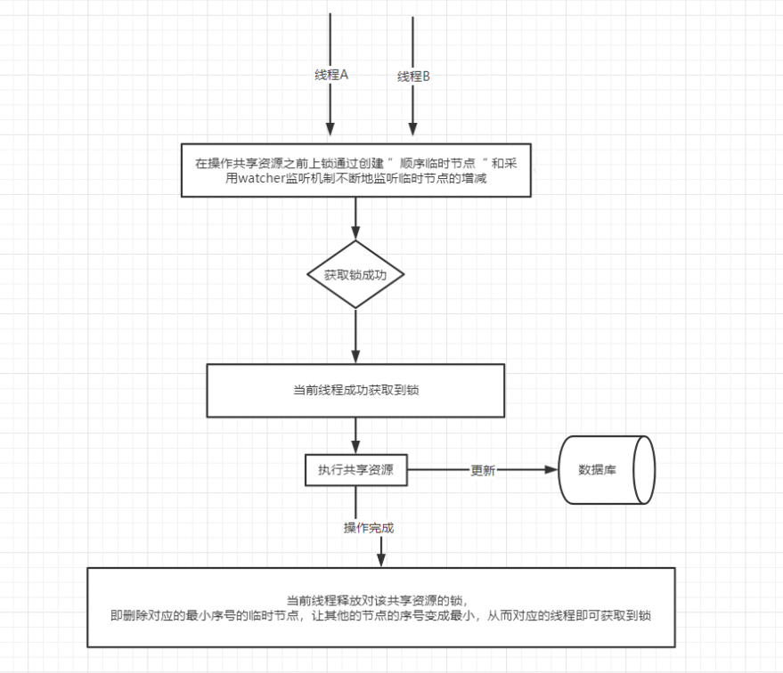
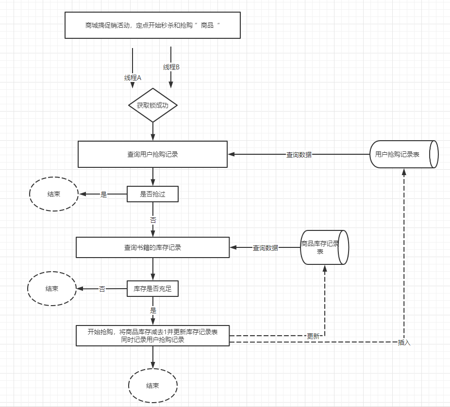

# 基于Zookeeper的方式实现分布式锁 - 商品抢购案例

案例场景：

- 商品表
- 商品库存表
- 抢购商品下单

## Zookeeper概述

Zookeeper是一款开源的分布式服务协调中间件，是由雅虎团队研发而来，其设计的初衷是开发一个通用的，无单点问题的分布式协调框架，采用统一的协调管理方式更好地管理各个子系统，从而让开发者将更多的经理集中在业务逻辑处理上。最终整个分布式系统看上去就想是一个大型的动物园，而这个中间件正好用来协调分布式环境中的各个子系统，zookeeper因此而得名


## Zookeeper可以做什么
官网：[官方文档](https://zookeeper.apache.org/)

- 统一配置管理：将每个子系统都需要配置的文件统一放到zookeeper中的znode节点中。
- 统一命名服务：通过给存放在znode上的资源进行统一命名，各个子系统便可以通过名字获取到节点上响应的资源。
- 分布式锁：通过创建于该共享资源相关的”顺序临时节点“与动态watcher监听机制，而从监控多线程对共享资源的并发访问。(排队取号的机制，如果不明白可以百度找一些文章，其实更加建议结合redis去理解会更好)
  - 为什么一定是：顺序临时节点，因为可以保证每个线程执行的都是唯一的。
  - watcher机制机制：把最小的序号删除以后，一定要把List第一个元素给删除，让其他的线程继续获取锁。
- 集群状态：通过动态地感知节点的增加，删除，从而保证集群下的相关节点数据主，副本数据的一致。


## Zookeeper分布式锁流程

zookeeper实现分布式锁主要是通过创建与共享资源相关的：“顺序临时节点” 并采用其提供的Watcher监听机制，控制多线程对共享资源的并发访问，整体如下：




## SpringBoot整合Zookeeper

zookeeper下载地址：[下载地址](https://archive.apache.org/dist/zookeeper/)


### 1、依赖

```xml
<!--zookeeper-->
<dependency>
    <groupId>org.apache.zookeeper</groupId>
    <artifactId>zookeeper</artifactId>
    <version>3.6.3</version>
    <exclusions>
        <exclusion>
            <artifactId>slf4j-log4j12</artifactId>
            <groupId>org.slf4j</groupId>
        </exclusion>
    </exclusions>
</dependency>
<!-- https://mvnrepository.com/artifact/org.apache.curator/curator-framework -->
<dependency>
    <groupId>org.apache.curator</groupId>
    <artifactId>curator-framework</artifactId>
    <version>4.3.0</version>
</dependency>
<dependency>
    <groupId>org.apache.curator</groupId>
    <artifactId>curator-recipes</artifactId>
    <version>4.3.0</version>
</dependency>
```

### 2、配置

```yaml
#zookeeper配置
zk.host=127.0.0.1:2181
zk.namespace=pug_middle_lock
```

### 3、配置初始化

```java
/**
 * 通用化配置
 **/
@Configuration
public class CuratorFrameworkConfiguration {

    @Value("${zk.host}")
    private String host;
    @Value("${zk.namespace}")
    private String namespace;


    // 自定义注入Bean-ZooKeeper高度封装过的客户端Curator实例
    @Bean
    public CuratorFramework curatorFramework() {
        //创建CuratorFramework实例
        //（1）创建的方式是采用工厂模式进行创建；
        //（2）指定了客户端连接到ZooKeeper服务端的策略：这里是采用重试的机制(5次，每次间隔1s)
        CuratorFramework curatorFramework = CuratorFrameworkFactory.builder()
                .connectString(host).namespace(namespace)
                .retryPolicy(new RetryNTimes(5, 1000)).build();
        curatorFramework.start();
        //返回CuratorFramework实例
        return curatorFramework;
    }

}
```

### 4、用户注册实现分布式锁

```java
/**
 * 处理用户注册信息提交服务Service
 **/
@Service
public class UserRegService {
    //定义日志实例
    private static final Logger log= LoggerFactory.getLogger(UserRegService.class);
    //定义用户注册Mapper操作接口实例
    @Autowired
    private UserRegMapper userRegMapper;


    //定义ZooKeeper客户端CuratorFramework实例
    @Autowired
    private CuratorFramework client;
    //ZooKeeper分布式锁的实现原理是由ZNode节点的创建与删除跟监听机制构成的
    //而ZNoe节点将对应一个具体的路径-跟Unix文件夹路径类似-需要以 / 开头
    private static final String pathPrefix="/middleware/zkLock/";

    /**
     * 处理用户提交注册的请求-加ZooKeeper分布式锁
     * @param dto
     * @throws Exception
     */
    public void userRegWithZKLock(UserRegDto dto) throws Exception{
        //创建ZooKeeper互斥锁组件实例，需要将监控用的客户端实例、精心构造的共享资源 作为构造参数
        InterProcessMutex mutex=new InterProcessMutex(client,pathPrefix+dto.getUserName()+"-lock");
        try {
            //采用互斥锁组件尝试获取分布式锁-其中尝试的最大时间在这里设置为10s
            //当然,具体的情况需要根据实际的业务而定
            if (mutex.acquire(10L, TimeUnit.SECONDS)){
                //TODO：真正的核心处理逻辑

                //根据用户名查询用户实体信息
                UserReg reg=userRegMapper.selectByUserName(dto.getUserName());
                //如果当前用户名还未被注册，则将当前用户信息注册入数据库中
                if (reg==null){
                    log.info("---加了ZooKeeper分布式锁---,当前用户名为：{} ",dto.getUserName());
                    //创建用户注册实体信息
                    UserReg entity=new UserReg();
                    //将提交的用户注册请求实体信息中对应的字段取值
                    //复制到新创建的用户注册实体的相应字段中
                    BeanUtils.copyProperties(dto,entity);
                    //设置注册时间
                    entity.setCreateTime(new Date());
                    //插入用户注册信息
                    userRegMapper.insertSelective(entity);

                }else {
                    //如果用户名已被注册，则抛出异常
                    throw new Exception("用户信息已经存在!");
                }
            }else{
                throw new RuntimeException("获取ZooKeeper分布式锁失败!");
            }
        }catch (Exception e){
            throw e;
        }finally {
            //TODO：不管发生何种情况，在处理完核心业务逻辑之后，需要释放该分布式锁
            mutex.release();
        }
    }

}

```

### 5、实现商品抢购扣减库存



```sql
-- ----------------------------
-- Table structure for book_rob
-- ----------------------------
DROP TABLE IF EXISTS `book_rob`;
CREATE TABLE `book_rob` (
  `id` int(11) NOT NULL AUTO_INCREMENT COMMENT '主键',
  `user_id` int(11) NOT NULL COMMENT '用户id',
  `book_no` varchar(255) NOT NULL COMMENT '商品编号',
  `rob_time` datetime DEFAULT NULL COMMENT '抢购时间',
  PRIMARY KEY (`id`)
) ENGINE=InnoDB AUTO_INCREMENT=153 DEFAULT CHARSET=utf8 COMMENT='商品抢购记录';

-- ----------------------------
-- Records of book_rob
-- ----------------------------
INSERT INTO `book_rob` VALUES ('2', '10010', 'BS20190421001', '2019-04-22 22:49:05');
INSERT INTO `book_rob` VALUES ('147', '10040', 'BS20190421001', '2019-04-22 23:28:05');
INSERT INTO `book_rob` VALUES ('148', '10042', 'BS20190421001', '2019-04-22 23:28:05');
INSERT INTO `book_rob` VALUES ('149', '10041', 'BS20190421001', '2019-04-22 23:28:05');
INSERT INTO `book_rob` VALUES ('150', '10045', 'BS20190421001', '2019-04-22 23:28:05');
INSERT INTO `book_rob` VALUES ('151', '10043', 'BS20190421001', '2019-04-22 23:28:05');
INSERT INTO `book_rob` VALUES ('152', '10044', 'BS20190421001', '2019-04-22 23:28:05');


-- ----------------------------
-- Table structure for book_stock
-- ----------------------------
DROP TABLE IF EXISTS `book_stock`;
CREATE TABLE `book_stock` (
  `id` int(11) NOT NULL AUTO_INCREMENT COMMENT '主键',
  `book_no` varchar(255) NOT NULL COMMENT '商品编号',
  `stock` int(255) NOT NULL COMMENT '库存',
  `is_active` tinyint(255) DEFAULT '1' COMMENT '是否上架（1=是；0=否）',
  PRIMARY KEY (`id`)
) ENGINE=InnoDB AUTO_INCREMENT=2 DEFAULT CHARSET=utf8 COMMENT='商品库存表';

-- ----------------------------
-- Records of book_stock
-- ----------------------------
INSERT INTO `book_stock` VALUES ('1', 'BS20190421001', '4', '1');

```

#### 1、bean
```java

//商品抢购记录实体
@Data
@ToString
public class BookRob {
    private Integer id;    //主键id
    private Integer userId;//用户id
    private String bookNo; //商品编号
    private Date robTime;  //抢购时间
}


```

```java
//商品库存实体
@Data
@ToString
public class BookStock {
    private Integer id;   //主键Id
    private String bookNo;//商品编号
    private Integer stock;//存库
    private Byte isActive;//是否上架
}
```

#### 2、mapper

```java
//商品抢购成功的记录实体Mapper操作接口
public interface BookRobMapper {
    //插入抢购成功的记录信息
    int insertSelective(BookRob record);
    //统计每个用户每本书的抢购数量
    //用于判断用户是否抢购过该商品
    int countByBookNoUserId(@Param("userId") Integer userId,@Param("bookNo") String bookNo);
}
```

```java
//商品库存实体操作接口Mapper
public interface BookStockMapper {
    //根据商品编号查询
    BookStock selectByBookNo(@Param("bookNo") String bookNo);
    //更新商品库存-不加锁
    int updateStock(@Param("bookNo") String bookNo);
    //更新商品库存-加锁
    int updateStockWithLock(@Param("bookNo") String bookNo);
}
```


#### 3、service

```java
/**
 * 商品抢购服务
 **/
@Service
public class BookRobService {
    //定义日志实例
    private static final Logger log= LoggerFactory.getLogger(BookRobService.class);
    //定义商品库存实体操作接口Mapper实例
    @Autowired
    private BookStockMapper bookStockMapper;
    //定义商品抢购实体操作接口Mapper实例
    @Autowired
    private BookRobMapper bookRobMapper;

    //定义ZooKeeper客户端CuratorFramework实例
    @Autowired
    private CuratorFramework client;
    //ZooKeeper分布式锁的实现原理是由ZNode节点的创建与删除跟监听机制构成的
    //而ZNoe节点将对应一个具体的路径-跟Unix文件夹路径类似-需要以 / 开头
    private static final String pathPrefix="/middleware/zkLock/";

    /**
     * 处理商品抢购逻辑-不加分布式锁
     * @param dto
     * @throws Exception
     */
    @Transactional(rollbackFor = Exception.class)
    public void robWithNoLock(BookRobDto dto) throws Exception{
        //根据商品编号查询记录
        BookStock stock=bookStockMapper.selectByBookNo(dto.getBookNo());
        //统计每个用户每本书的抢购数量
        int total=bookRobMapper.countByBookNoUserId(dto.getUserId(),dto.getBookNo());

        //商品记录存在、库存充足，而且用户还没抢购过本书，则代表当前用户可以抢购
        if (stock!=null && stock.getStock()>0 && total<=0){
            log.info("---处理商品抢购逻辑-不加分布式锁---,当前信息：{} ",dto);

            //当前用户抢购到商品，库存减一
            int res=bookStockMapper.updateStock(dto.getBookNo());
            //更新库存成功后，需要添加抢购记录
            if (res>0){
                //创建商品抢购记录实体信息
                BookRob entity=new BookRob();
                //将提交的用户抢购请求实体信息中对应的字段取值
                //复制到新创建的商品抢购记录实体的相应字段中
                BeanUtils.copyProperties(dto,entity);
                //设置抢购时间
                entity.setRobTime(new Date());
                //插入用户注册信息
                bookRobMapper.insertSelective(entity);
            }
        }else {
            //如果不满足上述的任意一个if条件，则抛出异常
            throw new Exception("该商品库存不足!");
        }
    }


    /**
     * 处理商品抢购逻辑-加ZooKeeper分布式锁
     * @param dto
     * @throws Exception
     */
    @Transactional(rollbackFor = Exception.class)
    public void robWithZKLock(BookRobDto dto) throws Exception{
        //创建ZooKeeper互斥锁组件实例，需要将CuratorFramework实例、精心构造的共享资源 作为构造参数
        InterProcessMutex mutex=new InterProcessMutex(client,pathPrefix+dto.getBookNo()+dto.getUserId()+"-lock");
        try {
            //采用互斥锁组件尝试获取分布式锁-其中尝试的最大时间在这里设置为15s
            //当然,具体的情况需要根据实际的业务而定
            if (mutex.acquire(15L, TimeUnit.SECONDS)){
                //TODO：真正的核心处理逻辑

                //根据商品编号查询记录
                BookStock stock=bookStockMapper.selectByBookNo(dto.getBookNo());
                //统计每个用户每本书的抢购数量
                int total=bookRobMapper.countByBookNoUserId(dto.getUserId(),dto.getBookNo());

                //商品记录存在、库存充足，而且用户还没抢购过本书，则代表当前用户可以抢购
                if (stock!=null && stock.getStock()>0 && total<=0){
                    log.info("---处理商品抢购逻辑-加ZooKeeper分布式锁---,当前信息：{} ",dto);

                    //当前用户抢购到商品，库存减一
                    int res=bookStockMapper.updateStock(dto.getBookNo());
                    //更新库存成功后，需要添加抢购记录
                    if (res>0){
                        //创建商品抢购记录实体信息
                        BookRob entity=new BookRob();
                        //将提交的用户抢购请求实体信息中对应的字段取值
                        //复制到新创建的商品抢购记录实体的相应字段中
                        entity.setUserId(dto.getUserId());
                        entity.setBookNo(dto.getBookNo());
                        //设置抢购时间
                        entity.setRobTime(new Date());
                        //插入用户注册信息
                        bookRobMapper.insertSelective(entity);
                    }
                }else {
                    //如果不满足上述的任意一个if条件，则抛出异常
                    throw new Exception("该商品库存不足!");
                }

            }else{
                throw new RuntimeException("获取ZooKeeper分布式锁失败!");
            }
        }catch (Exception e){
            throw e;
        }finally {
            //TODO：不管发生何种情况，在处理完核心业务逻辑之后，需要释放该分布式锁
            mutex.release();
        }
    }
}

```

#### 4、controller

```java
/**
 * 商品抢购Controller
 * @Author:debug (SteadyJack)
 * @Date: 2019/4/21 23:31
 **/
@RestController
public class BookRobController {
    //定义日志
    private static final Logger log= LoggerFactory.getLogger(BookRobController.class);
    //定义请求前缀
    private static final String prefix="book/rob";
    //定义核心逻辑处理服务类
    @Autowired
    private BookRobService bookRobService;

    /**
     * 用户抢购商品请求
     * @param dto
     * @return
     */
    @RequestMapping(value = prefix+"/request",method = RequestMethod.GET)
    public BaseResponse takeMoney(BookRobDto dto){
        if (Strings.isNullOrEmpty(dto.getBookNo()) || dto.getUserId()==null || dto.getUserId()<=0){
            return new BaseResponse(StatusCode.InvalidParams);
        }
        BaseResponse response=new BaseResponse(StatusCode.Success);
        try {
            //加ZooKeeper分布式锁的情况
            bookRobService.robWithZKLock(dto);

        }catch (Exception e){
            response=new BaseResponse(StatusCode.Fail.getCode(),e.getMessage());
        }
        return response;
    }
}
```