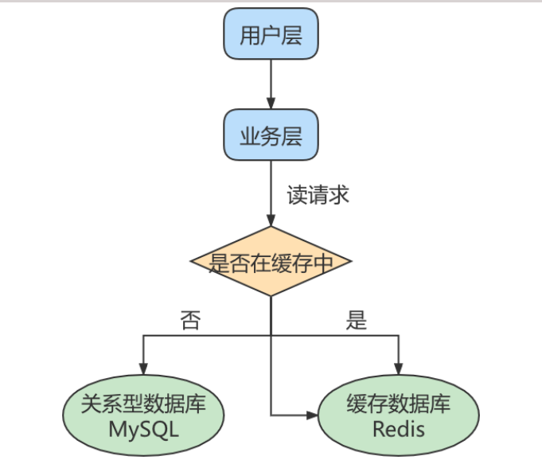

## 如何提升数据库并发能力



一般应用对数据库而言都是<span style="color:#0080c0;">“ 读多写少 ”</span>，也就说对数据库读取数据的压力比较大，有一个思路就 是采用数据库集群的方案，做 <span style="color:#0080c0;">主从架构 、进行 读写分离</span>，这样同样可以提升数据库的并发处理能力。但 并不是所有的应用都需要对数据库进行主从架构的设置，毕竟设置架构本身是有成本的。 

如果我们的目的在于提升数据库高并发访问的效率，那么首先考虑的是如何 <span style="color:#0080c0;">优化SQL和索引 </span>，这种方式 简单有效；其次才是采用 <span style="color:#0080c0;">缓存的策略</span> ，比如使用 Redis将热点数据保存在内存数据库中，提升读取的效 率；最后才是对数据库采用 <span style="color:#0080c0;">主从架构 </span>，进行读写分离。

## 什么是主从复制？

主从复制是指将主数据库的DDL和DML操作通过二进制日志传到从数据库上，然后在从数据库上对这些日志进行重新执行，从而使从数据库和主数据库的数据保持一致。

## 主从复制的作用

主从同步设计不仅可以提高数据库的吞吐量，还有以下 3 个方面的作用。

- 读写分离

    

- 数据备份

- 具有高可用性

## 原理剖析

实际上主从同步的原理就是基于 binlog 进行数据同步的。在主从复制过程中，会基于 <span style="color:#0080c0;">3 个线程</span> 来操 作，一个主库线程，两个从库线程。

三个线程分别是：<span style="color:#0080c0;">master（binlog dump thread）、slave（I/O thread 、SQL thread）</span>。


<span style="color:#0080c0;">二进制日志转储线程</span> （Binlog dump thread）是一个主库线程。当从库线程连接的时候， 主库可以将二进 制日志发送给从库，当主库读取事件（Event）的时候，会在 Binlog 上 加锁 ，读取完成之后，再将锁释 放掉。

<span style="color:#0080c0;">从库 I/O 线程</span> 会连接到主库，向主库发送请求更新 Binlog。这时从库的 I/O 线程就可以读取到主库的 二进制日志转储线程发送的 Binlog 更新部分，并且拷贝到本地的中继日志 （Relay log）。 

<span style="color:#0080c0;">从库 SQL 线程</span> 会读取从库中的中继日志，并且执行日志中的事件，将从库中的数据与主库保持同步。


1. <span style="color:#0080c0;">Master </span>将写操作记录到二进制日志（ <span style="color:#0080c0;">binlog </span>）。

2. <span style="color:#0080c0;">Slave</span> 将 Master 的binary log events拷贝到它的中继日志（ <span style="color:#0080c0;">relay log</span> ）。

3. <span style="color:#0080c0;">Slave</span> 重做中继日志中的事件，将改变应用到自己的数据库中。 MySQL复制是异步的且串行化 的，而且重启后从 接入点 开始复制。

> 复制的最大问题：<span style="color:#0080c0;">延时</span>

## 复制的基本原则

- 每个 <span style="color:#0080c0;">Slave </span>只有一个 <span style="color:#0080c0;">Master </span>

- 每个<span style="color:#0080c0;"> Slave </span>只能有一个唯一的服务器ID 

- 每个 <span style="color:#0080c0;">Master</span> 可以有多个 <span style="color:#0080c0;">Slave</span>

## 准备工作

1. 准备 2台 CentOS 虚拟机 
2. 每台虚拟机上需要安装好MySQL (可以是MySQL8.0 ) 说明：前面我们讲过如何克隆一台CentOS。大家可以在一台CentOS上安装好MySQL，进而通过克隆的方式复制出1台包含MySQL的虚拟机。

>[!tip]注意
> 克隆的方式需要修改新克隆出来主机的：
> <span style="color:#0080c0;">
> ① MAC地址 ② hostname ③ IP 地址 ④ UUID </span>。
>
>此外，克隆的方式生成的虚拟机（包含MySQL Server），则克隆的虚拟机MySQL Server的UUID相同，必 须修>改，否则在有些场景会报错。
>
>比如： show slave status\G ，报如下的错误： 修改MySQL Server 的UUID方式：

```sql
Last_IO_Error: Fatal error: The slave I/O thread stops because master and slave have
equal MySQL server UUIDs; these UUIDs must be different for replication to work.
```

修改MySQL Server 的UUID方式：

```bash
# 修改MySQL Server的UUID
vim /var/lib/mysql/auto.cnf
# 重启MySQL服务配置
systemctl restart mysqld
```

## 主机配置文件

建议mysql版本一致且后台以服务运行，主从所有配置项都配置在 [mysqld] 节点下，且都是小写字母。 具体参数配置如下：

- 必选

    ```sql
    #[必须]主服务器唯一ID
    server-id=1
    #[必须]启用二进制日志,指名路径。比如：自己本地的路径/log/mysqlbin
    log-bin=atguigu-bin
    ```

- 可选

    ```sql
    #[可选] 0（默认）表示读写（主机），1表示只读（从机）
    read-only=0
    #设置日志文件保留的时长，单位是秒
    binlog_expire_logs_seconds=6000
    #控制单个二进制日志大小。此参数的最大和默认值是1GB
    max_binlog_size=200M
    #[可选]设置不要复制的数据库
    binlog-ignore-db=test
    #[可选]设置需要复制的数据库,默认全部记录。比如：binlog-do-db=atguigu_master_slave
    binlog-do-db=需要复制的主数据库名字
    #[可选]设置binlog格式
    binlog_format=STATEMENT

    ```

## 从机配置文件

要求主从所有配置项都配置在 <span style="color:#0080c0;">my.cnf </span>的 <span style="color:#0080c0;">[mysqld] </span>栏位下，且都是小写字母。

- 必选

    ```sql
    #[必须]从服务器唯一ID
    server-id=2
    ```

- 可选

    ```sql
    #[可选]启用中继日志
    relay-log=mysql-relay
    ```

重启后台mysql服务，使配置生效。

>[!danger]注意
>主从机都关闭防火墙
>
>- service iptables stop #CentOS 6
>
>- systemctl stop firewalld.service #CentOS 7

## 在主机上：建立账户并授权

MySQL5.7授权方式：

```sql
#在主机MySQL里执行授权主从复制的命令
GRANT REPLICATION SLAVE ON *.* TO 'slave1'@'从机器数据库IP' IDENTIFIED BY 'abc123';
```

>[!danger]注意：如果使用的是MySQL8，需要如下的方式建立账户，并授权slave

```sql
# 创建用户
CREATE USER 'slave1'@'%' IDENTIFIED BY '123456';
# 给创建的用户授权
GRANT REPLICATION SLAVE ON *.* TO 'slave1'@'%';
#此语句必须执行。否则见下面。
ALTER USER 'slave1'@'%' IDENTIFIED WITH mysql_native_password BY '123456';
# 刷新权限
flush privileges;
```

>[!danger]注意
> 如果在MySQL8中如果没有执行ALTER USER 'slave1'@'%' IDENTIFIED WITH mysql_native_password BY '123456';命令，则在从机执行show slave status\G时报错如下
>
> Last_IO_Error: error connecting to master 'slave1@192.168.1.150:3306' - retry-time: 60 retries: 1 message: Authentication plugin 'caching_sha2_password' reported error: Authentication requires secure connection.

查询Master的状态，并记录下File和Position的值。

```sql
show master status;
```


记录下File和Position的值

>[!danger]注意：执行完此步骤后不要再操作主服务器MySQL，防止主服务器状态值变化。

## 在从机上：配置需要复制的主机

1. 从机上复制主机的命令

     ```properties
     CHANGE MASTER TO
     MASTER_HOST='主机的IP地址',
     MASTER_USER='主机用户名',
     MASTER_PASSWORD='主机用户名的密码',
     MASTER_LOG_FILE='mysql-bin.具体数字',
     MASTER_LOG_POS=具体值;
     ```

     >[!tip]举例
     >
     >CHANGE MASTER TO MASTER_HOST='192.168.1.150',MASTER_USER='slave1',MASTER_PASSWORD='123456',MASTER_LOG_F ILE='atguigu-bin.000007',MASTER_LOG_POS=154;

2. 启动slave同步

     ```sql
     #启动slave同步
     START SLAVE;
     ```

     如果报错：

     

     可以执行如下操作，删除之前的relay_log信息。然后重新执行 CHANGE MASTER TO ...语句即可。

     ```sql
     #删除SLAVE数据库的relaylog日志文件，并重新启用新的relaylog文件
     reset slave;
     ```

     接着，查看同步状态：

    
