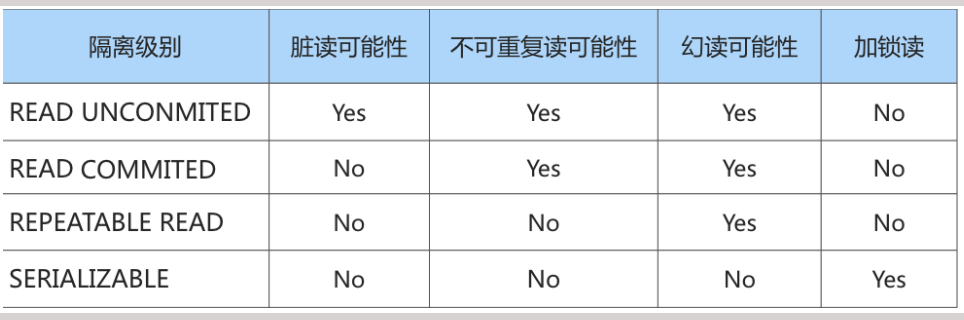
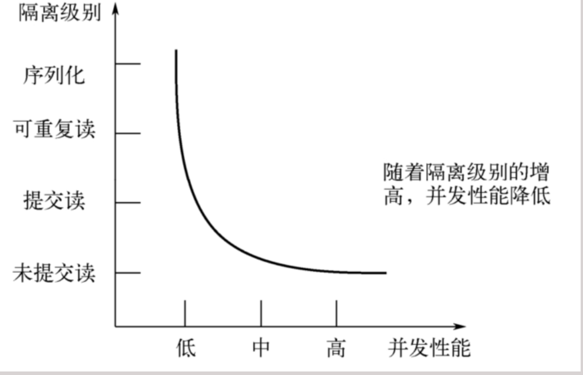

## 事务的基本概念

<span style="color:red;">事务：</span>一组逻辑操作单元，使数据从一种状态变换到另一种状态。

<span style="color:red;">事务处理的原则：</span>保证所有事务都作为 一个工作单元 来执行，即使出现了故障，都不能改变这种执行方式。当在一个事务中执行多个操作时，要么所有的事务都被提交( commit )，那么这些修改就永久地保
存下来；要么数据库管理系统将 放弃 所作的所有 修改 ，整个事务回滚( rollback )到最初状态。

## 事务的ACID特性

- <span style="color:red;">原子性（atomicity）</span>

    原子性是指事务是一个不可分割的工作单位，要么全部提交，要么全部失败回滚。

- <span style="color:red;">一致性（consistency）</span>

    根据定义，一致性是指事务执行前后，数据从一个 合法性状态 变换到另外一个 合法性状态 。这种状态
    是语义上 的而不是语法上的，跟具体的业务有关。
    那什么是合法的数据状态呢？满足 预定的约束 的状态就叫做合法的状态。通俗一点，这状态是由你自己
    来定义的（比如满足现实世界中的约束）。满足这个状态，数据就是一致的，不满足这个状态，数据就
    是不一致的！如果事务中的某个操作失败了，系统就会自动撤销当前正在执行的事务，返回到事务操作
    之前的状态。

- <span style="color:red;">隔离型（isolation）</span>

    事务的隔离性是指一个事务的执行 不能被其他事务干扰 ，即一个事务内部的操作及使用的数据对 并发 的
    其他事务是隔离的，并发执行的各个事务之间不能互相干扰。

- <span style="color:red;">持久性（durability）</span>

    持久性是指一个事务一旦被提交，它对数据库中数据的改变就是 永久性的 ，接下来的其他操作和数据库
    故障不应该对其有任何影响。
    持久性是通过 事务日志 来保证的。日志包括了 重做日志 和 回滚日志 。当我们通过事务对数据进行修改
    的时候，首先会将数据库的变化信息记录到重做日志中，然后再对数据库中对应的行进行修改。这样做
    的好处是，即使数据库系统崩溃，数据库重启后也能找到没有更新到数据库系统中的重做日志，重新执
    行，从而使事务具有持久性。


## 事务隔离级别


### 数据并发问题

针对事务的隔离性和并发性，我们怎么做取舍呢？先看一下访问相同数据的事务在 不保证串行执行（也
就是执行完一个再执行另一个）的情况下可能会出现哪些问题

- <span style="color:red;">脏写（ Dirty Write ）</span> 

    对于两个事务或两个以上的事务，例如：有事务A，事务B，两个事务。事务A修改了事务B修改过且没有提交的数据，这就称为脏写。


- <span style="color:red;">脏读（Dirty Read）</span>

    对于两个事务或及两个以上的事务，例如：有事务A，事务B，两个事务。如果事务A修改了表中的某些数据，但是事务A还没有提交（commit）,此时事务B对事务A操作的表进行了查询，获取到事务A操作过并没有commit的数据。这种操作成为脏读。

- <span style="color:red;">不可重复读（ Non-Repeatable Read ）</span> 

    对于两个事务或及两个以上的事务，例如：有事务A，事务B，两个事务。事务A读取了数据库中表的某条数据,而事务B对事务A读取的那条数据进行了<span style="color:red;">更新、修改</span>操作，当事务A再次对同一条数据进行读取时得到的结果与第一次读取的结果不相同，这就称为不可重复读。

- <span style="color:red;">幻读（ Phantom ）</span>

    对于两个事务或及两个以上的事务，例如：有事务A，事务B，两个事务。事务A读取数据库中某表的数据，然后事务B往事务A操作的表<span style="color:red;">插入</span>了某些数据，当事务A再次读取表时会发现多了几条数据。这就称为幻读。（多出来的数据就是事务B插入的数据）。

### SQL中的四种隔离级别

上面介绍了几种并发事务执行过程中可能遇到的一些问题，这些问题有轻重缓急之分，我们给这些问题
按照严重性来排一下序

```properties
脏写>脏读>不可重复读>幻读
```

我们愿意舍弃一部分隔离性来换取一部分性能在这里就体现在：设立一些隔离级别，隔离级别越低，并
发问题发生的就越多。

SQL标准中设立了4个隔离级别：

- <span style="color:red;">READ UNCOMMITTED</span>

    读未提交，在该隔离级别，所有事务都可以看到其他未提交事务的执行结果。不能避免脏读、不可重复读、幻读。

- <span style="color:red;">READ COMMITTED</span>

    读已提交，它满足了隔离的简单定义：一个事务只能看见已经提交事务所做的改变。这是大多数数据库系统的默认隔离级别（但不是MySQL默认的）。可以避免脏读，但不可重复读、幻读问题仍然存在。

- <span style="color:red;">REPEATABLE READ</span>

    可重复读，事务A在读到一条数据之后，此时事务B对该数据进行了修改并提交，那么事务A再读该数据，读到的还是原来的内容。可以避免脏读、不可重复读，但幻读问题仍然存在。这是MySQL的默认隔离级别。

- <span style="color:red;">SERIALIZABLE ：</span>

    可串行化，确保事务可以从一个表中读取相同的行。在这个事务持续期间，禁止其他事务对该表执行插入、更新和删除操作。所有的并发问题都可以避免，但性能十分低下。能避免脏读、不可重复读和幻读。


SQL标准中规定，针对不同的隔离级别，并发事务可以发生不同严重程度的问题，具体情况如下：



<span style="color:red;">脏写</span> 怎么没涉及到？因为脏写这个问题太严重了，不论是哪种隔离级别，都不允许脏写的情况发生。
不同的隔离级别有不同的现象，并有不同的锁和并发机制，隔离级别越高，数据库的并发性能就越差

4种事务隔离级别与并发性能的关系如下：



### MySQL支持的4种事务隔离级别

在MySQL数据库中，都支持SQL标准中的事务隔离级别。默认为<span style="color:red;">REPEATABLE READ</span>级别。

通过下面的语句修改事务的隔离级别：

```sql
SET [GLOBAL|SESSION] TRANSACTION ISOLATION LEVEL 隔离级别;
# 其中，隔离级别格式：
# READ UNCOMMITTED
# READ COMMITTED
# REPEATABLE READ
# SERIALIZABLE
```

或者

```sql
SET [GLOBAL|SESSION] TRANSACTION_ISOLATION = '隔离级别';
# 其中，隔离级别格式：
# READ-UNCOMMITTED
# READ-COMMITTED
# REPEATABLE-READ
# SERIALIZABLE
```

- GLOBAL 全局范围影响

``` sql
SET GLOBAL TRANSACTION ISOLATION LEVEL SERIALIZABLE;
# 或
SET GLOBAL TRANSACTION_ISOLATION = 'SERIALIZABLE';

```

>[!tip]贴士
>只对当前已经存在的会话无效
>
>只对执行完该语句之后产生的会话起作用

- SESSION 会话范围影响

```sql
SET SESSION TRANSACTION ISOLATION LEVEL SERIALIZABLE;
#或
SET SESSION TRANSACTION_ISOLATION = 'SERIALIZABLE';
```

>[!tip]贴士
>对当前会话的所有后续的事务有效
>
>如果在事务之间执行，则对后续的事务有效
>
>该语句可以在已经开启的事务中间执行，但不会影响当前正在执行的事务


### 小结

数据库规定了多种事务隔离级别，不同隔离级别对应不同的干扰程度，隔离级别越高，数据一致性
就越好，但并发性越弱。
