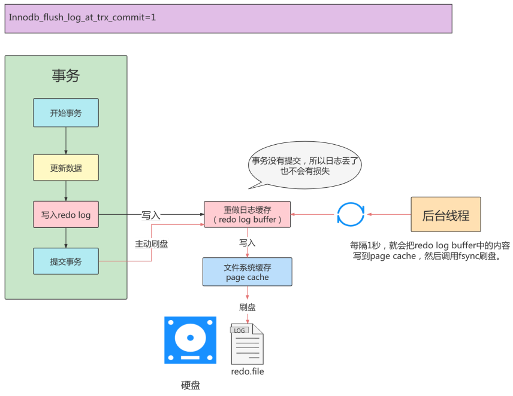

事务有4种特性：原子性、一致性、隔离性和持久性。那么事务的四种特性到底是基于什么机制实现呢？

- 事务的隔离性由<span style="color:#0080c0;"> 锁机制</span> 实现。

- 而事务的原子性、一致性和持久性由事务的redo日志和undo日志来保证。

redo log 称为 <span style="color:#0080c0;">重做日志</span> ，提供再写入操作，恢复提交事务修改的页操作，用来保证事务的持 久性。

undo log 称为<span style="color:#0080c0;"> 回滚日志</span> ，回滚行记录到某个特定版本，用来保证事务的原子性、一致性。

## 为什么需要redo log

我们都知道，事务的四大特性里面有一个是<span style="color:#0080c0;">**持久性**</span>，具体来说就是<span style="color:#0080c0;">**只要事务提交成功，那么对数据库做的修改就被永久保存下来了，不可能因为任何原因再回到原来的状态**。</span>那么<span style="color:#0080c0;">mysql</span>是如何保证持久性的呢？最简单的做法是在每次事务提交的时候，将该事务涉及修改的数据页全部刷新到磁盘中。但是这么做会有严重的性能问题，

主要体现在两个方面

1. 因为<span style="color:#0080c0;">Innodb</span>是以`页`为单位进行磁盘交互的，而一个事务很可能只修改一个数据页里面的几个字节，这个时候将完整的数据页刷到磁盘的话，太浪费资源了！

2. 一个事务可能涉及修改多个数据页，并且这些数据页在物理上并不连续，使用随机IO写入性能太差！

因此<span style="color:#0080c0;">MySQL</span>设计了redo log，<span style="color:#0080c0;">**具体来说就是只记录事务对数据页做了哪些修改**</span>，这样就能完美地解决性能问题了(相对而言文件更小并且是顺序IO)。

## redo log基本概念

redo log包括两部分：一个是内存中的日志缓冲(<span style="color:#0080c0;">redo log buffer</span>)，另一个是磁盘上的日志文件(<span style="color:#0080c0;">redo log file</span>)。

MySQL每执行一条<span style="color:#0080c0;">DML</span>语句，先将记录写入redo log buffer，后续某个时间点再一次性将多个操作记录写到redo log file。

这种<span style="color:#0080c0;">**先写日志，再写磁盘**</span>的技术就是MySQL里经常说到的<span style="color:#0080c0;">WAL(Write-Ahead Logging)</span>技术。Write-Ahead Logging（预先日志持久化）：在持久化一个数据页之前，先将内存中相应的日志页持久化。

## redo的组成

redo log可以简单分为以下两个部分：

- 重做日志的缓冲 (redo log buffer) ，保存在内存中，是易失的。
    redo log buffer大小默认为16M，最大值为4096M，最小值为1M。

    ```sql
    # 查看redo log buffer的缓冲大小
    show variables like '%innodb_log_buffer_size%';
    ```

- 重做日志文件 (redo log file) ，保存在硬盘中，是持久的。

## redo log的好处、特点

- 好处
    - redo日志降低了刷盘频率

    - redo日志占用的空间非常小

- 特点
    - redo日志是顺序写入磁盘的 事务执行过程中

    - redo log不断记录

## redo的整体流程

以一个更新事务为例，redo log 流转过程，如下图所示：


```properties
第1步：先将原始数据从磁盘中读入内存中来，修改数据的内存拷贝

第2步：生成一条重做日志并写入redo log buffer，记录的是数据被修改后的值

第3步：当事务commit时，将redo log buffer中的内容刷新到 redo log file，对redo log file采用追加写的方式

第4步：定期将内存中修改的数据刷新到磁盘中

```

## redo log的刷盘策略

redo log的写入并不是直接写入磁盘的，InnoDB引擎会在写redo log的时候先写redo log buffer，之后以 一 定的频率 刷入到真正的redo log file 中。这里的一定频率怎么看待呢？这就是我们要说的刷盘策略。


>[!tip]注意
> redo log buffer刷盘到redo log file的过程并不是真正的刷到磁盘中去，只是刷入到 <span style="color:#0080c0;">文件系统缓存 （page cache）</span>中去（这是现代操作系统为了提高文件写入效率做的一个优化），真正的写入会交给系 统自己来决定（比如page cache足够大了）。那么对于InnoDB来说就存在一个问题，如果交给系统来同步，同样如果系统宕机，那么数据也丢失了（虽然整个系统宕机的概率还是比较小的）。

针对这种情况，InnoDB给出 <span style="color:#0080c0;"> innodb_flush_log_at_trx_commit </span>参数，该参数控制 commit提交事务时，如何将 redo log buffer 中的日志刷新到 redo log file中。

它支持三种策略：

## 不同刷盘策略演示

- 当<span style="color:#0080c0;"> innodb_flush_log_at_trx_commit </span>值为0时


- 当<span style="color:#0080c0;"> innodb_flush_log_at_trx_commit </span>值为1时



- 当<span style="color:#0080c0;"> innodb_flush_log_at_trx_commit </span>值为2时


## redo log file

- <span style="color:#0080c0;">innodb_log_group_home_dir</span>

    指定 redo log 文件组所在的路径，默认值为 ./ ，表示在数据库的数据目录下。

    MySQL的默认数据目录（ var/lib/mysql ）下默认有两个名为 ib_logfile0 和 ib_logfile1 的文件，log buffer中的日志默认情况下就是刷新到这两个磁盘文件中。此redo日志 文件位置还可以修改。

- <span style="color:#0080c0;">innodb_log_files_in_group</span>

    指明redo log file的个数，命名方式如：ib_logfile0，iblogfile1... iblogfilen。

    默认2个，最大100个。

    查看innodb_log_files_group个数的命令

    ```sql
    show variables like 'innodb_log_files_in_group';
    ```

- <span style="color:#0080c0;">innodb_flush_log_at_trx_commit</span>

    控制 redo log 刷新到磁盘的策略，默认为1。

- <span style="color:#0080c0;"> innodb_log_file_size</span>

    单个 redo log 文件设置大小，默认值为 48M 。

    最大值为512G，注意最大值指的是整个redo log 系列文件之和，

    即（innodb_log_files_in_group * innodb_log_file_size ）不能大于最大值512G。

## 日志文件组


总共的redo日志文件大小其实就是：

<span style="color:#0080c0;"> innodb_log_file_size × innodb_log_files_in_group </span>。

采用循环使用的方式向redo日志文件组里写数据的话，会导致后写入的redo日志覆盖掉前边写的redo日志？当然！所以InnoDB的设计者提出了checkpoint的概念。

### checkpoint


如果 write pos追上checkpoint ，表示<span style="color:#0080c0;">日志文件组满</span>了，这时候不能再写入新的redo log记录，MySQL 得 停下来，清空一些记录，把 checkpoint 推进一下。


