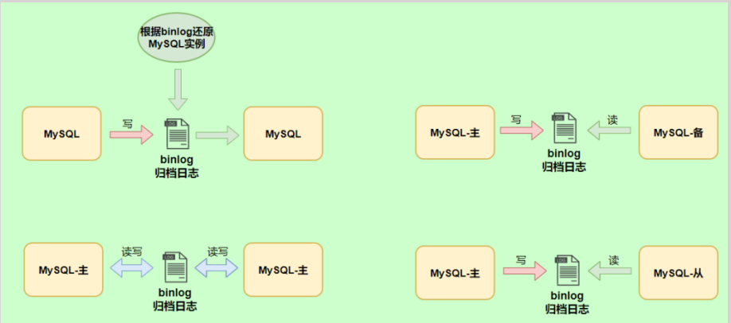
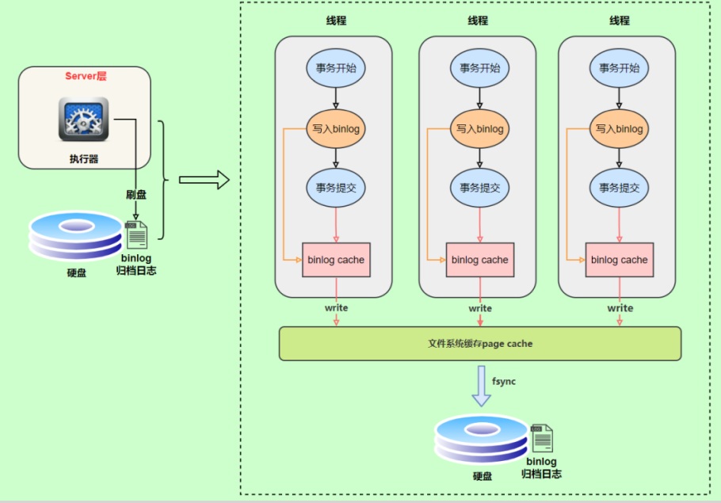
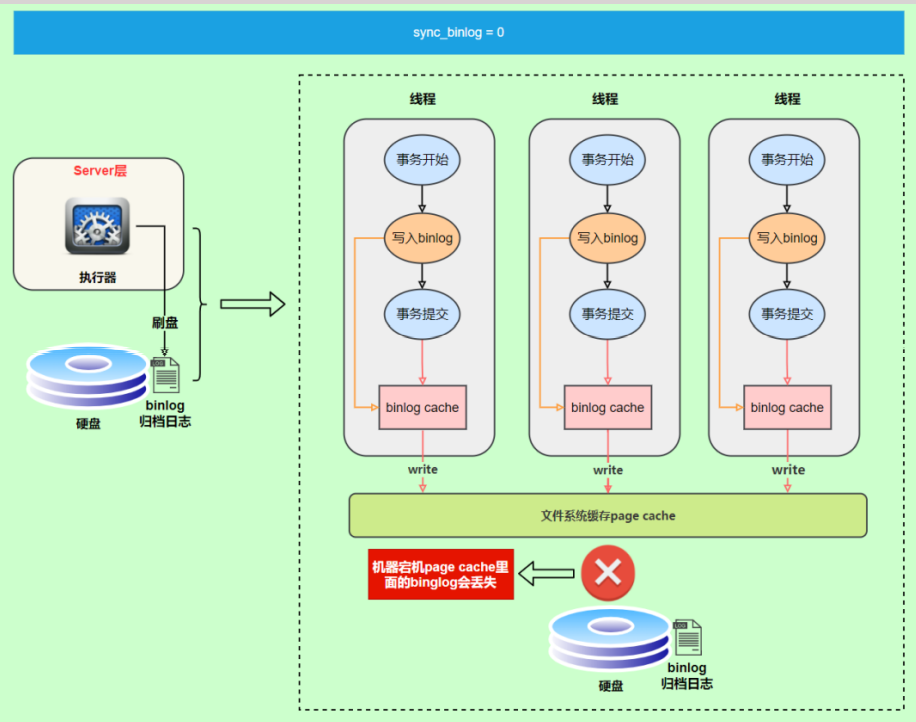
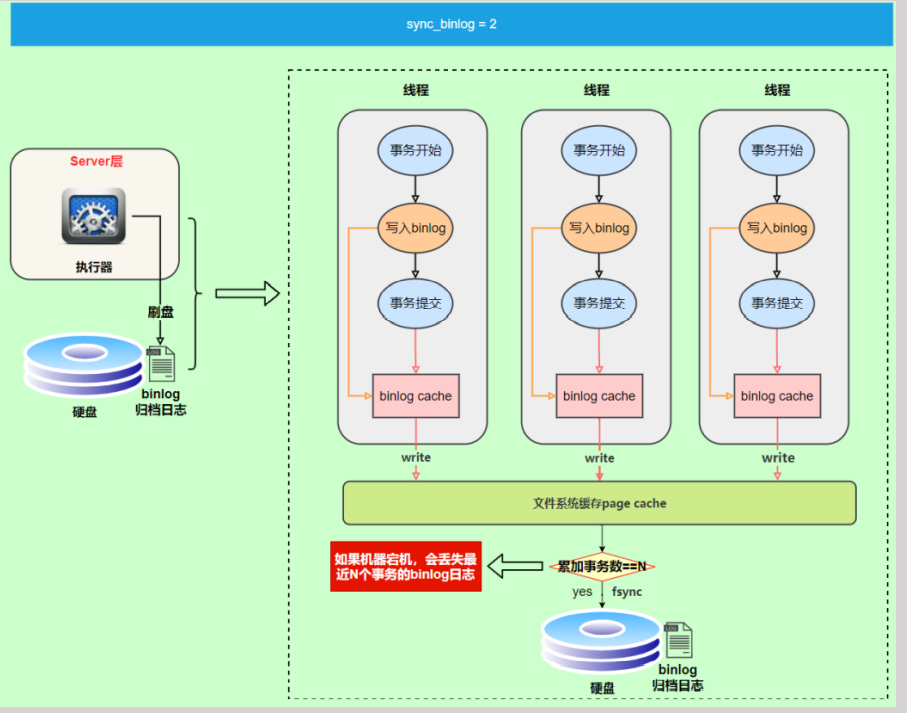
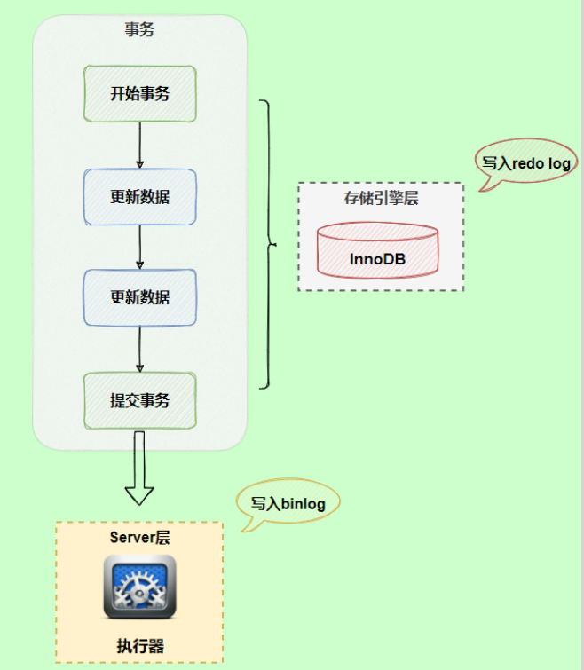
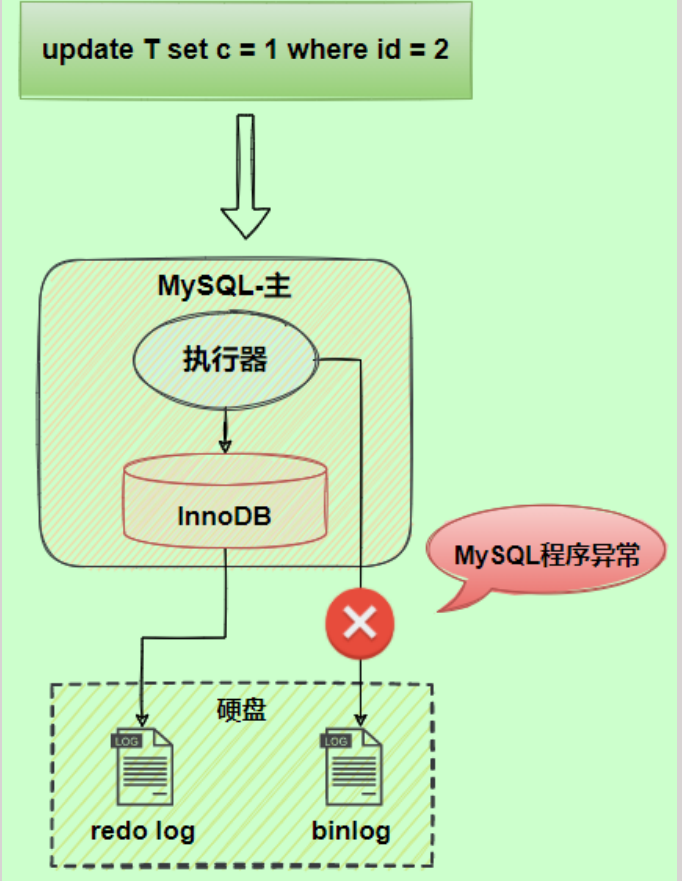
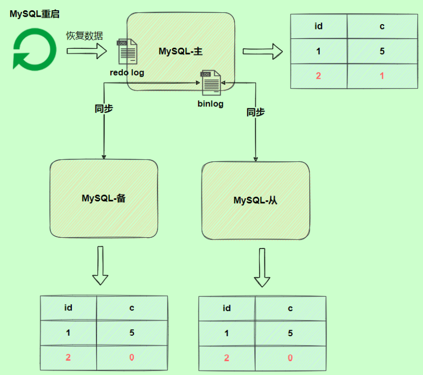
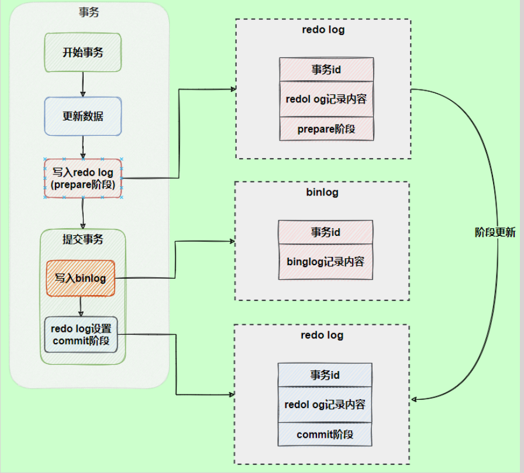
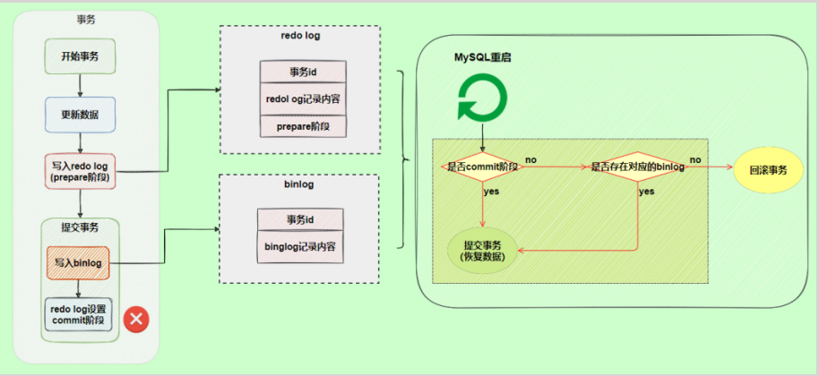

## 概述

binlog可以说是MySQL中比较 重要的日志了，在日常开发及运维过程中，经常会遇到。 binlog即binary log，二进制日志文件，也叫作变更日志（update log）。它记录了数据库所有执行的 DDL和 DML等数据库更新事件的语句，但是不包含没有修改任何数据的语句（如数据查询语句select、 show等）。

它以<span style="color:#0080c0;">事件形式</span>记录并保存在<span style="color:#0080c0;">二进制文件</span>中。通过这些信息，我们可以再现数据更新操作的全过程。

> 如果想要记录所有语句（例如：为了识别有问题的查询），需要使用通用查询日志。

binlog主要应用场景：

- 一是用于<span style="color:#0080c0;"> 数据恢复</span>，如果MySQL数据库意外停止，可以通过二进制文件来查看用户执行了那些操作，对数据库服务器文件做了哪些修改，然后根据二进制文件中的记录来恢复数据库服务器。

- 二是用于<span style="color:#0080c0;"> 数据复制</span>，由于日志的延续性和时效性，master把它的二进制日志传递给slaves来达到master->slave数据一致的目的。



可以说MySQL数据的<span style="color:#0080c0;">数据备份、主备、主主、主从</span>都离不开binlog，需要依靠binlog来同步数据，保证数据一致性。

## 日志参数设置

查看记录二进制日志是否开启：在MySQL8中默认情况下，二进制文件是开启的。

```sql
show variables like '%log_bin%';
```

### 永久性方式

修改MySQL的my.cnf或my.ini文件可以设置二进制日志的相关参数

```properties
[mysqld]
#启用二进制日志
log-bin=atguigu-bin
binlog_expire_logs_seconds=600
max_binlog_size=100M
```

>[!tip]提示
>
>1. log-bin=mysql-bin #打开日志(主机需要打开)，这个mysql-bin也可以自定义，这里也可以加上路径，
>如：/home/www/mysql_bin_log/mysql-bin
>
>2. binlog_expire_logs_seconds:此参数控制二进制日志文件保留的时长，单位是秒，默认2592000 30天， 14400 4小时 ，86400 1天，259200 3天。
>
>3. max_binlog_size：控制单个二进制日志大小，当前日志文件大小超过此变量时，执行切换动作。此参数的最大值和默认值是1GB，该设置并不能严格控制Binlog的大小，尤其是Binlog比较靠近最大值而又遇到一个比较大事务时，为了保证事务的完整性，可能不做切换日志的动作，只能将该事务的所有SQL都记录进当前日志，直到事务结束。一般情况可采取默认值。

重新启动MySQL服务，查询二进制日志的信息，执行结果

```sql
mysql> show variables like '%log_bin%';
+---------------------------------+----------------------------------+
| Variable_name | Value |
+---------------------------------+----------------------------------+
| log_bin | ON |
| log_bin_basename | /var/lib/mysql/atguigu-bin |
| log_bin_index | /var/lib/mysql/atguigu-bin.index |
| log_bin_trust_function_creators | OFF |
| log_bin_use_v1_row_events | OFF |
| sql_log_bin | ON |
+---------------------------------+----------------------------------+
6 rows in set (0.00 sec)
```

设置带文件夹的bin-log日志存放目录

如果想改变日志文件的目录和名称，可以对my.cnf或my.ini中的log_bin参数修改如下

```properties
[mysqld]
log-bin="/var/lib/mysql/binlog/atguigu-bin"
```

>[!tip]注意
>新建的文件夹需要使用mysql用户，使用下面的命令即可。

### 临时性方式

如果不希望通过修改配置文件并重启的方式设置二进制日志的话，还可以使用如下指令，需要注意的是在mysql8中只有会话级别的设置，没有了global级别的设置。

```properties
# global 级别
mysql> set global sql_log_bin=0;
ERROR 1228 (HY000): Variable 'sql_log_bin' is a SESSION variable and can`t be used
with SET GLOBAL
# session级别
mysql> SET sql_log_bin=0;
Query OK, 0 rows affected (0.01 秒)
```

## 查看日志

当MySQL创建二进制日志文件时，先创建一个以“filename”为名称、以“.index”为后缀的文件，再创建一个以“filename”为名称、以“.000001”为后缀的文件。 

MySQL服务<span style="color:#0080c0;">重新启动一次</span>，以“.000001”为后缀的文件就会增加一个，并且后缀名按1递增。

即日志文件的个数与MySQL服务启动的次数相同；如果日志长度超过了<span style="color:#0080c0;"> max_binlog_size</span> 的上限（默认是1GB），就会创建一个新的日志文件。 查看当前的二进制日志文件列表及大小。指令如下：

```sql
 SHOW BINARY LOGS;
```

下面命令将行事件以 <span style="color:#0080c0;">伪SQL的形式</span>表现出来

```properties
mysqlbinlog -v "binlog存在的完整路径"
```

上面这种办法读取出binlog日志的全文内容比较多，不容易分辨查看到pos点信息，下面介绍一种更为方 便的查询命令：

```sql
mysql> show binlog events [IN 'log_name'] [FROM pos] [LIMIT [offset,] row_count];
```

- <span style="color:#0080c0;">IN 'log_name' ：</span>指定要查询的binlog文件名（不指定就是第一个binlog文件）　

- <span style="color:#0080c0;">FROM pos ：</span>指定从哪个pos起始点开始查起（不指定就是从整个文件首个pos点开始算）

- <span style="color:#0080c0;">LIMIT [offset] ：</span>偏移量(不指定就是0)

- <span style="color:#0080c0;">row_count :</span>查询总条数（不指定就是所有行）


## 使用日志恢复数据

MySQL binlog恢复数据的语法如下

```sql
mysqlbinlog [option] filename|mysql –uuser -ppass;
```

这个命令可以这样理解：使用mysqlbinlog命令来读取filename中的内容，然后使用mysql命令将这些内容 恢复到数据库中。

- filename

     日志文件名。

- option

     可选项，比较重要的两对option参数是--start-date、--stop-date 和 --start-position、-- stop-position。

     --start-date 和 --stop-date：可以指定恢复数据库的起始时间点和结束时间点。

     --start-position和--stop-position：可以指定恢复数据的开始位置和结束位置。

    >[!tip]注意
    > 使用mysqlbinlog命令进行恢复操作时，必须是编号小的先恢复，例如atguigu-bin.000001必 须在atguigu-bin.000002之前恢复。


## 删除二进制日志

MySQL的二进制文件可以配置自动删除，同时MySQL也提供了安全的手动删除二进制文件的方法。 

<span style="color:#0080c0;">PURGE MASTER LOGS </span>只删除指定部分的二进制日志文件，

<span style="color:#0080c0;">RESET MASTER </span>删除所有的二进制日志文 件。具体如下：

PURGE MASTER LOGS：删除指定日志文件

>[!tip]语法
> ```sql
>  PURGE {MASTER | BINARY} LOGS TO ‘指定日志文件名’
>  PURGE {MASTER | BINARY} LOGS BEFORE ‘指定日期’
> ```

## 写入机制

binlog的写入时机也非常简单，事务执行过程中，先把日志写到<span style="color:#0080c0;"> binlog cache</span>，事务提交的时候，再把binlog cache写到binlog文件中。

因为一个事务的binlog不能被拆开，无论这个事务多大，也要确保一 次性写入，所以系统会给每个线程分配一个块内存作为binlog cache。



write和fsync的时机，可以由参数<span style="color:#0080c0;">  sync_binlog</span> 控制，默认是 0 。

为0的时候，表示每次提交事务都只write，由系统自行判断什么时候执行fsync。

虽然性能得到提升，但是机器宕机，page cache里面的 binglog 会丢失。

如下图：

为了安全起见，可以设置为1 ，表示每次提交事务都会执行fsync，就如同<span style="color:#0080c0;">redo log 刷盘流程一样</span>。

最后还有一种折中方式，可以设置为N(N>1)，表示每次提交事务都write，但累积N个事务后才fsync。



在出现IO瓶颈的场景里，将sync_binlog设置成一个比较大的值，可以提升性能。同样的，如果机器宕 机，会丢失最近N个事务的binlog日志。

## 两阶段提交

在执行更新语句过程，会记录redo log与binlog两块日志，以基本的事务为单位，redo log在事务执行过程 中可以不断写入，而binlog只有在提交事务时才写入，所以redo log与binlog的 写入时机 不一样。



> redo log与binlog两份日志之间的逻辑不一致，会出现什么问题？



由于binlog没写完就异常，这时候binlog里面没有对应的修改记录



为了解决两份日志之间的逻辑一致问题，InnoDB存储引擎使用<span style="color:#0080c0;">两阶段提交方案。</span>



另一个场景，redo log设置commit阶段发生异常，那会不会回滚事务呢？



并不会回滚事务，它会执行上图框住的逻辑，虽然redo log是处于prepare阶段，但是能通过事务id找到对 应的binlog日志，所以MySQL认为是完整的，就会提交事务恢复数据。