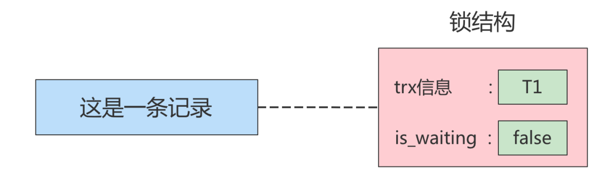

## 概述

在数据库中，除传统的计算资源（如CPU、RAM、I/O等）的争用以外，数据也是一种供许多用户共享的 资源。为保证数据的一致性，需要对<span style="color:#dd9595;"> 并发操作进行控制</span>，因此产生了锁 。同时 <span style="color:#dd9595;">锁机制</span> 也为实现MySQL 的各个隔离级别提供了保证。 锁冲突也是影响数据库<span style="color:#dd9595;">并发访问性能</span>的一个重要因素。所以锁对数据库而言显得尤其重要，也更加复杂。

## MySQL并发事务访问相同记录

并发事务访问相同记录的情况大致可以划分为3种：

### 1、读-读

读-读 情况，即并发事务相继 <span style="color:#dd9595;">读取相同的记录</span> 。读取操作本身不会对记录有任何影响，并不会引起什么 问题，所以允许这种情况的发生。

### 2、写-写

写-写 情况，即并发事务相继对相同的记录做出修改操作。

在这种情况下会发生<span style="color:#dd9595;"> 脏写</span>的问题，任何一种隔离级别都不允许这种问题的发生。所以在多个未提交事务相继对一条记录做改动时，需要让它们<span style="color:#dd9595;"> 排队执行 </span>，这个排队的过程其实是通过 <span style="color:#dd9595;">锁 </span>来实现的。这个所谓 的锁其实是一个<span style="color:#dd9595;"> 内存中的结构</span> ，在事务执行前本来是没有锁的，也就是说一开始是没有<span style="color:#dd9595;"> 锁结构</span> 和记录进行关联的

如图所示：


当一个事务想对这条记录做改动时，首先会看看内存中有没有与这条记录关联的<span style="color:#dd9595;"> 锁结构</span> ，当没有的时候 就会在内存中生成一个 锁结构与之关联。比如，事务 T1 要对这条记录做改动，就需要生成一个锁结构与之关联




>[!tip]小结
>
> - 不加锁
>     意思就是不需要在内存中生成对应的 锁结构 ，可以直接执行操作。
>
> - 获取锁成功，或者加锁成功
>     意思就是在内存中生成了对应的 锁结构 ，而且锁结构的 is_waiting 属性为 false ，也就是事务 可以继续执行操作。
>
> - 获取锁失败，或者加锁失败，或者没有获取到锁
>     意思就是在内存中生成了对应的 锁结构 ，不过锁结构的 is_waiting 属性为 true ，也就是事务 需要等待，不可以继续执行操作。

### 3、读-写或写-读

读-写或写-读 ，即一个事务进行读取操作，另一个进行改动操作。这种情况下可能发生脏读、不可重复读、幻读的问题。

各个数据库厂商对SQL标准的支持都可能不一样。比如<span style="color:#dd9595;">MySQL</span>在 REPEATABLE READ (可重复读)隔离级别上就已经 解决了幻读问题。

## 并发问题的解决方案

怎么解决<span style="color:#dd9595;"> 脏读 、 不可重复读 、 幻读 </span>这些问题呢？其实有两种可选的解决方案：

>[!info]方案一：读操作利用多版本并发控制（ MVCC ），写操作进行 加锁 。

普通的SELECT语句在<span style="color:#dd9595;">READ COMMITTED</span>和<span style="color:#dd9595;">REPEATABLE READ</span>隔离级别下会使用到MVCC读取记录。

在 <span style="color:#dd9595;">READ COMMITTED </span>隔离级别下，一个事务在执行过程中每次执行SELECT操作时都会生成一 个ReadView，ReadView的存在本身就保证了<span style="color:#dd9595;"> 事务不可以读取到未提交的事务所做的更改</span> ，也就 是避免了脏读现象。

在 <span style="color:#dd9595;">REPEATABLE READ</span> 隔离级别下，一个事务在执行过程中<span style="color:#dd9595;">只有 第一次</span>执行SELECT操作 才会 生成一个ReadView，之后的SELECT操作都 复用 这个ReadView，这样也就避免了不可重复读 和幻读的问题。

>[!info]方案二：读、写操作都采用 <span style="color:#dd9595;">加锁 </span>的方式。

>[!tip]小结
>
>- 采用 MVCC 方式的话， 读-写 操作彼此并不冲突， 性能更高 。 
>- 采用 加锁 方式的话， 读-写 操作彼此需要 排队执行 ，影响性能。
>
>一般情况下我们当然愿意采用 <span style="color:#dd9595;">MVCC </span>来解决 读-写 操作并发执行的问题，但是业务在某些特殊情况 下，要求必须采用 加锁 的方式执行。

## 什么是MVCC

MVCC （Multiversion Concurrency Control），多版本并发控制。

顾名思义，MVCC是通过数据行的多个版本管理来实现数据库的<span style="color:#dd9595;">并发控制 </span>。这项技术使得在InnoDB的事务隔离级别下执行一致性读操作有了保证。换言之，就是为了查询一些正在被另一个事务更新的行，并且可以看到它们被更新之前的值，这样 在做查询的时候就不用等待另一个事务释放锁。

## MVCC实现原理

MVCC的实现依赖于：<span style="color:#dd9595;">隐藏字段、Undo Log、Read View</span>

### Undo log的版本链

Undo日志的版本链，对于使用InnoDB 存储引擎的表来说，它的聚簇索引记录中都包含两个必要的隐藏列。

- <span style="color:#dd9595;">trx_id</span>

    每次一个事务对某条聚簇索引记录进行改动时，都会把该事务的 事务id 赋值给 trx_id 隐藏列。

- <span style="color:#dd9595;">roll_pointer</span>

    每次对某条聚簇索引记录进行改动时，都会把旧的版本写入到 undo日志 中，然 后这个隐藏列就相当于一个指针，可以通过它来找到该记录修改前的信息。

举例：现在通过一个事务往表中插入一条数据如下


>[!info]贴士
>insert undo只在事务回滚时起作用，当事务提交后，该类型的undo日志就没用了，它占用的Undo Log Segment也会被系统回收（也就是该undo日志占用的Undo页面链表要么被重用，要么被释放）

假设之后两个事务id分别为 <span style="color:#dd9595;"> 10 、 20</span> 的事务对这条记录进行 <span style="color:#dd9595;"> UPDATE</span> 操作

操作流程如下：

每次对记录进行改动，都会记录一条undo日志，每条undo日志也都有一个<span style="color:#dd9595;">roll_pointer</span>属性（ INSERT 操作对应的undo日志没有该属性，因为该记录并没有更早的版本），可以将这些undo日志都连起来，

串成一个链表如下：

对该记录每次更新后，都会将<span style="color:#dd9595;">旧值放到一条undo日志 </span>中，就算是该记录的一个旧版本，随着更新次数的增多，所有的版本都会被roll_pointer 属性连接成一个链表，我们把这个链表称之为<span style="color:#dd9595;"> 版本链 </span>

版本链的头节点就是当前记录最新的值。每个版本中还包含生成该版本时对应的事务id 。

## ReadView的组成部分

> 事务的id是由系统分配的，如果是增、删、改的行为会分配对应的id且id依次递增的分配，如果是查询的话id为0。

这个ReadView中主要包含4个比较重要的内容，分别如下：

- <span style="color:#dd9595;">creator_trx_id</span>

    创建这个 Read View 的事务 ID

>[!info]说明
>只有在对表中的记录做改动时（执行INSERT、DELETE、UPDATE这些语句时）才会为 事务分配事务id，否则在一个只读事务中的事务id值都默认为0。

- <span style="color:#dd9595;">trx_ids</span>

    表示在生成ReadView时当前系统中活跃的读写事务的 事务id列表 。

- <span style="color:#dd9595;">up_limit_id</span>

    活跃的事务中最小的事务 ID。

- <span style="color:#dd9595;">low_limit_id</span>

    表示生成ReadView时系统中应该分配给下一个事务的 id low_limit_id 是系 统最大的事务id值，这里要注意是系统中的事务id，需要区别于正在活跃的事务ID。

>[!tip]注意
>low_limit_id并不是trx_ids中的最大值，事务id是递增分配的。
>
>比如，现在有id为1，2，3这三个事务，之后id为3的事务提交了。那么一个新的读事务在生成ReadView时，trx_ids就包括1和2，up_limit_id的值就是1，low_limit_id的值就是4。

##  ReadView的规则

有了这个ReadView，这样在访问某条记录时，只需要按照下边的步骤判断记录的某个版本是否可见。

1. 如果被访问版本的<span style="color:#dd9595;">trx_id</span>属性值与ReadView中的 <span style="color:#dd9595;">creator_trx_id </span>值相同，意味着当前事务在访问 它自己修改过的记录，所以该版本可以被当前事务访问。

2. 如果被访问版本的<span style="color:#dd9595;">trx_id</span>属性值小于ReadView中的 <span style="color:#dd9595;">up_limit_id </span>值，表明生成该版本的事务在当前 事务生成ReadView前已经提交，所以该版本可以被当前事务访问。

3. 如果被访问版本的<span style="color:#dd9595;">trx_id</span>属性值大于或等于ReadView中的 <span style="color:#dd9595;">low_limit_id</span> 值，表明生成该版本的事 务在当前事务生成ReadView后才开启，所以该版本不可以被当前事务访问。

4. 如果被访问版本的<span style="color:#dd9595;">trx_id</span>属性值在ReadView的<span style="color:#dd9595;"> up_limit_id 和 low_limit_id 之间</span>，那就需要判 断一下<span style="color:#dd9595;">trx_id属性值是不是在 trx_ids 列表中</span>。
     如果在，说明创建ReadView时生成该版本的事务还是活跃的，该版本不可以被访问。
     如果不在，说明创建ReadView时生成该版本的事务已经被提交，该版本可以被访问

## MVCC整体操作流程

我们来看下当查询一条记录的时候，系统如何通过MVCC找到它

1. 首先获取事务自己的版本号，也就是事务ID；
2. 获取ReadView；
3. 查询得到的数据，然后与 ReadView中的事务版本号进行比较；
4. 如果不符合ReadView的规则，就需要从Undo Log中获取历史快照（版本链）；
5. 最后返回符合规则的数据。

MVCC使用于<span style="color:#dd9595;">READ COMMITTED</span> 和 <span style="color:#dd9595;">REPEATABLE READ</span>隔离级别下工作。

在隔离级别为读已提交（Read Committed）时，一个事务中的每一次SELECT 查询都会重新获取一次ReadView。

如图所示：


>[!info]注意
> 此时同样的查询语句都会重新获取一次 Read View，这时如果 Read View 不同，就可能产生 不可重复读或者幻读的情况。

在隔离级别为可重复读（REPEATABLE READ）时，就避免了不可重复读，这是因为一个事务只在第一次SELECT的时候会获取一次Read View，而后面所有的 SELECT 都会复用这个Read View

如下图所示：


## 举例子

- READ COMMITTED隔离级别

    <span style="color:#dd9595;">READ COMMITTED：每次读取数据前都生成一个ReadView。</span>

    现在有两个事务id分别为10、20的事务在执行：

    ```sql
    # Transaction 10
    BEGIN;
    UPDATE student SET name="李四" WHERE id=1;
    UPDATE student SET name="王五" WHERE id=1;
    # Transaction 20
    BEGIN;
    # 更新了一些别的表的记录
    ...
    ```

    此刻，表student中id为1的记录得到的版本链表。

    如下所示：

    假设现在有一个 READ COMMITTED 隔离级别的事务开始执行如下操作：

    ```sql
    # 使用READ COMMITTED隔离级别的事务
    BEGIN;
    # SELECT1：Transaction 10、20未提交,此时上述的事务10、事务20都
    # 还未提交
    SELECT * FROM student WHERE id = 1; # 此时得到的列name的值为'张三'
    ```

    > [!tip]执行流程
    > 这个<span style="color:#dd9595;">SELECT1</span>的执行过程如下：
    >
    >1. 在执行SELECT语句时会生成一个ReadView，ReadView中各部分的值分别为trx_ids=[10,20]，up_limit_id=10，low_limit_id=21，creator_trx_id（事务id）=0
    >2. 从版本链中挑选可见的记录，从图中看出，最新版本的列name='王五'。该版本的trx_id值为10，在trx_ids列表内，所以不符合可见性要求，根据roll_pointer跳到下一个版本。
    >3. 下一个版本的列name=‘李四’，该版本的trx_id值为10，也在trx_ids列表内，所以也不符合要求，继续跳到下一个版本。
    >4. 下一个版本的列name=‘张三’，该版本的trx_id值为8，小于ReadView中的up_limit_id值（10），所以这个版本是符合要求的，最后返回给用户的版本就是这条列name='张三'。

    之后，我们把事务id为10的事务提交一下

    ```sql
    # Transaction 10
    BEGIN;
    UPDATE student SET name="李四" WHERE id=1;
    UPDATE student SET name="王五" WHERE id=1;
    COMMIT;
    ```

    然后再到 事务id 为 20 的事务中<span style="color:#dd9595;">更新</span>一下表 student 中 id 为 1 的记录

    ```sql
    # Transaction 20
    BEGIN;
    # 更新了一些别的表的记录
    ...
    UPDATE student SET name="钱七" WHERE id=1;
    UPDATE student SET name="宋八" WHERE id=1;
    ```

    此刻，表student中 id 为 1 的记录的版本链就长这样
    
    
    
    然后再到刚才使用READ COMMITTED 隔离级别的事务中继续查找这个id为1的记录，如下：

    ```sql
    # 使用READ COMMITTED隔离级别的事务
    BEGIN;
    # SELECT1：Transaction 10、20均未提交,此时上述的事务10、事务20都
    # 还未提交 
    SELECT * FROM student WHERE id = 1; # 此时得到的列name的值为'张三'
    # SELECT2：Transaction 10提交，Transaction 20未提交
    SELECT * FROM student WHERE id = 1; # 此时得到的列name的值为'王五'
    ```

    >[!tip]执行流程
    > 这个<span style="color:#dd9595;">SELECT 2</span>的执行过程如下：
    >
    > 1. 在执行SELECT语句时又会生成一个ReadView，该ReadView中各部分的值trx_ids=[20]，up_limit_id=20，low_limit_id=21，creator_trx_id=0。
    > 2. 从版本链中挑选可见的记录，从图中可看出，最新版本的name='宋八'，该版本的trx_id=20，在trx_ids列表内，所以不符合可见性要求，根据roll_pointer跳到下一个版本。
    > 3. 下一个版本的列name='钱七'，该版本的trx_id=20，也在trx_ids列表内，所以也不符合要求，继续跳到下一个版本。
    > 4. 下一个版本的列name='王五'，该版本的trx_id=10，小于ReadView中的up_limit_id=20，所以这个版本是符合要求的，最后返回给用户的版本就是这条列name='王五'的记录。

-  REPEATABLE READ隔离级别

    使用REPEATABLE READ隔离级别的事务来说，<span style="color:#dd9595;">只会在第一次执行查询语句</span>时生成一个 ReadView ，之 后的查询就不会重复生成了。

    比如，系统里有两个 事务id 分别为 10 、 20 的事务在执行

    ```sql
    # Transaction 10
    BEGIN;
    UPDATE student SET name="李四" WHERE id=1;
    UPDATE student SET name="王五" WHERE id=1;
    # Transaction 20
    BEGIN;
    # 更新了一些别的表的记录
    ...
    ```

    此刻，表student中id为1的记录得到的版本链表如下所示：
    
    

    假设现在有一个使用 REPEATABLE READ 隔离级别的事务开始执行：

    ```sql
    # 使用REPEATABLE READ隔离级别的事务
    BEGIN;
    # SELECT1：Transaction 10、20未提交
    SELECT * FROM student WHERE id = 1; # 得到的列name的值为'张三'
    ```

    >[!tip]执行流程
    >这个SELECT 1 的执行过程如下：
    >
    >1. 在执行SELECT语句时会生成一个ReadView，ReadView中各部分的值分别为trx_ids=[10,20]，up_limit_id=10，low_limit_id=21，creator_trx_id（事务id）=0。
    >2. 从版本链中挑选可见的记录，从图中看出，最新版本的列name='王五'。该版本的trx_id值为10，在trx_ids列表内，所以不符合可见性要求，根据roll_pointer跳到下一个版本。
    >3. 下一个版本的列name=‘李四’，该版本的trx_id值为10，也在trx_ids列表内，所以也不符合要求，继续跳到下一个版本。
    >4. 下一个版本的列name=‘张三’，该版本的trx_id值为8，小于ReadView中的up_limit_id值（10），所以这个版本是符合要求的，最后返回给用户的版本就是这条列name='张三'。

    之后，我们把 事务id 为 10 的事务提交一下，就像这样

    ```sql
    # Transaction 10
    BEGIN;
    UPDATE student SET name="李四" WHERE id=1;
    UPDATE student SET name="王五" WHERE id=1;
    COMMIT;
    ```

    然后再到 事务id 为 20 的事务中更新一下表 student 中 id 为 1 的记录

    ```sql
    # Transaction 20
    BEGIN;
    # 更新了一些别的表的记录
    ...
    UPDATE student SET name="钱七" WHERE id=1;
    UPDATE student SET name="宋八" WHERE id=1;
    ```

    此刻，表student 中 id 为 1 的记录的版本链长这样：

    

    然后再到刚才使用 REPEATABLE READ 隔离级别的事务中继续查找这个id为1的记录，如下：

    ```sql
    # 使用REPEATABLE READ隔离级别的事务
    BEGIN;
    # SELECT1：Transaction 10、20均未提交
    SELECT * FROM student WHERE id = 1; # 得到的列name的值为'张三'
    # SELECT2：Transaction 10提交，Transaction 20未提交
    SELECT * FROM student WHERE id = 1; # 得到的列name的值仍为'张三'
    ```

    同上述一样，因为REPEATABLE READ隔离级别中ReadView只在初次查询的时候加载一次，分析过程如上。