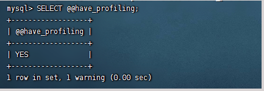
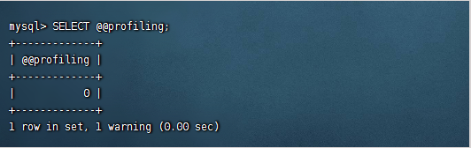
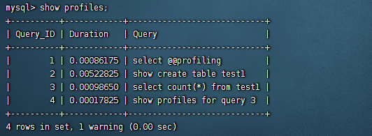
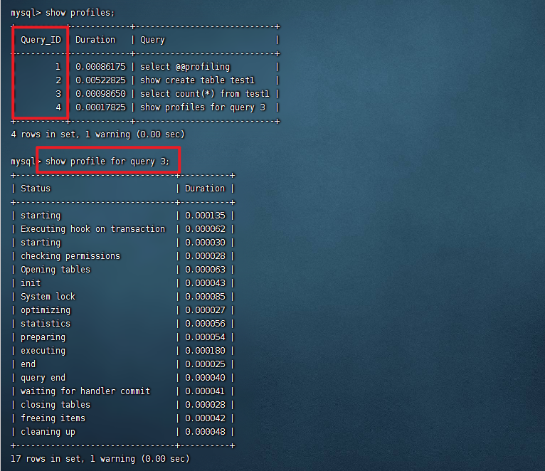

MySQL优化定义：从一定程度上减少MySQL的读写瓶颈，降低系统资源的浪费，并提升系统的性能。

## SHOW STATUS语句解析

SHOW STATUS 语句能获取MySQL服务器的一些信息状态，主要是数据库性能性能参数。

> [!tip]格式语法
>```sql
>SHOW [SESSION | GLOBAL] STATUS LIKE 'status_name'
>```

- SESSION：获取当前会话级别的性能参数
- GLOBAL：获取全局级别的性能参数

如果省略不写，默认为SESSION。

SHOW STATUS语句支持的参数：
| 参数值               | 参数说明                                    |
| -------------------- | ------------------------------------------- |
| Connections          | 连接MySQL服务器的次数                       |
| Uptime               | MySQL服务器启动后连接工作的时间             |
| Slow_queries         | 慢查询的次数                                |
| Com_insert           | 插入数据的次数，批量插入多条数据时，只累加1 |
| Com_delete           | 删除数据的次数，每次累加1                   |
| Com_update           | 修改数据的次数，每次累加1                   |
| Com_select           | 查询数据的次数，一次查询操作累加1           |
| Innodb_rows_read     | 查询数据时返回的记录数                      |
| Innodb_rows_inserted | 插入数据时返回的记录数                      |
| Innodb_rows_updated  | 更新数据时返回的记录数                      |
| Innodb_rows_deleted  | 删除数据时返回的记录数                      |

- Comm_xxx 形式的参数表示SQL语句执行的次数
- Innodb_rows_xxx 形式的参数表示在InnoDB存储引擎下，MySQL执行增删改查操作的次数。


## EXPLAIN 语句解析

使用EXPLAIN语句来获取执行查询语句的信息，只需将EXPLAIN语句放在查询语句前即可。

> [!tip]格式语法
>```sql
>EXPLAIN SELECT select_expr;
>```

- EXPLAIN：分析查询语句的关键字
- SELECT：执行查询语句的关键字
- select_expr：查询语句的查询选项

​<span style="color:red;">EXPLAIN</span> 语句输出的各个列的作用如下

| 列明                                           | 描述                                                    |
| :--------------------------------------------- | ------------------------------------------------------- |
| <span style="color:red;">id </span>            | 在一个大的查询语句中每个SELECT关键字都对应一个 唯一的id |
| <span style="color:red;">select_type </span>   | SELECT关键字对应的那个查询的类型                        |
| <span style="color:red;">table </span>         | 表名                                                    |
| <span style="color:red;">partitions </span>    | 匹配的分区信息                                          |
| <span style="color:red;">type</span>           | 针对单表的访问方法                                      |
| <span style="color:red;">possible_keys </span> | 可能用到的索引                                          |
| <span style="color:red;">key</span>            | 实际上使用的索引                                        |
| <span style="color:red;">key_len </span>       | 实际使用到的索引长度                                    |
| <span style="color:red;">ref</span>            | 当使用索引列等值查询时，与索引列进行等值匹配的对象信息  |
| <span style="color:red;">rows</span>           | 预估的需要读取的记录条数                                |
| <span style="color:red;">filtered</span>       | 某个表经过搜索条件过滤后剩余记录条数的百分比            |
| <span style="color:red;">Extra </span>         | 一些额外的信息                                          |

- <span style="color:red;">id</span>

     表示SELECT语句的序列号，有多少个SELECT语句就有多少个序列号。

- <span style="color:red;">select_type</span>

     当前SQL语句的查询类型，select_type常见的取值如下：

- <span style="color:blue;">SIMPLE</span>

     当前SQL语句是简单查询，不包含任何连接查询和子查询。

- <span style="color:blue;">PRIMARY</span>

     主查询或者是包含子查询时最外层的查询语句。

- <span style="color:blue;">UNION</span>

     当前SQL语句为连接查询，表示连接查询的第二个SELECT语句或者是第二个后面的SELECT语句。

- <span style="color:blue;">DEPENDENT UNION</span>

     与UNION含有相同，但是DEPENDENT UNION取决于外层的查询语句。

- <span style="color:blue;">UNION RESULT</span>

     表示连接查询的结果信息。

- <span style="color:blue;">SUBQUERY</span>

     表示子查询中的第一个查询语句。

- <span style="color:blue;">DEPENDENT SUBQUERY</span>

     与SUBQUERY 含义相同，DEPENDENT SUBQUERY取决于外层的查询语句。

- <span style="color:blue;">DERIVED</span>

     表示FROM子句中的子查询。

- <span style="color:blue;">MATERIALIZED</span>

     表示实例化子查询。

- <span style="color:blue;">UNCACHEABLE SUBQUERY</span>

     表示不缓存子查询的结果数据，重新计算外部查询的每一行数据。

- <span style="color:blue;">UNCACHEABLE UNION</span>

     表示不缓存连接查询的结果数据，每次执行连接查询时都会重新计算数据结果。

- <span style="color:red;">table</span>

     当前查询所在的数据表。

- <span style="color:red;">partitions</span>

     如果当前数据表是分区表，则表示查询结果匹配的分区。

- <span style="color:red;">type</span>

     当前SQL语句所使用的关联类型或者访问类型，其取值从最优到最差依次排序为：system > const >eq_ref >ref > fulltext > ref_or_null > index_merge > unique_subquery > index_subquery > range >index > All 。

- <span style="color:blue;">system</span>

     查询的数据表中只有一行数据，是const类型的特例。

- <span style="color:blue;">const</span>

     表中最多只有一行数据符合查询条件。当查询或连接的字段为<span style="color:red;">主键或唯一索引</span>时，则type的取值为const。

- <span style="color:blue;">eq_ref</span>

     查询语句中的连接条件或查询条件使用了<span style="color:red;">主键或者非空唯一索引</span>包含的全部字段。则type的取值为eq_ref。典型场景：<span style="color:green;">使用"="操作符比较带索引的列。</span>

- <span style="color:blue;">ref</span>

     查询语句中连接条件或者查询条件使用的<span style="color:red;">索引不是主键和非空唯一约束索引</span>，或者只是一个索引的一部分，则type的取值为ref。典型场景：<span style="color:green;">使用“=” 或者“<=>”操作符比较带有索引的列。</span>

- <span style="color:blue;">fulltext</span>

     当查询语句中的查询条件使用了<span style="color:red;">全文索引</span>时，type的取值为fulltext。

- <span style="color:blue;">ref_or_null </span>

     类似与ref，但是查询语句的连接条件或者查询条件包含的列有NULL值时，MySQL会进行额外查询，经常被用于解析子查询。

- <span style="color:blue;">index_merge</span>

     当查询语句使用索引合并优化时，type的取值为index_merge。key会显示使用到的所有索引，key_line显示使用到索引的最长键长值。 

- <span style="color:blue;">unique_subquery</span>

     查询语句的查询条件为IN的语句，并且IN语句中的查询字段为数据表的<span style="color:red;">主键或者非空唯一索引</span>字段时，type的取值为unique_subquery。

- <span style="color:blue;">index_subquery</span>

     与unique_subquery 类似。IN语句中的查询字段为数据表中的<span style="color:red;">非唯一索引字段。</span>

- <span style="color:blue;">range</span>

     查询语句的查询条件为使用索引检查数据表中的某个范围的记录时，type的取值为range。key会显示使用到的索引，key_line显示使用到索引的最长键长值。

     典型场景：使用 =、<>、>、>=、<、<=、IS [NOT] NULL、<=> 、BETWEEN AND 或者IN操作时，用常量比较关键字的列。


- <span style="color:blue;">index</span>

     查询语句中的查询条件使用的是覆盖索引，也就是说查询条件中的字段包含索引中的全部字段，并且按照索引中字段的顺序进行条件匹配，此时只需要扫描索引树即可。
- <span style="color:blue;">ALL</span>

     每次进行连接查询时，都会进行全表的扫描。这种查询性能最差，一般情况下，需要添加索引来避免此类型的查询。

- <span style="color:red;">possible_keys</span>

     MySQL在执行查询语句时可能使用到的索引，但在实际查询中未必会使用到。当此列值为NULL时，说明MySQL没有可使用的索引，此时可以建立索引来提高查询性能。

- <span style="color:red;">key</span>

     执行查询语句时MySQL实际会使用到的索引，如果MySQLZ实际没有使用索引，则此列为NULL。

- <span style="color:red;">key_len</span>

     执行查询语句时MySQL实际会使用到的索引按照字节计算长度值。如果key为NULL,则key_len的值也为NULL。

- <span style="color:red;">ref</span>

     数据表中的哪个列或者哪个常量用来和key列中的索引做比较来检索数据。如果值此列值为func，则说明使用了某些函数的结果数据与key列的索引做比较来检索数据。

- <span style="color:red;">rows</span>

     MySQL查询数据时必须查找的数据行数，当数据表的存储引擎为InnoDB时，此值为MySQL的预估值。

- <span style="color:red;">filtered</span>

     查询结果符合查询条件的百分比。最小值为0，表示没有匹配条件的记录，最大值为100，表示数据表中所有行全部符合查询条件或者没有对数据进行过滤。

- <span style="color:red;">Extra</span>

     MySQL在执行查询语句时额外的详细信息。

## SHOW PROFILE 解析

MySQL从5.0.37版本开始支持SHOW PROFILES语句 SHOW PROFILE语句。

可以使用如下命令MySQL是否支持PROFILE。

```sql
SELECT @@have_profiling;
```



结果显示，当前MySQL支持PROFILE。

MySQL中默认profiling是关闭的，如下查看：

```sql
SELECT @@profiling;
```



可以通过SET语句开启profiling，例如：

```sql
SET SESSION profiling=1;
```


当@@profiling状态为1，则说明开启了profiling。

开启之后可以使用<span style="color:red;">SHOW PROFILES</span>语句查看SQL语句信息。例如：



通过如下语句查看某条的SQL语句执行过程中所在线程的具体信息：

```sql
SHOW PROFILE FOR QUERY N;
```

N为执行SHOW PROFILES中的Query_ID。



## 关联查询优化

1. 保证被驱动表的JOIN字段已经创建了索引

2. 需要JOIN 的字段，数据类型保持绝对一致。

3. LEFT JOIN 时，选择小表作为驱动表， 大表作为被驱动表 。减少外层循环的次数。

4. INNER JOIN 时，MySQL会自动将 小结果集的表选为驱动表 。选择相信MySQL优化策略。

5. 能够直接多表关联的尽量直接关联，不用子查询。(减少查询的趟数) 。

6. 不建议使用子查询，建议将子查询SQL拆开结合程序多次查询，或使用 JOIN 来代替子查询。

7. 衍生表建不了索引。

## 子查询优化

MySQL从4.1版本开始支持子查询，使用子查询可以进行SELECT语句的嵌套查询，即一个SELECT查询的结果作为另一个SELECT语句的条件。

<span style="color:red;">子查询可以一次性完成很多逻辑上需要多个步骤才能完成的SQL操作</span> 。

子查询是 MySQL 的一项重要的功能，可以帮助我们通过一个 SQL 语句实现比较复杂的查询。

但是，子查询的执行效率不高。原因：

1. 执行子查询时，MySQL需要为内层查询语句的查询结果 <span style="color:red;">建立一个临时表</span> ，然后外层查询语句从临时表 中查询记录。查询完毕后，再 <span style="color:red;">撤销这些临时表</span> 。这样会消耗过多的CPU和IO资源，产生大量的慢查询。

2. 子查询的结果集存储的临时表，不论是内存临时表还是磁盘临时表都<span style="color:red;"> 不会存在索引 </span>，所以查询性能会 受到一定的影响。

3. 对于返回结果集比较大的子查询，其对查询性能的影响也就越大。

<span style="color:red;">在MySQL中，可以使用连接（JOIN）查询来替代子查询</span>。连接查询不需要建立临时表 ，其速度比子查询要快 ，如果查询中使用索引的话，性能就会更好。

>[!tip]结论
> 尽量不要使用NOT IN 或者 NOT EXISTS，用LEFT JOIN xxx ON xx WHERE xx IS NULL替代


## 排序优化

问题：在 WHERE 条件字段上加索引，但是为什么在 ORDER BY 字段上还要加索引呢？

优化建议：

1. SQL 中，可以在 WHERE 子句和 ORDER BY 子句中使用索引，<span style="color:red;">目的是在 WHERE 子句中 避免全表扫描 </span>，在 ORDER BY 子句<span style="color:red;"> 避免使用 FileSort 排序 </span>。当然，某些情况下全表扫描，或者 FileSort 排 序不一定比索引慢。但总的来说，我们还是要避免，以提高查询效率。

2. 尽量使用 Index 完成 ORDER BY 排序。如果 WHERE 和 ORDER BY 后面是相同的列就使用单索引列； 如果不同就使用联合索引。

3. 无法使用 Index 时，需要对 FileSort 方式进行调优。

## GROUP BY优化

1. group by 使用索引的原则几乎跟order by一致 ，group by 即使没有过滤条件用到索引，也可以直接 使用索引。

2. group by 先排序再分组，遵照索引建的最佳左前缀法则

3. 当无法使用索引列，增大 <span style="color:red;">max_length_for_sort_data</span> 和<span style="color:red;"> sort_buffer_size</span> 参数的设置

4. where效率高于having，能写在where限定的条件就不要写在having中了

5. 减少使用order by，和业务沟通能不排序就不排序，或将排序放到程序端去做。Order by、group by、distinct这些语句较为耗费CPU，数据库的CPU资源是极其宝贵的。

6. 包含了order by、group by、distinct这些查询的语句，where条件过滤出来的结果集请保持在1000行 以内，否则SQL会很慢。


## 优化分页查询

1. 在索引上完成排序分页操作，最后根据主键关联回原表查询所需要的其他列内容。

```sql
EXPLAIN SELECT * FROM student t,(SELECT id FROM student ORDER BY id LIMIT 2000000,10)
a
WHERE t.id = a.id;
```

2. 该方案适用于主键自增的表，可以把Limit 查询转换成某个位置的查询 。

```sql
EXPLAIN SELECT * FROM student WHERE id > 2000000 LIMIT 10;
```
