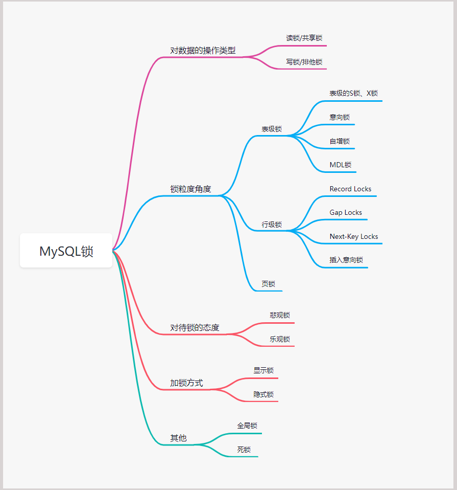
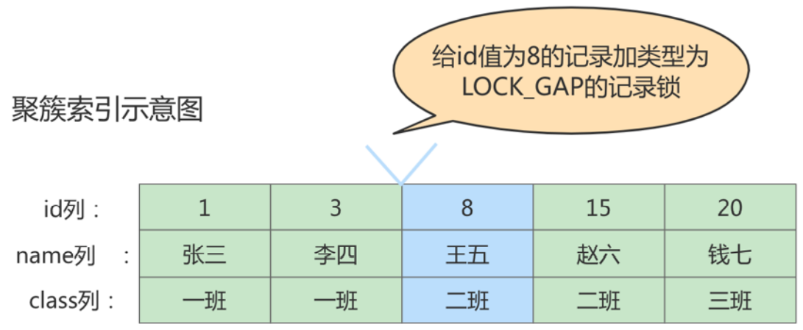

## 锁的不同角度分类

锁的分类图如下：




## 类型划分：读锁、写锁

<span style="color:#dd9595;">读锁 ：</span>也称为 <span style="color:#dd9595;">共享锁 、英文用 S 表示</span>。针对同一份数据，多个事务的读操作可以同时进行而不会 互相影响，相互不阻塞的。

<span style="color:#dd9595;">写锁 ：</span>也称为 <span style="color:#dd9595;">排他锁 、英文用 X 表示。</span>当前写操作没有完成前，它会阻断其他写锁和读锁。这样 就能确保在给定的时间里，只有一个事务能执行写入，并防止其他用户读取正在写入的同一资源。

>[!info]注意
> 需要注意的是对于 InnoDB 引擎来说，读锁和写锁可以加在表上，也可以加在行上。因为InnoDB引擎支持行锁和表锁。

## 粒度划分：表级锁、页级锁、行锁

<span style="color:#dd9595;">表锁（Table Lock）</span>

-   表级别的S锁、X锁
-   意向锁（intention lock）
    InnoDB 支持 多粒度锁（multiple granularity locking） ，它允许<span style="color:#dd9595;"> 行级锁 与 表级锁 共存</span>，而意向锁就是其中的一种 <span style="color:#dd9595;">表锁</span> 。

    意向锁分为两种：

    意向共享锁（intention shared lock, IS）：事务有意向对表中的某些行加共享锁（S锁）

    ```sql
    -- 事务要获取某些行的 S 锁，必须先获得表的 IS 锁。
    SELECT column FROM table ... LOCK IN SHARE MODE;
    ```

    意向排他锁（intention exclusive lock, IX）：事务有意向对表中的某些行加排他锁（X锁）

    ```sql
    -- 事务要获取某些行的 X 锁，必须先获得表的 IX 锁。
    SELECT column FROM table ... FOR UPDATE;
    ```

    意向锁是由存储引擎 自己维护的 ，用户无法手动操作意向锁，在为数据行加共享 / 排他锁之前， InooDB 会先获取该数据行 <span style="color:#dd9595;">所在数据表的对应意向锁 。</span>

-   自增锁（AUTO-INC锁）

-   元数据锁（MDL锁）
    MySQL5.5引入了meta data lock，简称MDL锁，属于表锁范畴。MDL 的作用是，保证读写的正确性。

    比如，如果一个查询正在遍历一个表中的数据，而执行期间另一个线程对这个 <span style="color:#dd9595;">表结构做变更</span> ，增加了一列，那么查询线程拿到的结果跟表结构对不上，肯定是不行的。

    因此，当对一个表做增删改查操作的时候，加MDL读锁。

    当要对表做结构变更操作的时候，加MDL写锁。

- 行锁

- 记录锁（Record Locks)

    记录锁也就是仅仅把一条记录锁上，官方的类型名称为LOCK_REC_NOT_GAP 。比如我们把id值为8的 那条记录加一个记录锁的示意图如图所示。仅仅是锁住了id值为8的记录，对周围的数据没有影响。

    

    记录锁是有S锁和X锁之分的，称之为S型记录锁和X型记录锁。

    当一个事务获取了一条记录的S型记录锁后，其他事务也可以继续获取该记录的S型记录锁，但不可 以继续获取X型记录锁；

    当一个事务获取了一条记录的X型记录锁后，其他事务既不可以继续获取该记录的S型记录锁，也不 可以继续获取X型记录锁。

- 间隙锁（Gap Locks）

    MySQL 在 REPEATABLE READ 隔离级别下是可以解决幻读问题的，解决方案有两种，可以使用 MVCC 方案解决，也可以采用 加锁 方案解决。但是在使用加锁方案解决时有个大问题，就是事务在第一次执行读取操作时，那些幻影记录尚不存在，我们无法给这些 幻影记录 加上 记录锁 。InnoDB提出了一种称之为Gap Locks 的锁，官方的类型名称为： LOCK_GAP ，我们可以简称为 gap锁 。比如，把id值为8的那条 记录加一个gap锁的示意图如下:

    

    图中id值为8的记录加了gap锁，意味着 <span style="color:#dd9595;">不允许别的事务在id值为8的记录前边的间隙插入新记录</span> ，其实就是 id列的值(3, 8)这个区间的新记录是不允许立即插入的。比如，有另外一个事务再想插入一条id值为4的新 记录，它定位到该条新记录的下一条记录的id值为8，而这条记录上又有一个gap锁，所以就会阻塞插入 操作，直到拥有这个gap锁的事务提交了之后，id列的值在区间(3, 8)中的新记录才可以被插入。<span style="color:#dd9595;"> gap锁的提出仅仅是为了防止插入幻影记录而提出的。</span>

- 临键锁（Next-Key Locks）

    有时候我们既想锁住某条记录 ，又想阻止其他事务在该记录前边的间隙插入新记录 ，所以InnoDB就提出了一种称之为 Next-Key Locks 的锁，官方的类型名称为： LOCK_ORDINARY ，我们也可以简称为 next-key锁 。Next-Key Locks是在存储引擎 innodb 、事务级别在 可重复读 的情况下使用的数据库锁， innodb默认的锁就是Next-Key locks。

- 插入意向锁（Insert Intention Locks）

    我们说一个事务在 <span style="color:#dd9595;">插入</span> 一条记录时需要判断一下插入位置是不是被别的事务加了gap锁 （ next-key锁 也包含 gap锁 ）

    如果有的话，插入操作需要等待，直到拥有 gap锁 的那个事务提交。<span style="color:#dd9595;">但是InnoDB规定事务在等待的时候也需要在内存中生成一个锁结构</span>，表明有事务想在某个间隙中插入 新记录，但是现在在等待。InnoDB就把这种类型的锁命名为 Insert Intention Locks ，官方的类型名称为： LOCK_INSERT_INTENTION ，我们称为插入意向锁 。<span style="color:#dd9595;">插入意向锁是一种Gap锁 </span>，不是意向锁，在insert 操作时产生。 插入意向锁是在插入一条记录行前，由 INSERT 操作产生的一种间隙锁 。 事实上插入意向锁并不会阻止别的事务继续获取该记录上任何类型的锁。

- 页锁

    就是在 <span style="color:#dd9595;">页的粒度</span>上进行锁定，锁定的数据资源比行锁要多，因为一个页中可以有多个行记录。

    当我们使用页锁的时候，会出现数据浪费的现象，但这样的浪费最多也就是一个页上的数据行。<span style="color:#dd9595;">页锁的开销介于表锁和行锁之间，会出现死锁。锁定粒度介于表锁和行锁之间，并发度一般。</span> 每个层级的锁数量是有限制的，因为锁会占用内存空间， 锁空间的大小是有限的 。当某个层级的锁数量超过了这个层级的阈值时，就会进行锁升级 。锁升级就是用更大粒度的锁替代多个更小粒度的锁，比如 InnoDB中行锁升级为表锁，这样做的好处是占用的锁空间降低了，但同时数据的并发度也下降了。

## 态度划分:乐观锁、悲观锁

从对待锁的态度来看锁的话，可以将锁分成乐观锁和悲观锁，从名字中也可以看出这两种锁是两种看待 数据并发的思维方式 。需要注意的是，乐观锁和悲观锁并不是锁，而是<span style="color:#dd9595;">锁的设计思想</span> 。

-   <span style="color:#dd9595;">悲观锁（Pessimistic Locking）</span>

    悲观锁是一种思想，顾名思义，就是很悲观，对数据被其他事务的修改持保守态度，会通过数据库自身 的锁机制来实现，从而保证数据操作的排它性。 悲观锁总是假设最坏的情况，每次去拿数据的时候都认为别人会修改，所以每次在拿数据的时候都会上 锁，这样别人想拿这个数据就会 阻塞 直到它拿到锁（<span style="color:#dd9595;">共享资源每次只给一个线程使用，其它线程阻塞， 用完后再把资源转让给其它线程</span>）。比如行锁，表锁等，读锁，写锁等，都是在做操作之前先上锁，当 其他线程想要访问数据时，都需要阻塞挂起。Java中 synchronized 和 ReentrantLock 等独占锁就是 悲观锁思想的实现。

-   <span style="color:#dd9595;">乐观锁（Optimistic Locking）</span>

    乐观锁认为对同一数据的并发操作不会总发生，属于小概率事件，不用每次都对数据上锁，但是在更新 的时候会判断一下在此期间别人有没有去更新这个数据，也就是<span style="color:#dd9595;">不采用数据库自身的锁机制，而是通过 程序来实现</span>。在程序上，我们可以采用 <span style="color:#dd9595;">版本号机制</span> 或者<span style="color:#dd9595;"> CAS机制 实现</span>。乐观锁适用于多读的应用类型， 这样可以提高吞吐量。在Java中 java.util.concurrent.atomic 包下的原子变量类就是使用了乐观锁的一种实现方式：CAS实现的。

    1. 乐观锁的版本号机制

    在表中设计一个 <span style="color:#dd9595;">版本字段version</span> ，第一次读的时候，会获取 version 字段的取值。然后对数据进行更 新或删除操作时，会执行 <span style="color:#dd9595;">UPDATE ... SET version=version+1 WHERE version=version </span>。此时 如果已经有事务对这条数据进行了更改，修改就不会成功。

    2. 乐观锁的时间戳机制

    时间戳和版本号机制一样，也是在更新提交的时候，将当前数据的时间戳和更新之前取得的时间戳进行 比较，如果两者一致则更新成功，否则就是版本冲突。 你能看到乐观锁就是程序员自己控制数据并发操作的权限，基本是通过给数据行增加一个戳（版本号或 者时间戳），从而证明当前拿到的数据是否最新。

>[!tip]乐观锁和悲观锁的适用场景 
>
>1. 乐观锁 适合  <span style="color:#dd9595;">读操作多</span> 的场景，相对来说写的操作比较少。它的优点在于 程序实现 ， 不存在死锁 问题，不过适用场景也会相对乐观，因为它阻止不了除了程序以外的数据库操作。
>2. 悲观锁 适合  <span style="color:#dd9595;">写操作多 </span>的场景，因为写的操作具有 排它性 。采用悲观锁的方式，可以在数据库层 面阻止其他事务对该数据的操作权限，防止读 - 写和写 - 写 的冲突。

## 方式划分：显式锁、隐式锁

-   隐式锁
-   显式锁
    通过特定的语句进行加锁，我们一般称之为显示加锁，例如：
    显示加共享锁：
    ```sql
    select .... lock in share mode
    ```

    显示加排它锁：
    ```sql
    select .... for update
    ```

## 全局锁

全局锁就是对 <span style="color:#dd9595;">整个数据库实例</span> 加锁。当你需要让整个库处于<span style="color:#dd9595;"> 只读状态 </span>的时候，可以使用这个命令，之后其他线程的以下语句会被阻塞：数据更新语句（数据的增删改）、数据定义语句（包括建表、修改表结 构等）和更新类事务的提交语句。全局锁的典型使用 场景是：做全库逻辑备份 。

全局锁的命令：

```sql
Flush tables with read lock
```

## 死锁

死锁是指两个或多个事务在同一资源上相互占用，并请求锁定对方占用的资源，从而导致恶性循环。

死锁示例


这时候，事务1在等待事务2释放id=2的行锁，而事务2在等待事务1释放id=1的行锁。 事务1和事务2在互 相等待对方的资源释放，就是进入了死锁状态。

当出现死锁以后，有两种策略

- 一种策略是，直接进入等待，直到超时。这个超时时间可以通过参数 <span style="color:#dd9595;">innodb_lock_wait_timeout</span> 来设置。

- 另一种策略是，发起死锁检测，发现死锁后，主动回滚死锁链条中的某一个事务（将持有最少行级排他锁的事务进行回滚），让其他事务得以继续执行。将参数<span style="color:#dd9595;"> innodb_deadlock_detect 设置为 on </span>，表示开启这个逻辑。