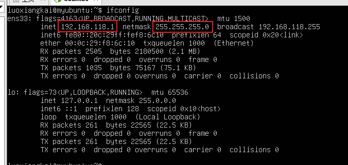
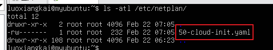
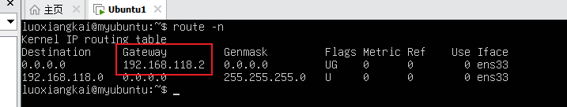

# Ubuntu 24.04.2 LTS 配置静态IP

这边使用的是Ubuntu netplan模块来配置静态ip，默认安装Ubuntu使用的是dhcp自动分配


## 查看当前Ubuntu系统的ip信息

使用命令`ifconfig` 查看系统分配的ip，使用命令查看的ip地址信息如下：



第一个红框中的是Ubuntu的ip地址，第二个为子网掩码


## 配置静态ip

使用命令`ls -alt /etc/netplan` 查看netplan模块下的文件名




使用`vim`命令修改上面截图的文件内容，上面截图的内容默认内容如下：

```yaml
network:
  version: 2
  ethernets:
    ens33:
      dhcp4: true
```

先将默认文件进行修改，注释或者删除`dhcp4`，配置内容如下：

```yaml
network:
  version: 2
  ethernets:
    ens33:
      address:
       - 192.168.118.1/24  # 192.168.118.1 ubuntu的ip地址 /24是子网掩码
      nameservers:
        address: [4.2.2.2, 8.8.8.8] # 配置dns解析
      routes:
        - to: default # 默认写default就行
          via: 192.168.118.2 # 网关
```

如果不清楚网关的使用 `route -n` 查看，如下截图的就是网关地址




## 重新应用

使用 `sudo netplan apply` 重新启动，即静态ip配置成功了

可以使用ifconfig 查看ip是否为上面配置的ip，且关掉虚拟机或重启虚拟机看ip是否变化，如果没有发生变化，说明静态ip配置成功了。

注意：如果xxx.xxx.xxx.1如果配置了之后，宿主机和虚拟机ping不同，则需要注意换一个地址。别使用xxx.xxx.xxx.1这个地址，可能与网卡有冲突

参考链接：https://blog.csdn.net/qq_61879710/article/details/130077108