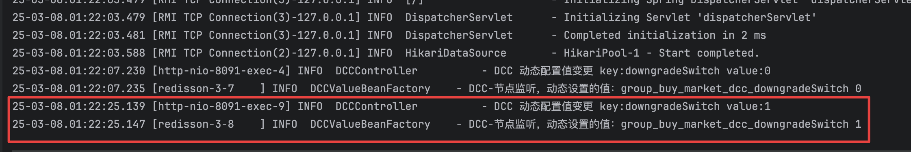

基于Redis的发布订阅，实现一个简易的配置中心，当Redis中的值发生变化时，对应类的属也会发生变化。

本文章中使用Redission做为操作Redis

大概的流程：

定义一个作用于对象字段的注解，当Spring容器启动时，将注解中的默认属性和值填入到Redis中，编写一个http请求用来修改Redis中对应键的值，Redis监听到值的变化，将值通过反射的方式设置到对应类的属性中。

## 定义@DCCValue注解

用于给默认对象的属性赋默认值

```java
/**
 * 自定义Dynamic Context 注解
 */
@Retention(RetentionPolicy.RUNTIME)
@Documented
@Target({ElementType.FIELD})
public @interface DCCValue {

    String value() default "";
}

```

## 使用@DCCValue

在对应需要做动态配置类的属性中，设置默认的一个值

```java

@Service
@Slf4j
public class DCCService {

    /**
     * 降级开关： 0关闭 1开启
     */
    @DCCValue("downgradeSwitch:0")
    private String downgradeSwitch;

    @DCCValue("cutRange:100")
    private String cutRange;

}

```

## 通过BeanPostProcessor进行处理

在Spring容器启动时，将对应默认属性值放置到Redis中，并配置Redis监听

```java

/**
 * 基于 Redis 实现动态配置中心
 */
@Configuration
@Slf4j
public class DCCValueBeanFactory implements BeanPostProcessor {

    private static final  String BASE_CONFIG_PATH = "group_buy_market_dcc_";

    private final RedissonClient redissonClient;

    private final Map<String, Object> dccObjGroup = new HashMap<>();


    public DCCValueBeanFactory(RedissonClient redissonClient) {
        this.redissonClient = redissonClient;
    }

    @Bean("dccTopic")
    public RTopic dccRedisTopicListener(RedissonClient redissonClient) {
        RTopic topic = redissonClient.getTopic("group_buy_market_dcc");

        topic.addListener(String.class,((charSequence, s) -> {
            String[] split = StringUtil.split(s, Constants.SPLIT);

            // 获取属性值
            String attribute = split[0];
            String key = BASE_CONFIG_PATH + attribute;
            // 注解属性上对应的值
            String value = split[1];

            // 设置值
            RBucket<String> bucket = redissonClient.getBucket(key);
            boolean exists = bucket.isExists();
            if (!exists) return;
            bucket.set(value);

            Object objBean = dccObjGroup.get(key);
            if (null == objBean) return;

            Class<?> clazz = objBean.getClass();
            // 检查objBean是否为代理对象
            if (AopUtils.isAopProxy(objBean)) {
                // 获取代理对象的目标对象
                clazz = AopUtils.getTargetClass(objBean);
            }

            try {
                // 获取对象的属性值
                Field field = clazz.getDeclaredField(attribute);
                field.setAccessible(true);
                field.set(objBean,value);
                field.setAccessible(false);
                log.info("DCC-节点监听，动态设置的值：{} {}",key,value);

            }catch (Exception e) {

                throw new RuntimeException(e);
            }

        }));

        return topic;
    }

    /**
     * 增强处理
     * @param bean bean对象
     * @param beanName bean的名称
     * @return 返回最终bean对象
     * @throws BeansException 异常
     */
    @Override
    public Object postProcessAfterInitialization(Object bean, String beanName) throws BeansException {

        // 注意；增加 AOP 代理后，获得类的方式要通过 AopProxyUtils.getTargetClass(bean);
        // 不能直接 bean.class 因为代理后类的结构发生变化，这样不能获得到自己的自定义注解了。
        Class<?> targetBeanClass = bean.getClass();

        Object targetBeanObject = bean;
        if (AopUtils.isAopProxy(bean)) {
            targetBeanClass = AopUtils.getTargetClass(bean);
            targetBeanObject = AopProxyUtils.getSingletonTarget(bean);
        }


        // 获取字段
        Field[] fields = targetBeanClass.getDeclaredFields();
        for (Field field : fields) {
            if (!field.isAnnotationPresent(DCCValue.class)){
                continue;
            }

            DCCValue dccValue = field.getAnnotation(DCCValue.class);

            String value = dccValue.value();
            if (StringUtils.isBlank(value)){
                throw new RuntimeException(field.getName() + "@DCCValue is not config value config case [isSwitch/isSwitch:1]");
            }

            String[] splits = value.split(":");

            String key = BASE_CONFIG_PATH.concat(splits[0]);
            String defaultValue = splits.length == 2 ? splits[1] : null;

            String setValue =  defaultValue;

            try{

                if (StringUtils.isBlank(defaultValue)){
                    throw new RuntimeException("dcc config error" + key + "is not null  - 请配置默认值！");
                }

                RBucket<String> bucket = redissonClient.getBucket(key);
                boolean exists = bucket.isExists();
                if (!exists) {
                    bucket.set(defaultValue);
                }else{
                    setValue = bucket.get();
                }

                field.setAccessible(true);
                field.set(targetBeanObject,setValue);
                field.setAccessible(false);

            }catch (Exception e){
                throw new RuntimeException(e);
            }

            dccObjGroup.put(key,targetBeanObject);

        }

        return bean;
    }
}

```


## 编写Controller进行修改Redis中的默认值

编写对应的请求修改redis中对应属性的值

```java
@Slf4j
@RestController()
@CrossOrigin("*")
@RequestMapping("/api/v1/gbm/dcc/")
public class DCCController {

    @Resource
    private RTopic dccTopic;


    /**
     * 动态值变更
     * @param key key
     * @param value 值
     * @return 返回结果
     */
    @GetMapping("/update_config")
    public Response<Boolean> updateConfig(@RequestParam("key") String key,
                                          @RequestParam("value") String value) {

        try{

            log.info("DCC 动态配置值变更 key:{} value:{}",key,value);
            dccTopic.publish(key + "," + value);

            return Response.<Boolean>builder()
                    .code(ResponseCode.SUCCESS.getCode())
                    .info(ResponseCode.SUCCESS.getInfo())
                    .build();

        }catch (Exception e){
            log.error("DCC 动态配置值变更失败 key:{} value:{}", key, value, e);
            return Response.<Boolean>builder()
                    .code(ResponseCode.UN_ERROR.getCode())
                    .info(ResponseCode.UN_ERROR.getInfo())
                    .build();
        }

    }
}

```

## 运行项目，并执行请求

启动项目，执行`http://localhost:端口/api/v1/gbm/dcc/update_config?key=downgradeSwitch&value=1` 修改`downgradeSwitch`的属性值
执行`http://localhost:端口/api/v1/gbm/dcc/update_config?key=cutRange&value=101` 修改`cutRange`的属性值

查看对应的日志是否有如下的输出内容，如果有说明这个简易的配置中心就完成了。

