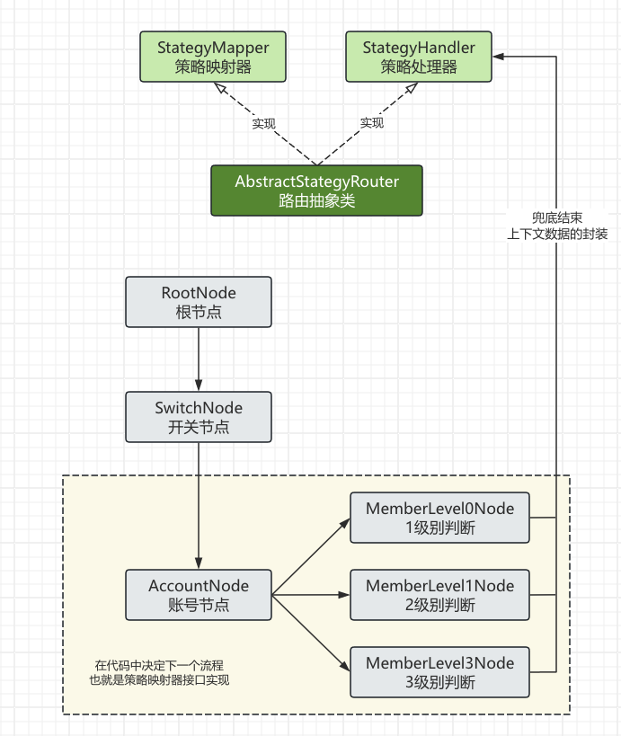
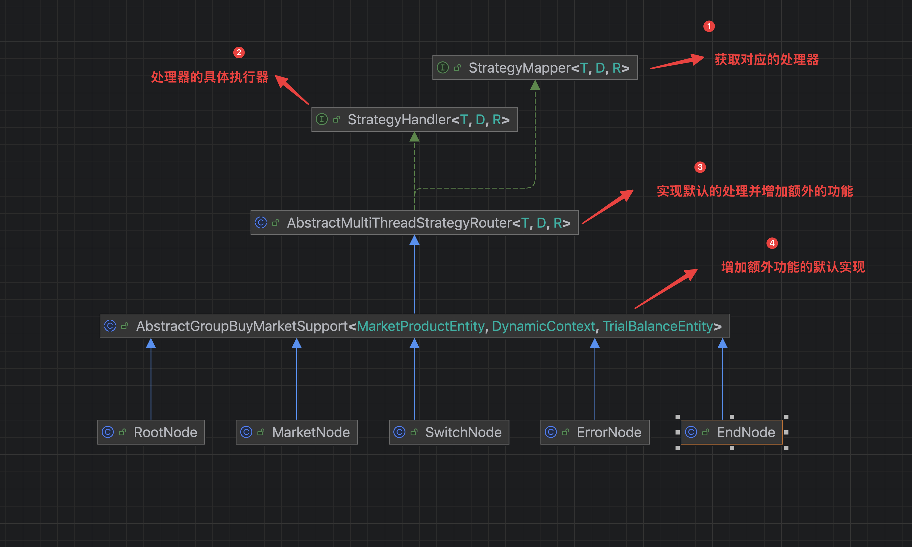

## 规则树设计

规则树的整体模型图如下：



用来解决在一个流程中，根据不同的节点执行不同的代码逻辑。完整的类图如下：




使用工厂进行流程的初始化，并执行后续一系列的逻辑。

`StrategyMapper` 获取对应的执行策略。用于获取对应的执行策略

```java

/**
 * 映射器
 * @param <T> 参数1
 * @param <D> 参数2
 * @param <R> 返回值
 */
public interface StrategyMapper<T,D,R> {

    /**
     * 获取待执行策略
     *
     * @param requestParameter 入参
     * @param dynamicContext   上下文
     * @return 返参
     */
    StrategyHandler<T,D,R> get(T requestParameter,D dynamicContext);
}

```

`StrategyHandler` 策略具体的执行器，不同的策略执行的逻辑代码不相同

```java
/**
 * 策略处理器
 * @param <T> 泛型参数1
 * @param <D> 泛型参数2
 * @param <R> 返回值
 */
public interface StrategyHandler<T,D,R> {

    /**
     * 默认的策略处理器
     */
    StrategyHandler DEFAULT = (T,D) -> null;

    /**
     * 执行调用对应策略实现
     * @param requestParameter 请求参数
     * @param dynamicContext 上下文
     * @return 返回
     * @throws Exception 异常
     */
    R apply(T requestParameter,D dynamicContext) throws Exception;
}

```

`AbstractMultiThreadStrategyRouter`抽象类实现策略映射器和处理器接口。`StrategyMapper`和`StrategyHandler`,并做额外的扩展

```java

/**
 * 多线程加载抽象类
 * @param <T> 入参
 * @param <D> 上下文
 * @param <R> 返回参数
 */
public abstract class AbstractMultiThreadStrategyRouter<T,D,R> implements StrategyHandler<T,D,R>,StrategyMapper<T,D,R> {

    protected StrategyHandler<T,D,R> defaultStrategyHandler = StrategyHandler.DEFAULT;

    /**
     * 从策略映射器中获取策略处理器，执行不同策略
     *
     * @param requestParameter 请求参数
     * @param dynamicContext 上下文
     * @return 返回
     * @throws Exception 异常
     */
    public R router(T requestParameter,D dynamicContext) throws Exception{
        // 获取对应策略映射器的处理器
        StrategyHandler<T, D, R> handler = get(requestParameter, dynamicContext);
        // 策略处理器不为空进行处理
        if (null != handler)  return handler.apply(requestParameter,dynamicContext);
        // 策略器为空，用默认的策略处理器
        return defaultStrategyHandler.apply(requestParameter,dynamicContext);
    }


    @Override
    public R apply(T requestParameter, D dynamicContext) throws Exception {
        multiThread(requestParameter,dynamicContext);
        return doApply(requestParameter,dynamicContext);
    }

    /**
     * 多线程加载数据
     *
     * @param requestParameter 请求参数
     * @param dynamicContext 上下文
     * @throws Exception 异常
     */
    protected abstract void multiThread(T requestParameter, D dynamicContext) throws Exception;


    /**
     * 数据查询方法
     *
     * @param requestParameter 请求参数
     * @param dynamicContext 上下文
     * @return 返回参数
     * @throws Exception 异常
     */
    protected abstract R doApply(T requestParameter, D dynamicContext) throws Exception;

}

```

上述中的`multiThread` 抽象方法异步加载数据并不是每个节点都是有的，所以需要额外在创建一个抽象类来提供默认的实现，后续各个节点根据不同的业务逻辑需求来决定是否要重写`multiThread`方法。

`AbstractGroupBuyMarketSupport`抽象类，提供了`multiThread`方法的空实现。

```java
public abstract class AbstractGroupBuyMarketSupport<MarketProductEntity,DynamicContext,TrialBalanceEntity> extends AbstractMultiThreadStrategyRouter<MarketProductEntity,DynamicContext,TrialBalanceEntity> {

    protected long timeout = 500;

    @Resource
    protected IActivityRepository repository;

    @Override
    protected void multiThread(MarketProductEntity marketProductEntity,DynamicContext dynamicContext) throws ExecutionException, InterruptedException, TimeoutException {

    }
}

```

下面的`RootNode`、`SwitchNode`、`MarketNode`、`ErrorNode`、`EndNode`等都是继承了`AbstractGroupBuyMarketSupport`类，不同的业务写在不同的节点中，`RootNode`节点是默认的头节点，根据流程的组装成不同的节点连接来串联整个业务。

通过默认的工厂来进入到头节点，然后在头节点中指定下一个节点依次形成类似单向链表的结构。

`DefaultActivityStrategyFactory` 默认工厂提供头节点的获取方式。

```java
@Service
@Slf4j
public class DefaultActivityStrategyFactory {

    private final RootNode rootNode;

    public DefaultActivityStrategyFactory(RootNode rootNode) {
        this.rootNode = rootNode;
    }


    public StrategyHandler<MarketProductEntity,DynamicContext, TrialBalanceEntity> getStrategyHandler(){
        return rootNode;
    }

    @AllArgsConstructor
    @NoArgsConstructor
    @Data
    @Builder
    public static class DynamicContext{
        /**
         * 拼团活动配置信息
         */

        private GroupBuyActivityDiscountVO groupBuyActivityDiscountVO;

        /**
         * SKU商品信息
         */
        private SkuVO skuVO;

        /**
         * 折扣价格
         */
        private BigDecimal deductionPrice;
    }
}

```

在需要使用到业务的情况，通过spring注入工厂，获取默认的执行器，并执行默认执行器的`apply`方法，即可串联完成整个业务流程。

```java

    @Resource
    private DefaultActivityStrategyFactory defaultActivityStrategyFactory;

    @Override
    public TrialBalanceEntity indexMarketTrial(MarketProductEntity marketProductEntity) throws Exception {

        StrategyHandler<MarketProductEntity, DefaultActivityStrategyFactory.DynamicContext, TrialBalanceEntity> strategyHandler = defaultActivityStrategyFactory.getStrategyHandler();

        return strategyHandler.apply(marketProductEntity,new DefaultActivityStrategyFactory.DynamicContext());
    }

```