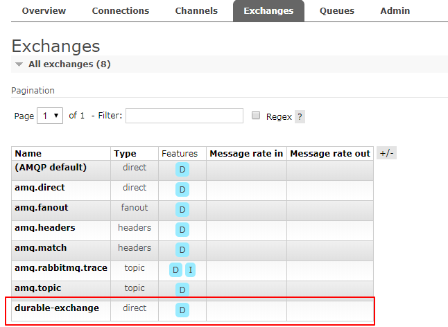

要解决该问题，就要用到RabbitMQ中**持久化**的概念，所谓持久化，就是RabbitMQ会将内存中的数据(Exchange 交换器，Queue 队列，Message 消息)固化到磁盘，以防异常情况发生时，数据丢失。

RabbitMQ的持久化分为三个部分
1. 交换器(Exchange)的持久化
2. 队列(Queue)的持久化
3. 消息(Message)的持久化

## 1. 交换器(Exchange)的持久化

声明Exchange的代码是这样的：

```java
// 创建一个Exchange
private final static String EXCHANGE_NAME = "normal-confirm-exchange";
channel.exchangeDeclare(EXCHANGE_NAME, "direct");
```

这种情况下声明的Exchange是非持久化的，在RabbitMQ出现异常情况（重启，宕机）时，该Exchange会丢失，会影响后续的消息写入该Exchange，那么如何设置Exchange为持久化的呢？

答案：设置durable参数。

>[!tip]说明
> durable：设置是否持久化。durable设置为true表示持久化，反之是非持久化。<br/>
> 持久化可以将交换器存盘，在服务器重启的时候不会丢失相关信息。

设置Exchange持久化

```java
channel.exchangeDeclare(EXCHANGE_NAME, "direct", true);
```

此时调用的重载方法为

```java
public DeclareOk exchangeDeclare(String exchange, String type, boolean durable) throws IOException {
    return this.exchangeDeclare(exchange, (String)type, durable, false, (Map)null);
}
```

为了能更好的理解，我们新建个生产类如下：

```java
package com.zwwhnly.springbootaction.rabbitmq.durable;import com.rabbitmq.client.Channel;
import com.rabbitmq.client.Connection;
import com.rabbitmq.client.ConnectionFactory;import java.io.IOException;
import java.util.concurrent.TimeoutException;public class DurableProducer {
    private final static String EXCHANGE_NAME = "durable-exchange";
    private final static String QUEUE_NAME = "durable-queue";    public static void main(String[] args) throws IOException, TimeoutException {
        // 创建连接
        ConnectionFactory factory = new ConnectionFactory();
        // 设置 RabbitMQ 的主机名
        factory.setHost("localhost");
        // 创建一个连接
        Connection connection = factory.newConnection();
        // 创建一个通道
        Channel channel = connection.createChannel();
        // 创建一个Exchange
        channel.exchangeDeclare(EXCHANGE_NAME, "direct");
        channel.queueDeclare(QUEUE_NAME, false, false, false, null);
        channel.queueBind(QUEUE_NAME, EXCHANGE_NAME, "");        // 发送消息
        String message = "durable exchange test";
        channel.basicPublish(EXCHANGE_NAME, "", null, message.getBytes());        // 关闭频道和连接
        channel.close();
        connection.close();
    }
}
```

示例代码中，我们新建了1个非持久化的Exchange，1个非持久化的Queue，并将它们做了绑定，此时运行代码，Exchange和Queue新建成功，消息durable exchange test也被正确地投递到了队列中：


此时重启下RabbitMQ服务，会发现Exchange丢失了


修改下代码,将durable参数设置为ture

```java
// 创建一个Exchange
channel.exchangeDeclare(EXCHANGE_NAME, "direct", true);
```

此时运行完代码，然后重启下RabbitMQ服务，会发现Exchange不再丢失：



## 2. 队列(Queue)的持久化

细心的网友可能会发现，虽然现在重启RabbitMQ服务后，Exchange不丢失了，但是队列和消息丢失了，那么如何解决队列不丢失呢？答案也是设置durable参数。

>[!tip]说明
> durable：设置是否持久化。为true则设置队列为持久化。<br/>
> 持久化的队列会存盘，在服务器重启的时候可以保证不丢失相关信息。

简单修改下上面声明Queue的代码，将durable参数设置为true：

```java
channel.queueDeclare(QUEUE_NAME, true, false, false, null);
```

此时调用的重载方法如下：

```java
public com.rabbitmq.client.impl.AMQImpl.Queue.DeclareOk queueDeclare(String queue, boolean durable, boolean exclusive, boolean autoDelete, Map<String, Object> arguments) throws IOException {
    validateQueueNameLength(queue);
    return (com.rabbitmq.client.impl.AMQImpl.Queue.DeclareOk)this.exnWrappingRpc((new com.rabbitmq.client.AMQP.Queue.Declare.Builder()).queue(queue).durable(durable).exclusive(exclusive).autoDelete(autoDelete).arguments(arguments).build()).getMethod();
}
```

运行代码，然后重启RabbitMQ服务，会发现队列现在不丢失了


## 3. 消息(Message)的持久化

虽然现在RabbitMQ重启后，Exchange和Queue都不丢失了，但是存储在Queue里的消息却仍然会丢失，那么如何保证消息不丢失呢？答案是设置消息的投递模式为2，即代表持久化。

修改发送消息的代码为

```java
// 发送消息
String message = "durable exchange test";
AMQP.BasicProperties props = new AMQP.BasicProperties().builder().deliveryMode(2).build();
channel.basicPublish(EXCHANGE_NAME, "", props, message.getBytes());
```

调用的重载方法为

```java
public void basicPublish(String exchange, String routingKey, BasicProperties props, byte[] body) throws IOException {
    this.basicPublish(exchange, routingKey, false, props, body);
}
```

运行代码，然后重启RabbitMQ服务，发现此时Exchange，Queue，消息都不丢失了：


至此，我们完美的解决了RabbitMQ重启后，消息丢失的问题。

## 4、 注意事项

1、理论上可以将所有的消息都设置为持久化，但是这样会严重影响RabbitMQ的性能。因为写入磁盘的速度比写入内存的速度慢得不止一点点。对于可靠性不是那么高的消息可以不采用持久化处理以提高整体的吞吐量。**在选择是否要将消息持久化时，需要在可靠性和吞吐量之间做一个权衡。**

2、**将交换器、队列、消息都设置了持久化之后仍然不能百分之百保证数据不丢失**，因为当持久化的消息正确存入RabbitMQ之后，还需要一段时间（虽然很短，但是不可忽视）才能存入磁盘之中。如果在这段时间内RabbitMQ服务节点发生了宕机、重启等异常情况，消息还没来得及落盘，那么这些消息将会丢失。

3、单单只设置队列持久化，重启之后消息会丢失；单单只设置消息的持久化，重启之后队列消失，继而消息也丢失。单单设置消息持久化而不设置队列的持久化显得毫无意义。