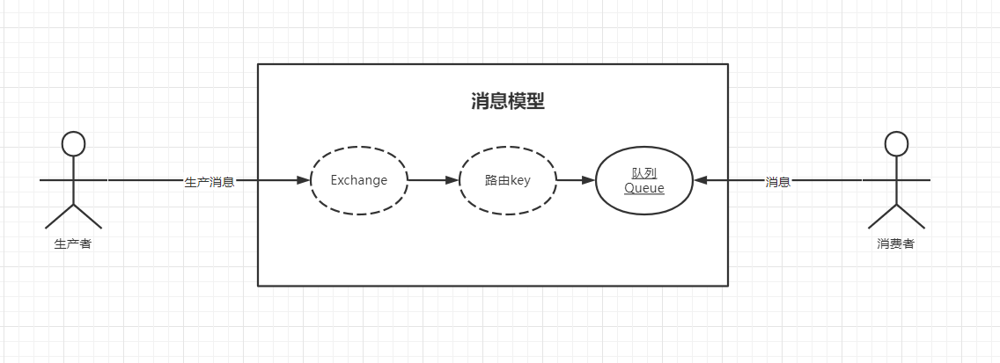
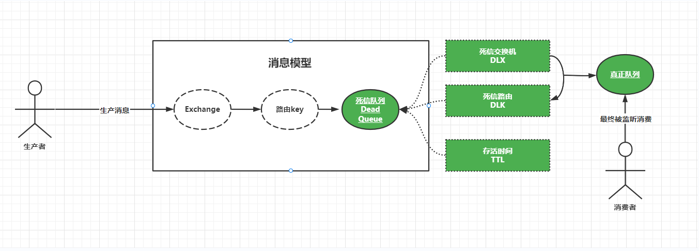

RabbitMQ的死信队列，相对于传统的定时器轮询的处理方式，死信队列具有占有系统资源少。（比如不需要轮询数据库获取数据，减少DB层面资源的消耗），人为很少干预，只需要搭建好死信队列消息模型，就可以不需要认为去进行干预了，以及自动处理消息和数据，不夸张的讲，在实际项目中，任何需要延迟，延时处理的业务都可以使用死信队列这个强大的组件。

### 死信队列的专有术语和词汇

与普通的队列相比，死信队列同样具有三个核心成员：

- 交换机
- 路由
- 队列

只不过死信队列，增加了另外三个成员即：

- DLX：死信交换机：即Dead -Letter-Exchange。是一种特殊的交换机。
- DLK：死信路由：即Dead-Letter-Routing-Key。主要和DLX一起使用，
- TTL：存活时间，即Time-To-Live，指的是进入死信队列的消息可以存活的时间，一旦达到TTL，讲以为这该消息死了，从而进入下一个中转站，等待被正在的消息队列监听消费。


### 什么样子的消息会进入死信DLX — 死信队列 — DLX – DLK

- 消息被拒绝，比如通过调用basic.reject或者basic.nack方法的时候，会进入到死信中，并且不在重新投递，即requeue参数的取值是false.
- 消息超过指定的存活时间（比如通过调用messageProperties.setExpiration()设置消息的TTL时间即可实现）。
- 队列达到最大长度。

当发生上述的情况时，将会出现死信的情况，而之后的消费讲被重新投递到另一个交换机，此时该交换机就是死信队列交换机。由于该死信队列交换机和死信路由绑定在一起对应真正的队列。导致消息讲被分发到真正的队列。最终被该队列对应的消费者所监听消费，简单说：就是没有被死信队列消费的消息，讲换个地方重新被消费从而实现消息：“延迟”，“延时”消费，而这个地方就是消息的下一个中转站，即死信交换机。

在前面我们得知，RabbitMQ的基础消息模型是由：交换机，路由和队列及其绑定所组成。生产者生产消息后，将消息发送到消费模型的交换机中，又由交换机与绑定的路由key找到对应的队列，然后监听该队列的消费者进行消费和处理，如下图：




### 死信队列消息模式实战




### 步骤


#### 1、消息载体

```java
@AllArgsConstructor
@NoArgsConstructor
@Data
public class PugMessage implements java.io.Serializable {
    private String orderId;

    private String messageType;
}

```

#### 2、RabbitTemplate配置类

```java
@Configuration
public class RabbitMQTemplateConfigration {

    // 设置RabbitMQ的链接工厂实例
    @Autowired
    private CachingConnectionFactory connectionFactory;


    @Bean
    public RabbitTemplate rabbitTemplate() {
        // 设置消息发送确认机制，生产确认
        connectionFactory.setPublisherConfirmType(CachingConnectionFactory.ConfirmType.CORRELATED);
        // 设置消息发送确认机制，发送成功返回反馈信息
        connectionFactory.setPublisherReturns(true);
        // 定义RabbitMQ消息操作组件实例
        RabbitTemplate rabbitTemplate = new RabbitTemplate(connectionFactory);
        // 设置发送的格式
        rabbitTemplate.setMessageConverter(new Jackson2JsonMessageConverter());

        return rabbitTemplate;
    }
}
```

#### 3、创建死信交换机、死信队列、死信路由key

```java
@Configuration
public class TopicDeadRabbitMQConfiguration {


    @Autowired
    private CachingConnectionFactory connectionFactory;

    // 定义正常交换机
    public static final String TOPIC_ORDER_NATURAL_EXCHANGE = "pug.mq.natural.topic.order.exchange";
    // 定义正常存mongodb的路由key
    public static final String TOPIC_ORDER_NATURAL_MONGODB_ROUTEING_KEY = "*.mongodb";

    // 定义一个死信交换机
    public static final String TOPIC_DEAD_ORDER_EXCHANGE = "pug.mq.dead.topic.order.ex";
    // 定义一个死信路由key
    public static final String TOPIC_DEAD_ORDER_ROUTEING_KEY = "dead.mongodb";
    // 定义一个死信队列
    public static final String TOPIC_DEAD_MONGODB_ORDER_QUEUE = "pug.mq.dead.topic.order.mongodb.queue";

    // 定义一个正常的真正的队列
    public static final String TOPIC_ORDER_MONGODB_QUEUE = "pug.mq.natural.topic.order.queue";

    /**
     * 创建正常交换机
     * @return
     */
    @Bean
    public Exchange naturalOrderExchange(){
        return ExchangeBuilder.topicExchange(TOPIC_ORDER_NATURAL_EXCHANGE).durable(true).build();
    }


    /**
     * 创建正常的队列
     * @return
     */
    @Bean
    public Queue naturalOrderQueue(){
        return QueueBuilder.durable(TOPIC_ORDER_MONGODB_QUEUE).build();
    }


    /**
     * 正常交换机绑定死信队列
     * @return
     */
    @Bean
    public Binding naturalBindTopicKey(){
        return BindingBuilder.bind(deadOrderQueue()).to(naturalOrderExchange()).with(TOPIC_ORDER_NATURAL_MONGODB_ROUTEING_KEY).noargs();
    }


    /**
     * 创建死信队列
     * @return
     */
    @Bean
    public Queue deadOrderQueue(){
        // 使用Map存放死信队列的三个核心组成部分
        Map<String, Object> args = new HashMap<>();
        // 创建死信队列交换机
        args.put("x-dead-letter-exchange", TOPIC_DEAD_ORDER_EXCHANGE);
        // 创建死信队列路由
        args.put("x-dead-letter-routing-key", TOPIC_DEAD_ORDER_ROUTEING_KEY);
        // 设定TTL，单位是ms，下面的单位是1分钟
        args.put("x-message-ttl", 60000);
        // 创建队列并返回死信队列实例
        return QueueBuilder.durable(TOPIC_DEAD_MONGODB_ORDER_QUEUE).withArguments(args).build();
    }


    /**
     * 创建死信交换机
     * @return
     */
    @Bean
    public Exchange createDeadOrderExchange(){
        return ExchangeBuilder.topicExchange(TOPIC_DEAD_ORDER_EXCHANGE).durable(true).build();
    }


    /**
     * 将死信交换机通过死信路由key绑定正常队列
     * @return
     */
    @Bean
    public Binding deadExchangeBindsNaturalQueu(){
        return BindingBuilder.bind(naturalOrderQueue()).to(createDeadOrderExchange()).with(TOPIC_DEAD_ORDER_ROUTEING_KEY).noargs();
    }

    @Bean("simpleTopicListenerDeadContainer")
    public SimpleRabbitListenerContainerFactory simpleTopicListenerContainer(){
        // 创建消息监听器所在的容器工厂实例
        SimpleRabbitListenerContainerFactory factory = new SimpleRabbitListenerContainerFactory();
        // 为容器工厂实例设置链接工厂
        factory.setConnectionFactory(connectionFactory);
        // 设置消息在传输过程中的格式为JSON
        factory.setMessageConverter(new Jackson2JsonMessageConverter());
        // 设置消息并发实例,这里采用单一模式，如果你消息对接100W或者消息你怎么处理？
        factory.setConcurrentConsumers(1);
        // 设置消费者并发最大数量实例
        factory.setMaxConcurrentConsumers(1);
        // 设置消费每个并发实例预拉取的消息数据量，这个地方很重要，如果你设置的话，有多少拉取多少。
        factory.setPrefetchCount(1);
        // 设置应答模型.改成自动应答
        factory.setAcknowledgeMode(AcknowledgeMode.MANUAL);
        // 返回监听器容器工厂实例
        return factory;
    }

}
```

#### 4、生产者

```java
@Service
@Slf4j
public class TopicDeadService {

    @Autowired
    private RabbitTemplate rabbitTemplate;


    public void sendMessage(PugMessage pugMessage){
        // 设置交换机
        rabbitTemplate.setExchange(TopicDeadRabbitMQConfiguration.TOPIC_ORDER_NATURAL_EXCHANGE);

        // 设置路由key
        rabbitTemplate.setRoutingKey(pugMessage.getRouteKey());

        // 设置可靠生产
        rabbitTemplate.setMandatory(true);

        rabbitTemplate.setConfirmCallback((correlationData, ack, cause) -> {

            log.info("消息发送成功！{}，{}，{}",correlationData,ack,cause);
        });

        // 发送消息
        rabbitTemplate.convertAndSend(pugMessage, new MessagePostProcessor() {
            @Override
            public Message postProcessMessage(Message message) throws AmqpException {
                return message;
            }
        });
        log.info("发送消息方法已执行结束");
    }

}
```

#### 5、消费者

```java
@Service
@Slf4j
public class TopicDeadComsum {

    @RabbitListener(queues = {TopicDeadRabbitMQConfiguration.TOPIC_ORDER_MONGODB_QUEUE},containerFactory = "simpleTopicListenerDeadContainer")
    public void orderESmessage(@Payload PugMessage pugMessage, Message message, Channel channel) throws IOException {
        long deliveryTag = message.getMessageProperties().getDeliveryTag();
        try {
            // basicAck自动应答
            channel.basicAck(deliveryTag, false);
            log.info("================pug topic dead order mongdb message is :{}", pugMessage);
        } catch (Exception ex) {
            Map<String, Object> headers = message.getMessageProperties().getHeaders();
            //重试次数
            Integer retryCount;
            String mapKey = "retry-count";
            if (!headers.containsKey(mapKey)) {
                retryCount = 0;
            } else {
                retryCount = (Integer) headers.get(mapKey);
            }

            if (retryCount++ < 3) {
                log.info("已经重试 " + retryCount + " 次");
                headers.put("retry-count", retryCount);
                // 当消息回滚到消息队列时，这条消息不会回到队列尾部，而是仍是在队列头部。
                // 这时消费者会立马又接收到这条消息进行处理，接着抛出异常，进行 回滚，如此反复进行
                // 而比较理想的方式是，出现异常时，消息到达消息队列尾部，这样既保证消息不回丢失，又保证了正常业务的进行。
                // 因此我们采取的解决方案是，将消息进行应答。
                // 这时消息队列会删除该消息，同时我们再次发送该消息 到消息队列，这时就实现了错误消息进行消息队列尾部的方案
                // 1.应答
                channel.basicAck(deliveryTag, false);
                // 2.重新发送到MQ中
                AMQP.BasicProperties basicProperties = new AMQP.BasicProperties().builder()
                        .contentType("application/json").headers(headers).build();
                // 重新把消息发动自己的交换机和队列中继续消费
                channel.basicPublish(message.getMessageProperties().getReceivedExchange(),
                        message.getMessageProperties().getReceivedRoutingKey(), basicProperties,
                        message.getBody());
            } else {
                log.info("现在重试次数为：" + retryCount);
                /**
                 * 重要的操作 存盘
                 * 手动ack
                 * channel.basicAck(deliveryTag,false);
                 * 通知人工处理
                 * log.error("重试三次异常，快来人工处理");
                 */
                // 消息存盘
                // MsgLog msgLog = new MsgLog();
                // msgLog.setMsgId(msg.getMsgId());
                // msgLog.setMsg(new String(message.getBody(),"utf-8"));
                // msgLog.setExchange(message.getMessageProperties().      getReceivedExchange());
                //  msgLog.setRoutingKey(message.getMessageProperties().getReceivedRoutingKey());
                // msgLog.setTryCount(retryCount);
                // msgLog.setStatus(MsgLogStatusEnum.FAIL.getStatus());
                // msgLogService.save(msgLog);

                /**
                 * 不重要的操作放入 死信队列
                 * 消息异常处理：消费出现异常后，延时几秒，然后从新入队列消费，直到达到ttl超时时间，再转到死信，证明这个信息有问题需要人工干预
                 */
                // 休眠2s 延迟写入队列，触发转入死信队列
                // Thread.sleep(2000);
                // channel.basicNack(deliveryTag, false, true);
            }
        }
        log.info("***************pug topic dead order mongdb message is :{}",pugMessage.getOrderId());
    }
}
```
