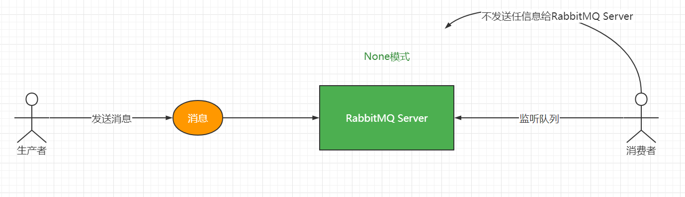
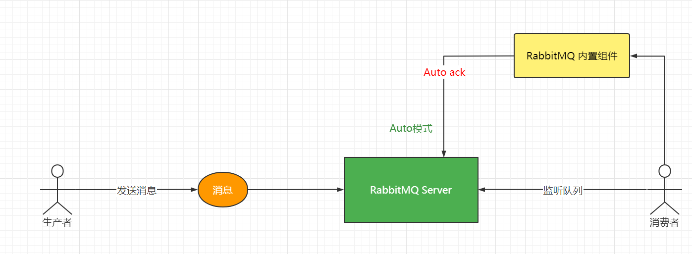
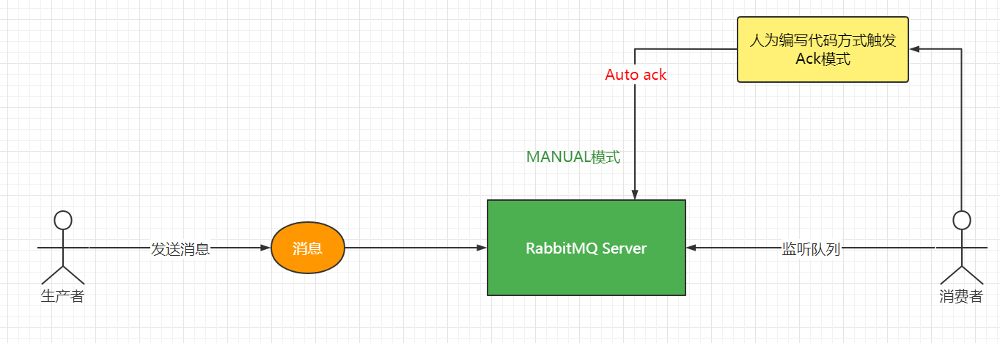

假设：如果消费者在消费消息的时候出现了异常会怎么样？

RabbitMQ默认情况下（none ack）的，会出现死循环，消息会一直反复投递，直到RabbitMQ服务宕机，不能对外提供服务为止。

解决方案：设置消费者与RabbitMQ服务的ACK机制

## 01、如何解决异常和死循环的问题呢？

- 给消息设定时间（ttl）(在特殊场景中会使用到，比如：延迟处理的时候)
- 设定重试次数
- (不重要的数据：)自己捕获异常 + 手动ACK / 或者 Reject
- (重要的数据)：自己捕获异常 + 手动ACK  + 死信队列 + 错误数据冗余 + 重新投递 /人工处理


### RabbitMQ 重试机制 -- 全局配置

```yaml
spring:
  rabbitmq:
    host: 120.77.34.190
    port: 5672
    username: admin
    password: admin
    virtual-host: /
    listener:
      simple:
        retry:
          enabled: true # 开启重试机制
          max-attempts: 3 # 重试的次数
          max-interval: 10000   # 重试最大间隔时间 
          initial-interval: 2000  # 重试初始间隔时间
          multiplier: 2 # 间隔时间乘子，重试初始间隔时间*乘子=下一次的间隔时间，最大不能超过设置的最大间隔时间 max-interval
```


### RabbitMQ 重试机制 -- 局部配置

```java
@Configuration
public class TopicOrderRabbitMQConfiguration {

    /**
     * 单一消费者，确认模式是：ACK的AUTO
     */
    @Bean("simpleTopicListenerContainerAuto")
    public SimpleRabbitListenerContainerFactory simpleTopicListenerContainerAuto(){
        // 创建消息监听器所在的容器工厂实例
        SimpleRabbitListenerContainerFactory factory = new SimpleRabbitListenerContainerFactory();
        // 为容器工厂实例设置链接工厂
        factory.setConnectionFactory(connectionFactory);
        // 设置消息在传输过程中的格式为JSON
        factory.setMessageConverter(new Jackson2JsonMessageConverter());
        // 设置消息并发实例,这里采用单一模式
        factory.setConcurrentConsumers(1);
        // 设置消费者并发最大数量实例
        factory.setMaxConcurrentConsumers(1);
        // 设置消费每个并发实例预拉取的消息数据量
        factory.setPrefetchCount(1);

        RetryTemplate retryTemplate = new RetryTemplate();
        //==================== 尝试的次数
        RetryPolicy retryPolicy = new SimpleRetryPolicy();
        //====================== 时间和次数的策略
        ExponentialBackOffPolicy exponentialBackOffPolicy = new ExponentialBackOffPolicy();
        //初始等待时间
        exponentialBackOffPolicy.setInitialInterval(1000);
        //时间等待倍数
        exponentialBackOffPolicy.setMultiplier(2);
        //最大等待时间
        exponentialBackOffPolicy.setMaxInterval(5000);

        retryTemplate.setBackOffPolicy(exponentialBackOffPolicy);
        retryTemplate.setRetryPolicy(retryPolicy);

        factory.setRetryTemplate(retryTemplate);

        // 设置重试机制
        RetryInterceptorBuilder builder =   RetryInterceptorBuilder.stateless();
        builder.retryOperations(retryTemplate);
        MessageRecoverer recoverer = new RejectAndDontRequeueRecoverer();
        builder.recoverer(recoverer);
        factory.setAdviceChain(builder.build());

        // 设置应答模型.改成自动应答
        factory.setAcknowledgeMode(AcknowledgeMode.AUTO);
        // 返回监听器容器工厂实例
        return factory;
    }
}
```


### 结论

- 应答机制：none ，代表全有Rabbitmq来决定。
>[!tip]注意点：
**如果消费者出错以后加了try/catch，重试机制会自动失效。**

>[!tip]好处
>就是可能消费者的网络突然出现暂时性的断开或者故障，可能使用重试可以带来可靠的消费。
>
>使用它可以解决，消息出异常而造成死循环的问题呢

>[!danger]缺点：
>重试一旦开启，如果在重试的次数和时间内，如果消息还没有正常的消费，rabbitmq-server直接把消息删除,所以重试次数：不建议在特别**重要**的数据中去使用。比如下单不允许使用重试次数。
>
>应答模式ACK：只是告诉rabbitmq的ack应答的一种方式，和重试没有任何关联。所有没办法解决死循环的问题。


## 02、消费者 & RabbitMQ服务的ACK确认机制

### 自动签收AUTO

自动应答： 不在乎消费者对消息处理是否成功，都会告诉队列删除消息。如果处理消息失败，实现自动补偿（队列投递过去 重新处理）。

### 手动应答ACK

消费者处理完业务逻辑，手动返回ack（通知）告诉队列处理完了，队列进而删除消息。

### 消息的高可用和确认机制

在实际的开发和生产中，很多事情并不是那么的完美。分布式消息中间件也是如此，使用RabbitMQ的开发者可能并不会陌生，即RabbitMQ在实际的应用过程中如果配置和使用不当，则会出现各种令人头疼的问题

- 不知道发送出去的消息到底有没有发送成功，即采用RabbitTemplate操作组件发送消息时，开发者自认为消息已经发送出去了，然后在某些情况下：比如交换机，路由和队列以及绑定构成的消息模型不存在的时候，很有可能会发送失败。（**消费者可靠生产的问题** ）

    >[!tip]解决方案：针对上面的问题，RabbitMQ提出了发送确认机制，当确认成功即代表消息发送出去了，

- 由于特殊的原因，RabbitMQ服务出现宕机或者崩溃等问题，导致其需要执行重启操作，如果此时队列中仍有大量的消息还未被消费，则很有可能在重启RabbitMQ服务的过程中发生消息丢失的现象。(**Rabbitserver崩溃或者宕机怎么办？**)

    >[!tip]解决方案：即如何保证RabbitMQ队列的消息不丢失。RabbitMQ强烈建议开发者在创建队列，交换机的时候设置其持久化参数：true，即durable参数值为：true.

- 消费者在监听消费处理消息的时候，可能会出现监听失败或者有时候服务器会直接崩溃掉等问题，导致消息所在的队列找不到对应的消费者而不断地重新入队列，最终出现消息被重复消费的现象。（**可靠消费的问题**）

    >[!tip]解决方案：如何保证消息能够被准确消费，不重复消息，RabbitMQ提供消息确认机制，即ACK模式。RabbitMQ的消息确认模式有三种，分别是：
    >
    >1、NONE : 无需确认
    >
    >2、AUTO：自动确认
    >
    >3、MANUAL ：手动确认
    >
    >不同的确认机制，底层的执行逻辑和实际的应用场景是不相同的。在实际生产中，为了提高消息的高可用，防止消息重复消息，一般都会使用消息的确认机制，而只有当消息被确认消费后，消息才会从队列中移除，这也是避免消息被重复消息的实现方式。


### 消费消息的确认模式：NONE

RabbitMQ默认机制：none

- none的Ack：正常就移除掉
- none的Ack： 出错死循环，(正常+不出错我也不管了代表收到了)

NONE模式是一种：无需确认的模式，即生产者将消息发送到队列，消费者监听到消息时，无需发送任何反馈信息给RabbitMQ Server。

这就和用户禁止某个APP的通知提醒是一样的道理，当APP有重大更新信息时，虽然APP后端会推送给用户异步推送消息，但是由于用户进行了相关设置，古而虽然消息已经发送出去了。但是缺迟迟得不到用户的：“查看”和“确认“，消息就像：”石沉大海一般“。

图解如下：



>[!tip]结论
> - None的Ack：正常就移除掉
> - None的Ack：
>    - 不使用try/catch的情况：
>        -  错误也移除掉，啥都不做，不会死循环
>    - 使用了try/catch
>        - 也会自动移除掉，啥都不做，不会死循环


### 消费消息的确认模式：AUTO

AUTO模式是一种：是一种自动确认机制，即生产者将消息发送至队列，消费者监听到消息时，需要发送一个AUTO ACK的反馈信息给RabbitMQ服务器，之后该消息将在RabbitMQ的队列中被移除。其中这种发送反馈信息的行为是：RabbitMQ自动触发的。

图解如下：




Auto 模型代码分析：

```java
@Component
@Slf4j
public class MessageTopicConsumer {

    @Autowired
    private RabbitTemplate rabbitTemplate;


    @RabbitListener(queues = {TopicOrderRabbitMQConfiguration.TOPIC_ORDER_ES_QUEUE},
            containerFactory = "simpleTopicListenerContainerAuto")
    public void orderesmessage(@Payload PugMessageDto messageDto, Message message, Channel channel) {
        // 消费者在消费的过程中出现了异常？
        // 消息(数据)会怎么样？
        int i = 1 / 0;
        log.info("================pug topic order es message is :{}", messageDto);
    }

}
```

通过代码分析：自动autoack会出现如下的状况：

如果出现异常会怎么处理呢？

如果不使用try/catch ,就会出现死循环，会出现消费者重复消费的问题，也就是说RabbitMQ Server会重新投递给其他的消费者继续消费。

- 使用try/catch，代表RabbitMQ Server把消息自动应答，剔除消息，然后你自己去处理消息。
    - 第一个感受：不会出现死循环。消息会自动应答掉。代表你要自己去处理消息。
    - 第二个感受：重试机制会失效。

- 处理方式一：RabbitMQ Server收到该指令以后，会直接把消息当前正常的消费直接移除，面临的问题就很危险。如果这个时候是非常重要的消息就可能会丢失，所有调用这个方法的时候就一定要考虑清楚做重要的消息数据就要做好：转移  或者 备份+ 告警（日志 + 短信 + 监控）的工作。 然后使用定时器重发即可把数据查询出来重新投递继续消费。
- 处理方式二：把消息重新投递到别的交换机中，比如死信队列，其他的队列，将其消费。


>[!tip] 结论
>
> - Auto的Ack：正常就移除掉
> - Auto的Ack： 错误就死循环 + 走内部的raabbitmq组件就收到ack


### 消费消息的确认模式：MANUAL

MANUAL是一种：手动确认的消费机制，即生产者将消息发送至队列，消费者监听到消息时，需要手动地：“以代码的方式”发送一个ACK反馈信息给服务器，之后该消息将在RabbitMQ的队列中被移除，同时告诉生产者，消息已经被成功发送并且已经成功被消费者监听消费了。

图解如下：




这三种确认模式在实际生产中具有不同的应用场景，其中用得最多的肯定是：AUTO和MANUAL，由于NODE机制就是泼出去的水就收不回来了，发送完了就不需要再去理会，因此这种模式从严格意义来讲不严谨。实际的业务和场景中也比较少见。建议也不要使用。

而对于一些在消息，业务数据传输方面要求比较严格的场景：比如：手机话费充值业务，电商支付业务，游戏充值等，理应当选择：AUTO和MANUAL。从而保证数据不丢失，核心业务处理只做一次等。


MANUAL代码分析：

```java
@Component
@Slf4j
public class MessageTopicConsumer {

    @Autowired
    private ObjectMapper objectMapper;

    ThreadLocal<Integer> threadLocal = new ThreadLocal<Integer>();

    @RabbitListener(queues = {TopicOrderRabbitMQConfiguration.TOPIC_ORDER_MONGO_QUEUE},
            containerFactory = "simpleTopicListenerContainer")
    public void ordermonodbmessage(@Payload PugMessageDto messageDto, Message message, Channel channel) {
        // 消费者在消费的过程中出现了异常？
        // 消息(数据)会怎么样？
        // 1：每一条发过来我消息，在内部都会进行一次转换成Message对象，我们平时传递的数据是放在哪里呢？
        // 2：message.setBody(orderId), message.setBody(pugMesage)
        // 3：@Payload其实就是掉用message.getBody将其转换以后在注入到参数中。拿到getBody是一个byte[]数组
        // 4: message获取拿到消息的唯一标识，deliveryTag 这个标识有什么作用：
        // 5: message还拿到消息传递过来的附属参数，header,路由key,
        //byte[] body = message.getBody();
        //PugMessageDto pugMessageDto = objectMapper.readValue(body, PugMessageDto.class);
       try {
            // basicAck自动应答
            // 参数1：消息的id
            // 参数2：消息是否进行批量确认,如果你默认配置，就写false,代表就把当前的消息进行确认.
            channel.basicAck(deliveryTag, false);
            log.info("================pug topic order es message is :{}", messageDto);
        } catch (Exception ex) {
            Map<String, Object> headers = message.getMessageProperties().getHeaders();
            //重试次数
            Integer retryCount;
            String mapKey = "retry-count";
            if (!headers.containsKey(mapKey)) {
                retryCount = 0;
            } else {
                retryCount = (Integer) headers.get(mapKey);
            }

            if (retryCount++ < 3) {
                log.info("已经重试 " + retryCount + " 次");
                headers.put("retry-count", retryCount);
                //当消息回滚到消息队列时，这条消息不会回到队列尾部，而是仍是在队列头部。
                //这时消费者会立马又接收到这条消息进行处理，接着抛出异常，进行 回滚，如此反复进行
                //而比较理想的方式是，出现异常时，消息到达消息队列尾部，这样既保证消息不回丢失，又保证了正常业务的进行。
                //因此我们采取的解决方案是，将消息进行应答。
                //这时消息队列会删除该消息，同时我们再次发送该消息 到消息队列，这时就实现了错误消息进行消息队列尾部的方案
                //1.应答
                channel.basicAck(deliveryTag, false);
                //2.重新发送到MQ中
                AMQP.BasicProperties basicProperties = new AMQP.BasicProperties().builder()
                        .contentType("application/json").headers(headers).build();
                // 重新把消息发动自己的交换机和队列中继续消费
                channel.basicPublish(message.getMessageProperties().getReceivedExchange(),
                        message.getMessageProperties().getReceivedRoutingKey(), basicProperties,
                        message.getBody());
            } else {
                log.info("现在重试次数为：" + retryCount);
                /**
                 * 重要的操作 存盘
                 * 手动ack
                 * channel.basicAck(deliveryTag,false);
                 * 通知人工处理
                 * log.error("重试三次异常，快来人工处理");
                 */
                //消息存盘
                // MsgLog msgLog = new MsgLog();
                // msgLog.setMsgId(msg.getMsgId());
                // msgLog.setMsg(new String(message.getBody(),"utf-8"));
                // msgLog.setExchange(message.getMessageProperties().getReceivedExchange());
                // msgLog.setRoutingKey(message.getMessageProperties().getReceivedRoutingKey());
                // msgLog.setTryCount(retryCount);
                // msgLog.setStatus(MsgLogStatusEnum.FAIL.getStatus());
                // msgLogService.save(msgLog);

                /**
                 * 不重要的操作放入 死信队列
                 * 消息异常处理：消费出现异常后，延时几秒，然后从新入队列消费，直到达到ttl超时时间，再转到死信，证明这个信息有问题需要人工干预
                 */
                // 休眠2s 延迟写入队列，触发转入死信队列
                // Thread.sleep(2000);
                // channel.basicNack(deliveryTag, false, true);
            }
        }
    }
}

```

全程用代码的方式告诉RabbitMQ Server我是否收到消息，如果正常收到：直接调用channel.basicAck确认，RabbitMQ Server把消息移除，代表这是一个正常的执行，是一个可靠消费。

如果出现异常怎么处理呢？

使用try/catch，出现异常的消息就必须自己的处理？

- 处理方案一：channel.basicReject 拒绝，拒绝的消息会被rabbitmqserver重新投递给其他的消费者继续消费。所以这个时候你就要自己去写重试次数的控制。否则就出现死循环。不同拒绝，不停重复消费。
- 处理方式二：调用channel.basicNack方法，不应答，RabbitMQ Server收到该指令以后，会直接把消息当前正常的消费直接移除，面临的问题就很危险：如果这个时候是非常重要的消息就可能会丢失，所有调用这个方法的时候就一定要考虑清楚做重要的消息数据就要做好：转移  或者 备份+ 告警（日志 + 短信 + 监控）的工作。 然后使用定时器重发即可把数据查询出来重新投递继续消费。
- 处理方式三：调用channel.basicNack方法 ，把消息重新投递到别的交换机中，比如死信队列，其他的队列，将其消费。
- 如果不使用try/catch ,就不会出现死循环，但是会造成消息的堆积。

>[!tip]结论
>
> - 手动ACK告诉 正常就移除掉
> - 手动ACK告诉 错误不会重新投递 因为RabbitMQ Server收不到ack.。


### 结论

- 前提是没有try/catch ,不论你是None ,Auto,Manual 模型，只要你配置了重试机制，出现异常就重试
- 如果使用try/catch ,重试机制就会自动失效。


## 03、基于自动确认（AUTO）的消费模式


### 1、定义初始化RabbitTemplate配置类

```JAVA
@Configuration
@Slf4j
public class RabbitTemplateConfiguration {

    // 设置RabbitMQ的链接工厂实例
    @Autowired
    private CachingConnectionFactory connectionFactory;


    @Bean
    public RabbitTemplate rabbitTemplate() {
        // 设置消息发送确认机制，生产确认
        connectionFactory.setPublisherConfirmType(CachingConnectionFactory.ConfirmType.CORRELATED);
        // 设置消息发送确认机制，发送成功返回反馈信息
        connectionFactory.setPublisherReturns(true);
        // 定义RabbitMQ消息操作组件实例
        RabbitTemplate rabbitTemplate = new RabbitTemplate(connectionFactory);
        // 设置发送的格式
        rabbitTemplate.setMessageConverter(new Jackson2JsonMessageConverter());

        return rabbitTemplate;
    }
}
```


### 2、定义交换机，队列和路由

```java
@Configuration
public class TopicOrderRabbitMQConfiguration {

    @Autowired
    private CachingConnectionFactory connectionFactory;

    // 定义一个交换机
    public static final String TOPIC_ORDER_EXCHANGE = "pug.mq.topic.order.ex";
    // 定义一个路由key
    public static final String TOPIC_ORDER_MOGONDB_ROUTEING_KEY = "*.mogodb";

    public static final String TOPIC_ORDER_ES_ROUTEING_KEY = "es.#";
    // 定义一个订单mongodb队列
    public static final String TOPIC_ORDER_MONGO_QUEUE = "pug.mq.topic.order.mongo.queue";
    // 定义一个订单es队列
    public static final String TOPIC_ORDER_ES_QUEUE = "pug.mq.topic.order.es.queue";

    /**
     * 创建direct模型交换机
     * @return
     */
    @Bean
    public Exchange orderTopicExchange(){
        return ExchangeBuilder.topicExchange(TOPIC_ORDER_EXCHANGE).durable(true).build();
    }

    /**
     * 创建队列queue,mongodb
     * @return
     */
    @Bean
    public Queue orderTopicMongoQueue(){
        return QueueBuilder.durable(TOPIC_ORDER_MONGO_QUEUE).build();
    }

    /**
     * 创建队列queue,mongodb
     * @return
     */
    @Bean
    public Queue orderTopicEsQueue(){
        return QueueBuilder.durable(TOPIC_ORDER_ES_QUEUE).build();
    }

    /**
     * 将队列与交换机进行绑定，并设置路由key
     * @return
     */
    @Bean
    public Binding orderTopicMongoBinding() {
        return BindingBuilder
                .bind(orderTopicMongoQueue())
                .to(orderTopicExchange())
                .with(TOPIC_ORDER_MOGONDB_ROUTEING_KEY).noargs();
    }

    /**
     * 将队列与交换机进行绑定，并设置路由key
     * @return
     */
    @Bean
    public Binding orderTopicEsBinding() {
        return BindingBuilder
                .bind(orderTopicEsQueue())
                .to(orderTopicExchange())
                .with(TOPIC_ORDER_ES_ROUTEING_KEY).noargs();
    }

    /**
     * 单一消费者，确认模式是：AUTO
     */
    @Bean("simpleListenerContainerAuto")
    public SimpleRabbitListenerContainerFactory listenerContainerAuto(){
        // 创建消息监听器所在的容器工厂实例
        SimpleRabbitListenerContainerFactory factory = new SimpleRabbitListenerContainerFactory();
        // 为容器工厂实例设置链接工厂
        factory.setConnectionFactory(connectionFactory);
        // 设置消息在传输过程中的格式为JSON
        factory.setMessageConverter(new Jackson2JsonMessageConverter());
        // 设置消息并发实例,这里采用单一模式
        factory.setConcurrentConsumers(1);
        // 设置消费者并发最大数量实例
        factory.setMaxConcurrentConsumers(1);
        // 设置消费每个并发实例预拉取的消息数据量
        factory.setPrefetchCount(1);
        // 设置确认消费模式为自动确认消费
        factory.setAcknowledgeMode(AcknowledgeMode.AUTO);
        // 返回监听器容器工厂实例
        return factory;
    }
     /**
     * 多消费者，确认模式是：Auto
     */
    @Bean("multiListenerContainerAuto")
    public SimpleRabbitListenerContainerFactory multListenerContainerAuto(){
        // 创建消息监听器所在的容器工厂实例
        SimpleRabbitListenerContainerFactory factory = new SimpleRabbitListenerContainerFactory();
        // 为容器工厂实例设置链接工厂
        factory.setConnectionFactory(connectionFactory);
        // 设置消息在传输过程中的格式为JSON
        factory.setMessageConverter(new Jackson2JsonMessageConverter());
        // 设置消息并发实例,这里采用单一模式
        factory.setConcurrentConsumers(10);
        // 设置消费者并发最大数量实例
        factory.setMaxConcurrentConsumers(15);
        // 设置消费每个并发实例预拉取的消息数据量
        factory.setPrefetchCount(10);
        // 设置确认消费模式为自动确认消费
        factory.setAcknowledgeMode(AcknowledgeMode.AUTO);
        // 返回监听器容器工厂实例
        return factory;
    }
}

```

### 3、定义消费者

```java
@Component
@Slf4j
public class RabbitTopicMQConsumer {

    @RabbitListener(queues = {RabbitDirectConfiguration.TOPIC_ORDER_MONGO_QUEUE},
            containerFactory = "simpleListenerContainerAuto")
    public void watchQueueuMessage(@Payload MessageMo messageMo, Message message, Channel channel){
       try {
           log.info("Topic-------->基于AUTO的确认消费模式，消费者消费消息，内容是：{}",messageMo);
       }catch (Exception ex){
           log.error("Topic-------->基于AUTO的确认消费模式，消费者消费消息发生异常：{}",ex.fillInStackTrace());
       }
    }
}
```

## 04、基于手动ACK确认的消费模式


### 1、定义初始化RabbitTemplate配置类

```java
@Configuration
@Slf4j
public class RabbitTemplateConfiguration {

    // 设置RabbitMQ的链接工厂实例
    @Autowired
    private CachingConnectionFactory connectionFactory;


    @Bean
    public RabbitTemplate rabbitTemplate() {
        // 设置消息发送确认机制，生产确认
        connectionFactory.setPublisherConfirmType(CachingConnectionFactory.ConfirmType.CORRELATED);
        // 设置消息发送确认机制，发送成功返回反馈信息
        connectionFactory.setPublisherReturns(true);
        // 定义RabbitMQ消息操作组件实例
        RabbitTemplate rabbitTemplate = new RabbitTemplate(connectionFactory);
        rabbitTemplate.setMandatory(true);
        // 设置发送的格式
        rabbitTemplate.setMessageConverter(new Jackson2JsonMessageConverter());
        // 设置消息发送确认机制，即发送成功时输出日志
        rabbitTemplate.setConfirmCallback((correlationData, ack, cause) -> {
            log.info("消息发送成功!!!!,correlationData:{},ack:{},casuse:{}",correlationData,ack,cause);
        });

        // 设置消息发送确认机制，即发送完消息后输出反馈信息，如消息是否丢失等。
        rabbitTemplate.setReturnsCallback((resultMessage) -> {
            log.info("消息确认了:,message:{},replycode:{},replytext:{},exchange：{},routingKey:{}",
                    resultMessage.getMessage().getBody(),resultMessage.getReplyCode(),resultMessage.getReplyText(),resultMessage.getExchange(),resultMessage.getRoutingKey());
        });

        return rabbitTemplate;
    }
}
```


### 2：定义交换机，队列和路由

```java
@Configuration
public class RabbitTopicConfiguration {

    // 设置RabbitMQ的链接工厂实例
    @Autowired
    private CachingConnectionFactory connectionFactory;

    // 1: 定义交换机Exchange
    // 2: 定义队列 Queue
    // 3: 创建交换机 Exchange
    // 4: 创建队列Queue
    // 5: 交换机和队列绑定

    public static final String TOPIC_MESSAGE_EXCHANGE_NAME = "pug_topic_exchange_message";
    public static final String TOPIC_MESSAGE_QUEUE_NAME = "pug_topic_queue_message";
    public static final String TOPIC_MESSAGE_ROUTE_KEY = "pug.topic.routing.key";


    @Bean(TOPIC_MESSAGE_EXCHANGE_NAME)
    public Exchange topicDefineExchange(){
        return new DirectExchange(TOPIC_MESSAGE_EXCHANGE_NAME,true,false);
    }


    @Bean(TOPIC_MESSAGE_QUEUE_NAME)
    public Queue topicDefineQueue(){
        //return QueueBuilder.durable(TOPIC_MESSAGE_QUEUE_NAME).build();
        return new Queue(TOPIC_MESSAGE_QUEUE_NAME,true);
    }


    @Bean
    public Binding topicDefindDBinding(
            @Qualifier(TOPIC_MESSAGE_EXCHANGE_NAME) Exchange exchange,
            @Qualifier(TOPIC_MESSAGE_QUEUE_NAME) Queue queue){
        return BindingBuilder.bind(queue).to(exchange)
                .with(TOPIC_MESSAGE_ROUTE_KEY).noargs();
    }

    /**
     * 单一消费者，确认模式是：ACK
     */
    @Bean("simpleListenerContainerAck")
    public SimpleRabbitListenerContainerFactory listenerContainerAck(){
        // 创建消息监听器所在的容器工厂实例
        SimpleRabbitListenerContainerFactory factory = new SimpleRabbitListenerContainerFactory();
        // 为容器工厂实例设置链接工厂
        factory.setConnectionFactory(connectionFactory);
        // 设置消息在传输过程中的格式为JSON
        factory.setMessageConverter(new Jackson2JsonMessageConverter());
        // 设置消息并发实例,这里采用单一模式
        factory.setConcurrentConsumers(1);
        // 设置消费者并发最大数量实例
        factory.setMaxConcurrentConsumers(1);
        // 设置消费每个并发实例预拉取的消息数据量
        factory.setPrefetchCount(1);
        // 设置确认消费模式为自动确认消费
        factory.setAcknowledgeMode(AcknowledgeMode.MANUAL);
        // 返回监听器容器工厂实例
        return factory;
    }

    /**
     * 多消费者，确认模式是：ACK
     */
    @Bean("multiListenerContainerAck")
    public SimpleRabbitListenerContainerFactory multListenerContainerAck(){
        // 创建消息监听器所在的容器工厂实例
        SimpleRabbitListenerContainerFactory factory = new SimpleRabbitListenerContainerFactory();
        // 为容器工厂实例设置链接工厂
        factory.setConnectionFactory(connectionFactory);
        // 设置消息在传输过程中的格式为JSON
        factory.setMessageConverter(new Jackson2JsonMessageConverter());
        // 设置消息并发实例,这里采用单一模式
        factory.setConcurrentConsumers(10);
        // 设置消费者并发最大数量实例
        factory.setMaxConcurrentConsumers(15);
        // 设置消费每个并发实例预拉取的消息数据量
        factory.setPrefetchCount(10);
        // 设置确认消费模式为自动确认消费
        factory.setAcknowledgeMode(AcknowledgeMode.MANUAL);
        // 返回监听器容器工厂实例
        return factory;
    }
}
```


### 3、定义消费者

```java
@Component
@Slf4j
public class MessageTopicConsumer  {


    @RabbitListener(queues = {TopicOrderRabbitMQConfiguration.TOPIC_ORDER_MONGO_QUEUE}, containerFactory = "simpleListenerContainerAck")
    public void ordermonodbmessage(@Payload PugMessageDto messageDto, Message message, Channel channel)throws IOException, InterruptedException  {
        long deliveryTag = message.getMessageProperties().getDeliveryTag();
        try {
            // basicAck自动应答
            //System.out.println(1 / 0);
            // 参数1：消息的id
            // 参数2：消息是否进行批量确认,如果你默认配置，就写false,代表就把当前的消息进行确认.
            channel.basicAck(deliveryTag, false);
            log.info("================pug topic order es message is :{}", messageDto);
        } catch (Exception ex) {
            Map<String, Object> headers = message.getMessageProperties().getHeaders();
            //重试次数
            Integer retryCount;
            String mapKey = "retry-count";
            if (!headers.containsKey(mapKey)) {
                retryCount = 0;
            } else {
                retryCount = (Integer) headers.get(mapKey);
            }

            if (retryCount++ < 3) {
                log.info("已经重试 " + retryCount + " 次");
                headers.put("retry-count", retryCount);
                //当消息回滚到消息队列时，这条消息不会回到队列尾部，而是仍是在队列头部。
                //这时消费者会立马又接收到这条消息进行处理，接着抛出异常，进行 回滚，如此反复进行
                //而比较理想的方式是，出现异常时，消息到达消息队列尾部，这样既保证消息不回丢失，又保证了正常业务的进行。
                //因此我们采取的解决方案是，将消息进行应答。
                //这时消息队列会删除该消息，同时我们再次发送该消息 到消息队列，这时就实现了错误消息进行消息队列尾部的方案
                //1.应答
                channel.basicAck(deliveryTag, false);
                //2.重新发送到MQ中
                AMQP.BasicProperties basicProperties = new AMQP.BasicProperties().builder()
                        .contentType("application/json").headers(headers).build();
                // 重新把消息发动自己的交换机和队列中继续消费
                channel.basicPublish(message.getMessageProperties().getReceivedExchange(),
                        message.getMessageProperties().getReceivedRoutingKey(), basicProperties,
                        message.getBody());
            } else {
                log.info("现在重试次数为：" + retryCount);
                 /**
                 * 重要的操作 存盘
                 * 手动ack
                 * channel.basicAck(deliveryTag,false);
                 * 通知人工处理
                 * log.error("重试三次异常，快来人工处理");
                 */
                //消息存盘
                // MsgLog msgLog = new MsgLog();
                // msgLog.setMsgId(msg.getMsgId());
                // msgLog.setMsg(new String(message.getBody(),"utf-8"));
                // msgLog.setExchange(message.getMessageProperties().getReceivedExchange());
                // msgLog.setRoutingKey(message.getMessageProperties().getReceivedRoutingKey());
                // msgLog.setTryCount(retryCount);
                // msgLog.setStatus(MsgLogStatusEnum.FAIL.getStatus());
                // msgLogService.save(msgLog);

                /**
                 * 不重要的操作放入 死信队列
                 * 消息异常处理：消费出现异常后，延时几秒，然后从新入队列消费，直到达到ttl超时时间，再转到死信，证明这个信息有问题需要人工干预
                 */
                // 休眠2s 延迟写入队列，触发转入死信队列
                // Thread.sleep(2000);
                // channel.basicNack(deliveryTag, false, true);
            }
        }
    }
}
```