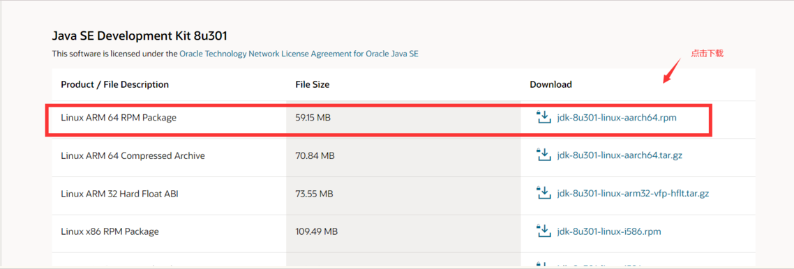
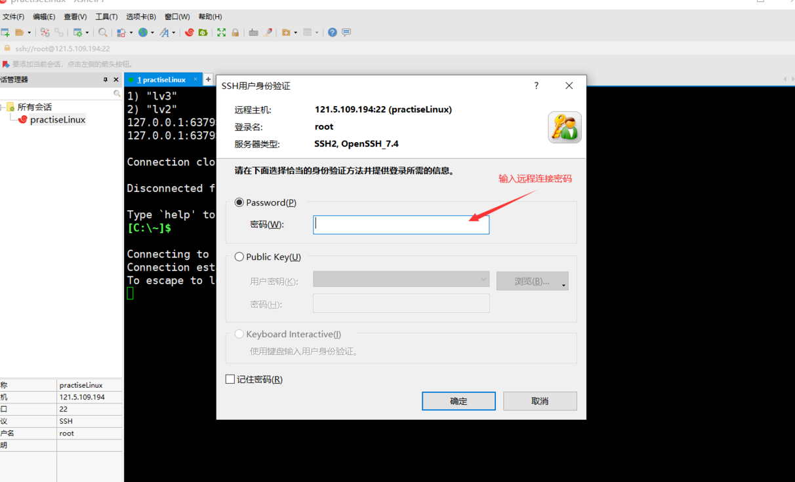
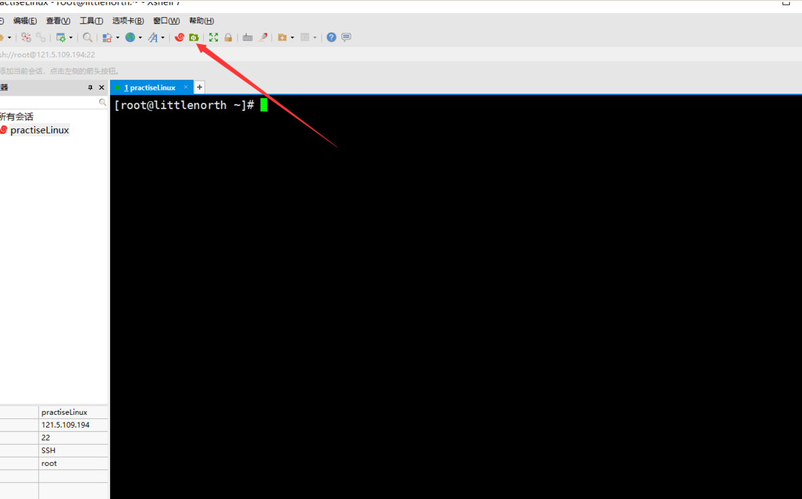

使用rpm安装JDK8

## 1. 下载JDK8的rpm包

链接：[Java SE Development Kit 8 - Downloads](https://www.oracle.com/java/technologies/javase/javase-jdk8-downloads.html)



## 2. 连接远程服务器

下载成功之后，使用Xshell链接远程Centos7服务器



>[!tip]注意
> 此处的密码为你购买服务器的密码。如果忘记服务器密码，则可以去购买服务器的平台重置密码，用重置的密码> 连接远程服务器

## 3. 上传rpm到Linux服务器

使用Xftp将下载好的JDK8 rpm包上传到服务器的一个文件夹中。文件夹可以是自己创建，也可以放在home文件夹中



上传成功之后，便可以进行jdk8的环境安装

## 4. 如果安装了JDK8，可以使用如下命令，进行强制删除

```sh
java -version # 先查看安装JDK8 的版本
rpm -qa|grep jdk #检查rpm包信息
rpm -e --nodeps jdk1.8-1.8.0_301-fcs.x86_64  #此卸载只适用rpm安装的JDK8
java -version#检查jdk是否卸载成功
#如果出现如下错误，则卸载成功
-bash: /usr/bin/java: No such file or directory
```

## 5. 开始安装JDK8

```sh
rpm -ivh jdk-8u301-linux-x64.rpm# 开始安装JDK8

#使用java -version命令查看JDK是否安装成功，如果出现以下为以下结果，则安装JDK8成功
java version "1.8.0_301"
Java(TM) SE Runtime Environment (build 1.8.0_301-b09)
Java HotSpot(TM) 64-Bit Server VM (build 25.301-b09, mixed mode)
```

## 6. 配置环境变量

```sh
#依次执行如下命令
vim  /etc/profile#修改配置文件
#输入i进入编辑模式，在文件的最后面输入以下内容
JAVA_HOME=/usr/java/jdk1.8.0_301-amd64
export PATH=$JAVA_HOME/bin:$PATH;
#按键盘上的Esc进入命令模式，然后输入:wq按回车，即可
```
