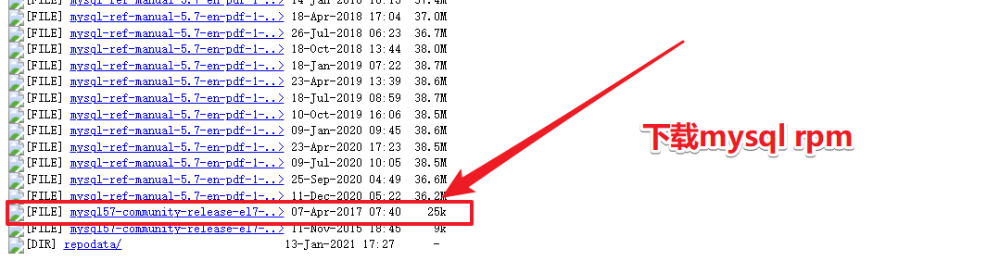
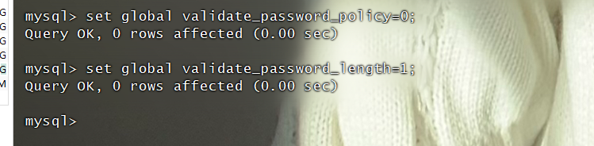
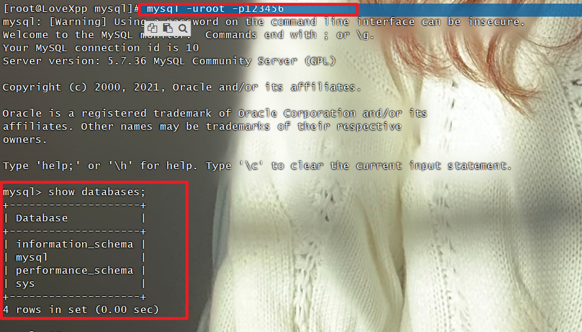

### 1、找到mysql 5.7 rpm的下载地址

mysql5.7rpm下载地址：[http://repo.mysql.com/yum/mysql-5.7-community/el/7/x86_64/](http://repo.mysql.com/yum/mysql-5.7-community/el/7/x86_64/)
划到最底下



### 2、创建mysql存放目录

```bash
mkdir /www/lovexpp/Enviroment/mysql
cd /www/lovexpp/Enviroment/mysql
```

### 3、使用yum安装mysql5.7

```bash
rpm -ivh http://repo.mysql.com/yum/mysql-5.7-community/el/7/x86_64/mysql57-community-release-el7-10.noarch.rpm
yum install mysql-community-server -y
```

### 4、启动Mysql

```bash
systemctl start mysqld
```

### 5、使用命令进入mysql数据库,修改数据库密码

```bash
mysql -uroot -p$(awk '/temporary password/{print $NF}' /var/log/mysqld.log)
```

>[!tip]注意
数据库默认密码规则必须携带大小写字母、特殊符号，字符长度大于8否则会报错。
因此设定较为简单的密码时需要首先修改set global validate_password_policy和_length参数值。



```bash
mysql> set global validate_password_policy=0;
Query OK, 0 rows affected (0.00 sec)

mysql> set global validate_password_length=1;
Query OK, 0 rows affected (0.00 sec)
```

### 6、修改mysql数据库密码

```bash
ALTER USER 'root'@'localhost' IDENTIFIED BY 'mkxiaoer';
```

### 7、使用修改之后的密码进行登录，看是否能够进入mysql数据库

```bash
 mysql -uroot -p123456
```



说明数据库密码修改成功。

### 8、可视化工具的登录授权：(如果授权不成功，请查看防火墙)

操作完成上面的，现在还不能用可视化的客户端进行连接，需要我们进行授权：

```bash
mysql > grant all on *.* to root@'%' identified by '数据库密码';
mysql > flush privileges;

#比如

> grant all privileges on *.* to 'root'@'%' identified by 'mkxiaoer1986' with grant option;
> flush privileges;
```

操作完毕，接下来可以使用navicat或者sqlylog进行远程连接了。