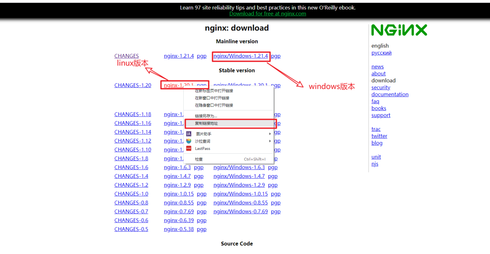
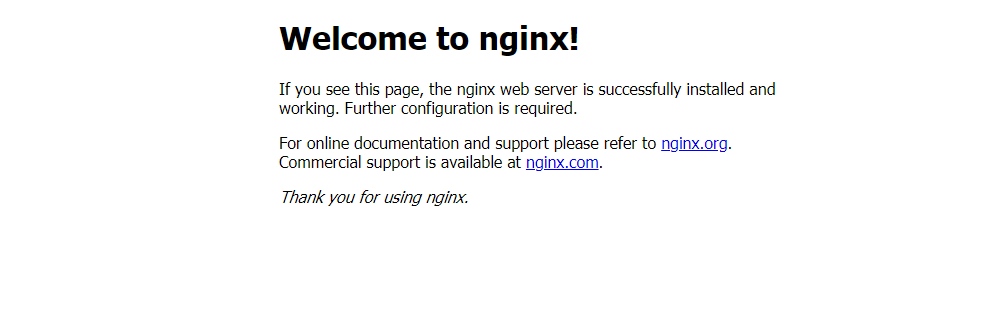
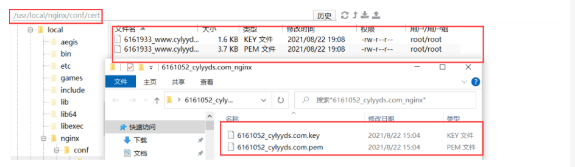
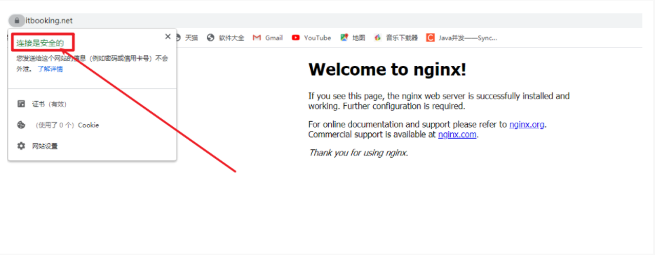

Nginx官网：http://nginx.org/en/download.html 

## 1、获取linux系统中nginx对应的版本



## 2、在linux服务器中创建一个文件夹，用来存储Nginx服务器


```bash
mkdir /www/lovexpp/Enviroment/nginx  #在linux服务器的根目录下创建
```

## 3、在此目录下安装nginx

```bash
wget http://nginx.org/download/nginx-1.20.1.tar.gz  
```

http://nginx.org/download/nginx-1.20.1.tar.gz为第1步中复制的路径

## 4、安装编译工具及库文件

```bash
yum -y install make zlib zlib-devel gcc-c++ libtool  openssl openssl-devel
yum -y install gcc openssl openssl-devel pcre-devel zlib zlib-devel
```

## 5、解压下载好的Nginx压缩包

```bash
tar -zxvf nginx-1.20.1.tar.gz
```

## 6、创建nginx的临时目录

```bash
mkdir -p /var/temp/nginx
```

## 7、进入nginx的解压目录，输入以下命令即可

```bash
./configure \
--prefix=/usr/local/nginx \
--pid-path=/var/run/nginx.pid \
--lock-path=/var/lock/nginx.lock \
--error-log-path=/var/log/nginx/error.log \
--http-log-path=/var/log/nginx/access.log \
--with-http_gzip_static_module \
--http-client-body-temp-path=/var/temp/nginx/client \
--http-proxy-temp-path=/var/temp/nginx/proxy \
--http-fastcgi-temp-path=/var/temp/nginx/fastgi \
--http-uwsgi-temp-path=/var/temp/nginx/uwsgi \
--http-scgi-temp-path=/var/temp/nginx/scgi \
--with-http_stub_status_module \
--with-http_ssl_module \
--with-http_stub_status_module
```
--with-http_ssl_module \
--with-http_stub_status_module   用来配置SSL

## 8、make编译安装nginx

```bash
make && make install
```

## 9、进入/usr/local/nginx/sbin目录启动nginx

```bash
cd /usr/local/nginx/sbin  #进入目录
./nginx  # 启动nginx

#停止：
./nginx -s stop
#重新加载：
./nginx -s reload 
```

## 10、浏览器输入服务器ip访问，如果nginx安装成功，则如下图



## 11、配置nginx环境变量

```bash
vim /etc/profile
```

在文件的底部追加

```bash
export NGINX_HOME=/usr/local/nginx\sbin:$PATH;
```

重启配置文件

```bash
source /etc/profile
```

## 12、Nginx和SSL配置

1. SSL安全证书的上传

在nginx的conf目录下新建一个cert目录，并将这两个文件上传到cert目录下



2. Nginx和SSL配置

```bash
# 这个服务器是http://www.itbooking.net的服务
server {
    listen 80;
    server_name www.itbooking.net; #需要将yourdomain.com替换成证书绑定的域名。
    rewrite ^(.*)$ https://$host$1; #将所有HTTP请求通过rewrite指令重定向到HTTPS。
    location / {
        index index.html index.htm;
    }
}
# 这个服务器是https://www.itbooking.net的服务
server {
    listen 443 ssl;
    #配置HTTPS的默认访问端口为443。
    #如果未在此处配置HTTPS的默认访问端口，可能会造成Nginx无法启动。
    #如果您使用Nginx 1.15.0及以上版本，请使用listen 443 ssl代替listen 443和ssl on。
    server_name www.itbooking.net; #需要将yourdomain.com替换成证书绑定的域名。
    root html;
    index index.html index.htm;
    ssl_certificate cert/6179501_www.itbooking.net.pem;  #需要将cert-file-name.pem替换成已上传的证书文件的名称。
    ssl_certificate_key cert/6179501_www.itbooking.net.key; #需要将cert-file-name.key替换成已上传的证书密钥文件的名称。
    ssl_session_timeout 5m;
    ssl_ciphers ECDHE-RSA-AES128-GCM-SHA256:ECDHE:ECDH:AES:HIGH:!NULL:!aNULL:!MD5:!ADH:!RC4;
    #表示使用的加密套件的类型。
    ssl_protocols TLSv1 TLSv1.1 TLSv1.2; #表示使用的TLS协议的类型。
    ssl_prefer_server_ciphers on;
    location / {
        root html;  #站点目录。
        index index.html index.htm;
    }
}
```

校验配置是否有误如下：

```bash
[root@iZuf62zev3la2ivndnxra5Z servers]# nginx -t
nginx: the configuration file /usr/local/nginx/conf/nginx.conf syntax is ok
nginx: configuration file /usr/local/nginx/conf/nginx.conf test is successful
```

然后重启nginx服务

```bash
nginx -s reload
```

然后访问服务器

```bash
https://www.itbooking.net/
```



## 如果配置应用程序的https服务呢?

1. 准备一个springboot项目

2. 编写一个首页

```java
@Controller
public class IndexController{
   @GetMapping("/index")
   public String index(){
           return "index";
   }
}
```

3. 上传项目到云服务器上

```bash
nohup java -jar springboot-app-0.0.1-SNAPSHOT.jar --server.port=8080 >>1.txt &
nohup java -jar springboot-app-0.0.1-SNAPSHOT.jar --server.port=8081 >>2.txt &;
nohup java -jar springboot-app-0.0.1-SNAPSHOT.jar --server.port=8082 >>3.txt &;
```

4. 配置nginx和tomcat的负载均衡配置

```bash
#负载均很tomcat中的服务
upstream tomcatservers {
   server 127.0.0.1:8080;
   server 127.0.0.1:8081;
   server 127.0.0.1:8082;
}
server {
    listen 80;
    server_name www.itbooking.net; #需要将yourdomain.com替换成证书绑定的域名。
    rewrite ^(.*)$ https://$host$1; #将所有HTTP请求通过rewrite指令重定向到HTTPS。
    location / {
        proxy_pass http://tomcatservers;
    }
}
#以下属性中，以ssl开头的属性表示与证书配置有关。
server {
    listen 443 ssl;
    #配置HTTPS的默认访问端口为443。
    #如果未在此处配置HTTPS的默认访问端口，可能会造成Nginx无法启动。
    #如果您使用Nginx 1.15.0及以上版本，请使用listen 443 ssl代替listen 443和ssl on。
    server_name www.itbooking.net; #需要将yourdomain.com替换成证书绑定的域名。
    root html;
    index index.html index.htm;
    ssl_certificate cert/6179501_www.itbooking.net.pem;  #需要将cert-file-name.pem替换成已上传的证书文件的名称。
    ssl_certificate_key cert/6179501_www.itbooking.net.key; #需要将cert-file-name.key替换成已上传的证书密钥文件的名称。
    ssl_session_timeout 5m;
    ssl_ciphers ECDHE-RSA-AES128-GCM-SHA256:ECDHE:ECDH:AES:HIGH:!NULL:!aNULL:!MD5:!ADH:!RC4;
    #表示使用的加密套件的类型。
    ssl_protocols TLSv1 TLSv1.1 TLSv1.2; #表示使用的TLS协议的类型。
    ssl_prefer_server_ciphers on;
    location / {
    		#反向代理tomcat中的服务
        proxy_pass http://tomcatservers;
    }
}
#以下属性中，以ssl开头的属性表示与证书配置有关。
server {
    listen 443 ssl;
    #配置HTTPS的默认访问端口为443。
    #如果未在此处配置HTTPS的默认访问端口，可能会造成Nginx无法启动。
    #如果您使用Nginx 1.15.0及以上版本，请使用listen 443 ssl代替listen 443和ssl on。
    server_name api.itbooking.net; #需要将yourdomain.com替换成证书绑定的域名。
    root html;
    index index.html index.htm;
    ssl_certificate cert/6184356_api.itbooking.net.pem;  #需要将cert-file-name.pem替换成已上传的证书文件的名称。
    ssl_certificate_key cert/6184356_api.itbooking.net.key; #需要将cert-file-name.key替换成已上传的证书密钥文件的名称。
    ssl_session_timeout 5m;
    ssl_ciphers ECDHE-RSA-AES128-GCM-SHA256:ECDHE:ECDH:AES:HIGH:!NULL:!aNULL:!MD5:!ADH:!RC4;
    #表示使用的加密套件的类型。
    ssl_protocols TLSv1 TLSv1.1 TLSv1.2; #表示使用的TLS协议的类型。
    ssl_prefer_server_ciphers on;
    location / {
         proxy_pass http://tomcatservers;
    }
}
```

5.  完成测试和配置

>[!tip]提示
记住：一定要重启nginx服务器即可。