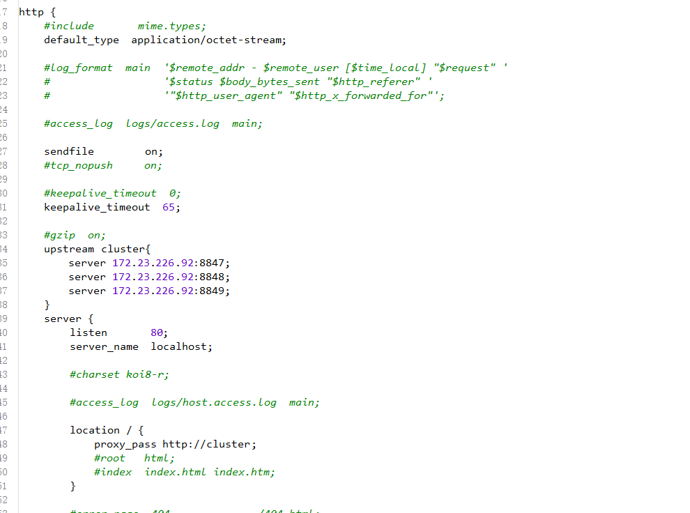

首先linux系统上得有一个Nginx和一个Mysql数据库

Linux上安装Nginx：https://www.jianshu.com/p/838671506a8b

Linux上安装Mysql：https://www.jianshu.com/p/5a8b25f23dd7

### 1、首先在github上，下载一个Linux版的Nacos

网址：[https://github.com/alibaba/nacos/](https://github.com/alibaba/nacos/)


### 2、将下载好的压缩包上传到Linux系统存放nacos的目录文件夹下

### 3、解压nacos压缩包

```
tar -zxvf nacos-server-2.0.3.tar.gz
```

### 4、复制配置文件

分别复制`bin`目录下的`startup.sh`文件为startup.sh.bk，`conf`目录文件下的`application.properties`为application.properties.init和`cluster.conf.example`为cluster.conf

注意：备份的文件名称可以随意取

### 5、修改配置文件

修改`cluster.conf`为文件，使用`hostname -i`，查看当前的IP地址。修改每台nacos的端口号。

文件修改之前：


文件修改之后:


### 6、修改Nacos配置文件，使用MySQL做配置持久化

修改`conf`目录下的`application.properties`配置文件。因为每个Nacos中都内嵌了一个`derby`数据库，搭建集群会造成数据库数据不一致性问题。所有要建一个mysql数据库(`nacos`)，来保证nacos集群数据库一致性问题。在`conf`目录下有一个`nacos-mysql.sql`文件，执行这个数据库脚本，并在`application.properties`配置即可


### 7、在Ngin启动配置文件代理nacos服务

```nginx
upstream cluster{
  server 172.23.226.92:8847;
  server 172.23.226.92:8848;
  server 172.23.226.92:8849;
}
server {
        listen       80;
        server_name  localhost;

        location / {
            proxy_pass http://cluster;
        }
}
```



### 8、进入安装nacos的bin目录启动服务

```
# 启动服务
./startup.sh
```

### 9、查看Nacos集群是否配置成功

打开浏览器，输入`ip地址/nacos`访问，出现如下页面，即nacos集群部署成功

