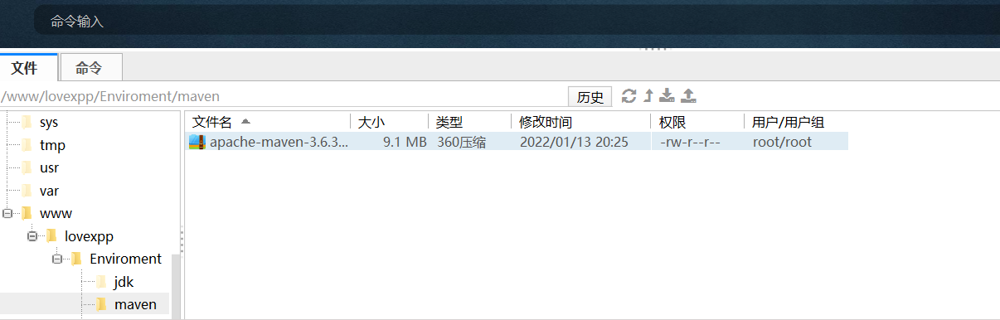
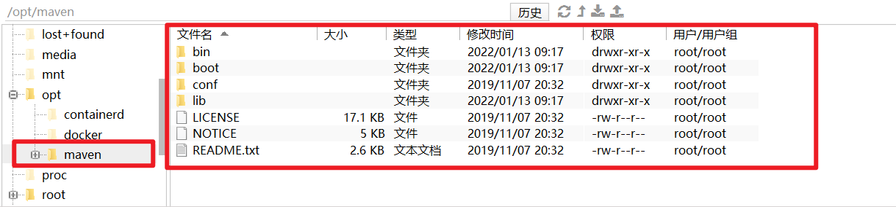
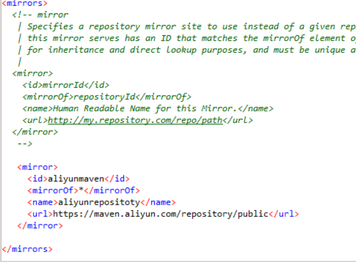
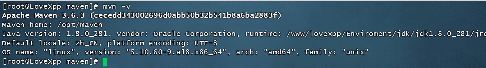

## 下载Maven对应的tar.gz包

官网下载地址： [官网地址](http://maven.apache.org/download.cgi)

各版本地址：[个版本地址](https://archive.apache.org/dist/maven/maven-3/)

maven3.6.3: [3.6.3](https://archive.apache.org/dist/maven/maven-3/3.6.3/binaries/apache-maven-3.6.3-bin.tar.gz)


## 将下载好的压缩包，上传到Linux服务器中




## 使用如下命令对压缩包进行解压

```sh
#解压文件
tar -xzvf apache-maven-3.6.3-bin.tar.gz
```

## 创建目录用来存放Maven

```sh
#创建目录,用于存放maven
mkdir -p /opt/maven
#将解压完的maven文件剪切到刚刚创建的目录下
mv apache-maven-3.6.3/* /opt/maven 
```



## 配置阿里云镜像

网址：https://developer.aliyun.com/mvn/guide
在conf/setttings.xml中配置如下：

```xml
<mirror>
    <id>aliyunmaven</id>
    <mirrorOf>*</mirrorOf>
    <name>aliyunrepositoty</name>
    <url>https://maven.aliyun.com/repository/public</url>
</mirror>
```



## 配置系统环境变量

使用如下命令，配置环境变量
```sh
vim /etc/profile
```

配置如下内容

```sh
export MAVEN_HOME=/opt/maven;  # opt/maven为maven安装的路径
export PATH=$MAVEN_HOME/bin:$PATH;
```
保存退出之后，使用`source /etc/profile `命令重新加载配置文件。

查看maven版本

```sh
mvn -v
```

出现如下图，则说明maven系统环境变量配置成功



