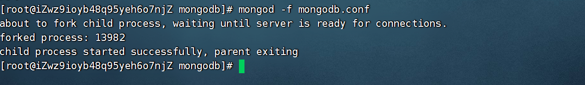

## 1、下载Mongodb

- 官网：https://www.mongodb.com/
- 下载地址：https://www.mongodb.com/try/download
- Linux下载地址：[Linux下载地址](https://downloads.mongodb.com/linux/mongodb-linux-x86_64-enterprise-rhel70-4.2.19.tgz)

## 2、开始安装

上传Mongodb文件到云服务器

  ```sh
  wget https://downloads.mongodb.com/linux/mongodb-linux-x86_64-enterprise-rhel70-4.2.19.tgz
  ```

  ```sh
  /www/mongodb-linux-x86_64-enterprise-rhel70-4.2.19.tgz
  ```

然后开始解压

```sh
  tar -zxvf mongodb-linux-x86_64-enterprise-rhel70-4.2.19.tgz 
```

移动到用户目录下

```sh
  mv mongodb-linux-x86_64-enterprise-rhel70-4.2.19 /usr/local/mongodb
  cd /usr/local/mongodb
```

配置环境变量，方便进行控制

```sh
vim /etc/profile
export MONGODB_HOME=/usr/local/mongodb
export PATH=$MONGODB_HOME/bin:$PATH
```

重启配置文件即可

```sh
source /etc/profile
```

查询安装

```sh
mongo -version
# MongoDB shell version v4.2.19
```

创建数据和日志目录

```sh
mkdir data/db -p
mkdir data/logs -p
cd data/logs/
touch mongodb.log
```

在mongodb根目录下创建mongodb.conf文件如下

```properties
# 端口号
port=27017
#数据库存储的文件位置
dbpath=/usr/local/mongodb/data/db
# 日志文件位置
logpath=/usr/local/mongodb/data/logs/mongodb.log
# 以追加日志形式记录
logappend=true
# 过滤掉无用日志信息，若需要调试设置false
quiet=true
# 以后台方式运行
fork=true
# 最大同时连接数
maxConns=100
#不启动验证权限
noauth=true
#启动用户账号权限
# auth=true
#开启日志，默认true
journal=true
# 提供外网访问
bind_ip=0.0.0.0

```

启动mongodb即可

```sh
  mongod -f mongodb.conf
```

如果启动报错安装一个组件即可

```sh
yum install net-snmp
```

然后在启动

```sh
mongod -f mongodb.conf
```

安装和启动成功如下

