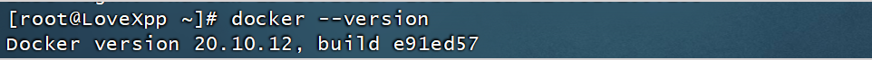

docker安装官网地址：[官网地址](https://docs.docker.com/engine/install/centos/)


如果之前安装过docker，可以使用如下命令去卸载旧的doker

```sh
sudo yum remove docker \
                  docker-client \
                  docker-client-latest \
                  docker-common \
                  docker-latest \
                  docker-latest-logrotate \
                  docker-logrotate \
                  docker-engine
```

执行如下命令设置存储库

```sh
sudo yum install -y yum-utils
sudo yum-config-manager \
--add-repo \
https://download.docker.com/linux/centos/docker-ce.repo
```

安装docker引擎

```sh
sudo yum install docker-ce docker-ce-cli containerd.io
```

安装指定的版本

```sh
 sudo yum install docker-ce-<VERSION_STRING> docker-ce-cli-<VERSION_STRING> containerd.io
```

启动docker

```sh
 sudo systemctl start docker
```

通过查看docker的版本来判断docker是否安装成功

```sh
docker --version
```



出现如上图结果，说明docker安装成功

