## Jenkins的安装

官网下载地址：[官网地址](https://www.jenkins.io/download/)

 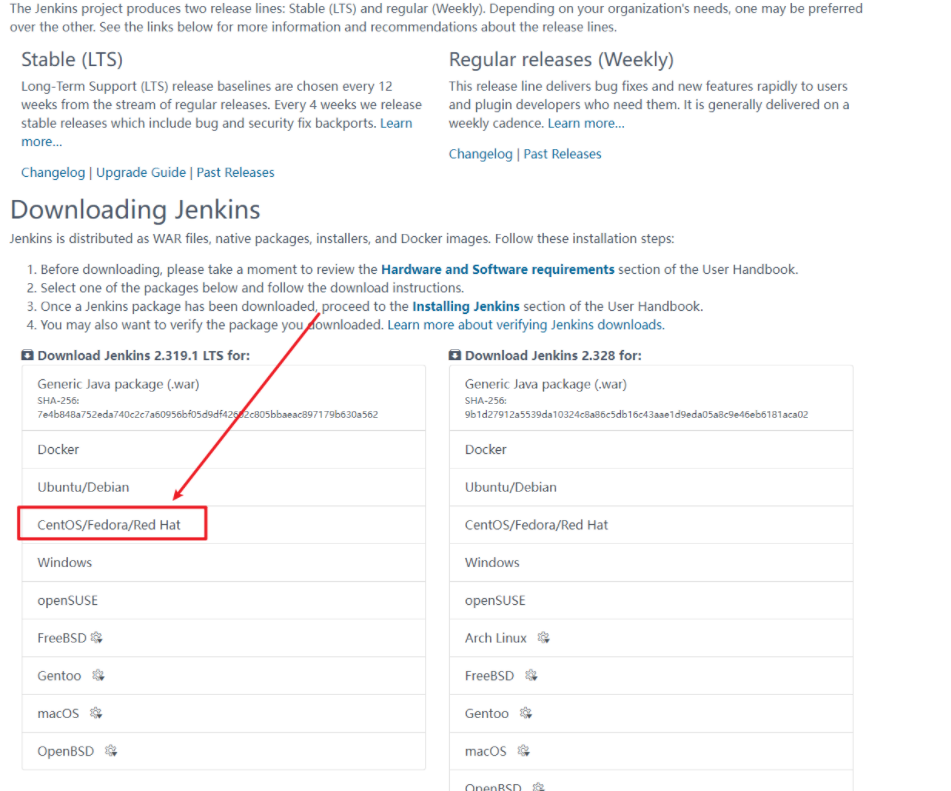

Linux系统安装jenkins如下：
依次执行如下命令，实现jenkins的安装

```shell
sudo wget -O /etc/yum.repos.d/jenkins.repo https://pkg.jenkins.io/redhat-stable/jenkins.repo

sudo rpm --import https://pkg.jenkins.io/redhat-stable/jenkins.io.key

yum install epel-release

yum install jenkins

```

如果之前安装过jenkins,执行如下命令进行卸载：

```sh
# 进入root文件夹
cd /root

#卸载之前残留的jenkins
rpm -e jenkins
find / -iname jenkins | xargs -n 1000 rm -rf

#查看是否卸载完毕
rpm -ql jenkins
```

对jenkins进行相应的配置，jenkins默认安装的目录为`/etc/sysconfig/jenkins`

安装完毕，进入jenkins的配置文件进行如下的配置

```sh
# 进入对应的jenkins配置文件
vim /etc/sysconfig/jenkins

# 修改JENKINS_USER和JENKINS_PORT两项
JENKINS_USER="用户名" 
JENKINS_PORT="端口号" 

```

wq保存退出
启动jenkins服务，查看jenkins的启动状态

```sh
# 启动jenkins服务
systemctl start jenkins

# 查看jenkins启动状态
systemctl status jenkins

```

如果在启动jenkins服务时，Jenkins报如下错误：

```sh
Job for jenkins.service failed because the control process exited with error code. See "systemctl status jenkins.service" and "journalctl -xe" for details.
```

 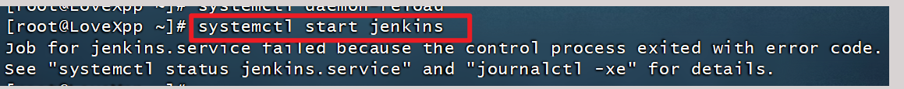


使用如下命令查看jenkins日志，查看排查错误的原因

```shell
systemctl status jenkins.service 或 journalctl -xe
```

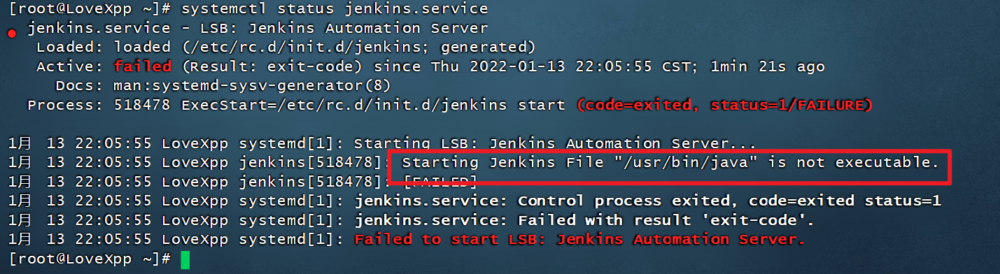

从上图可以得出，是因为找不到java路径。

1、配置java路径
查看当前 java 环境位置

```sh
echo $JAVA_HOME
```

2、修改配置环境
在`/etc/init.d/jenkins`配置文件中，添加java环境路径

```sh
vim /etc/init.d/jenkins
```

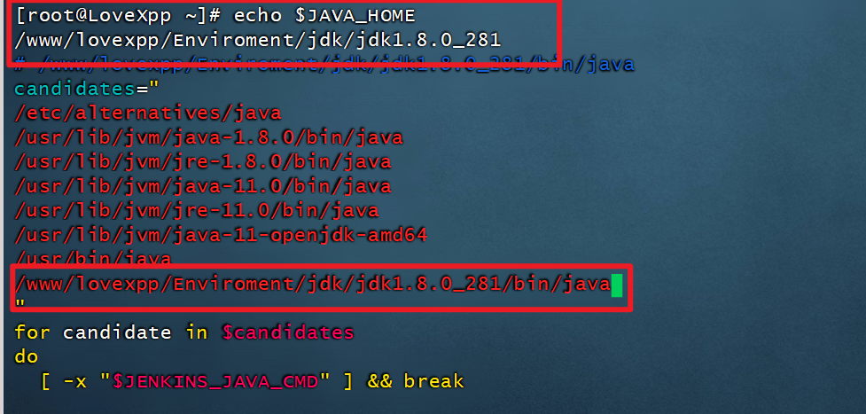

3、加载并重新启动

```sh
# 重新加载服务
systemctl daemon-reload
# 启动jenkins服务
systemctl start jenkins
```

4、查看状态

```shell
systemctl status jenkins
```
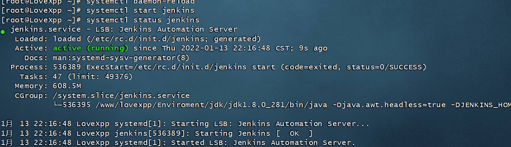

出现如上图，这说明jenkins服务安装成功！

## 启动jenkins

启动jenkins成功之后，访问刚刚配置的地址：http://服务器ip:刚刚配置的端口号/ 

端口号为`/etc/sysconfig/jenkins`中配置的端口号，ip是服务器外网ip
注意：配置的端口号，需要在购买服务器的平台中开发服务器对应的安全组

## 解锁 Jenkins

输入访问地址，出现如下界面

 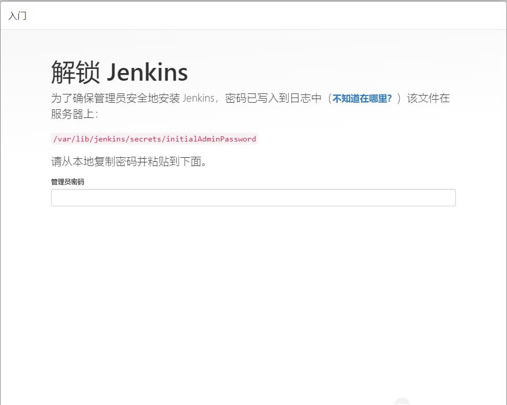

根据提示：在服务器输入

```sh
cat /var/lib/jenkins/secrets/initialAdminPassword
```

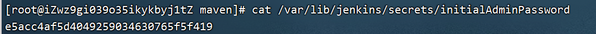

把密码复制出来粘贴上去即可，然后点击继续

 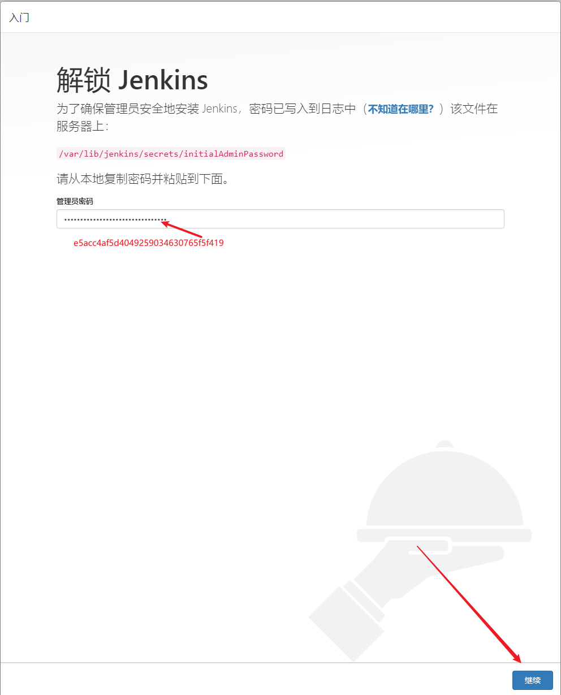

这里需要等待一会，才可以生效。

## 安装Jenkins插件

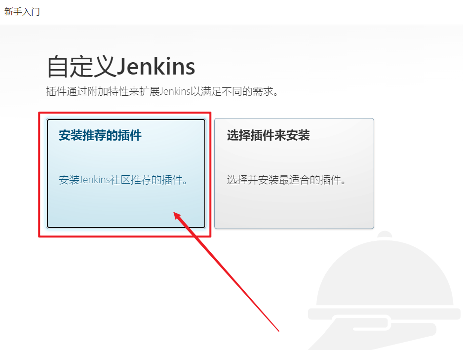

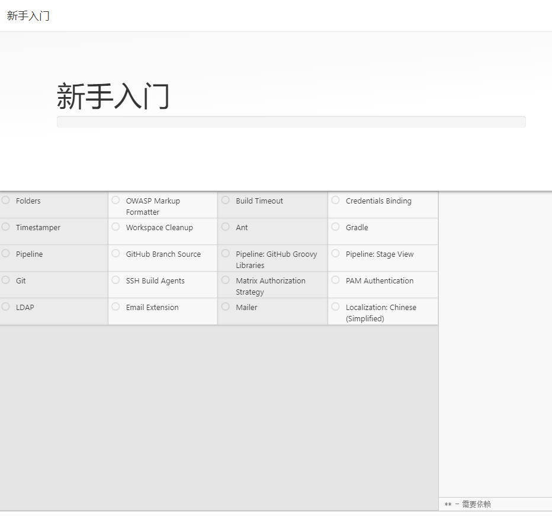

等待所有安装完毕即可

## 创建管理员账号

建议全写一样的

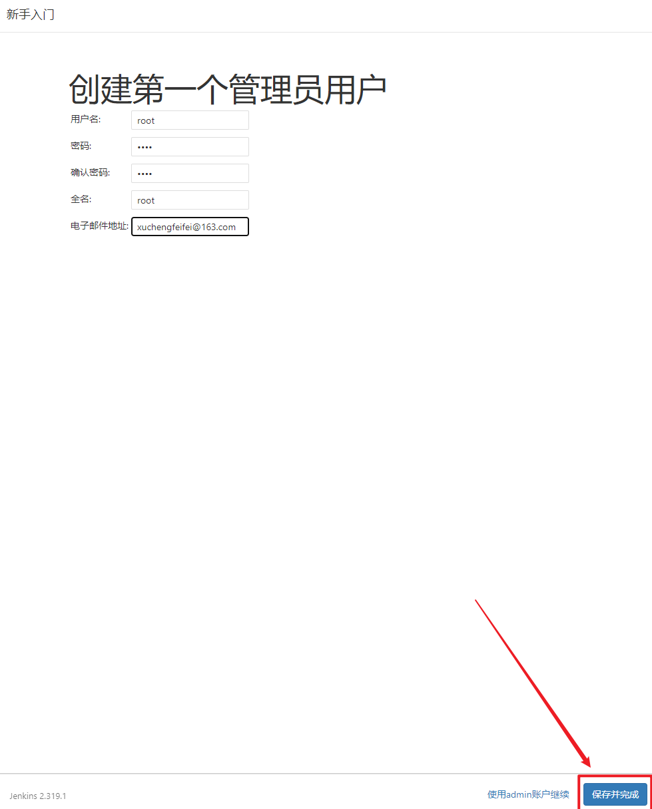

## 实例配置

这步是告诉你的jenkins访问地址，记住一下。

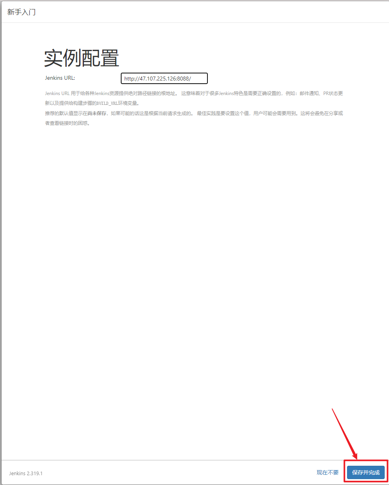

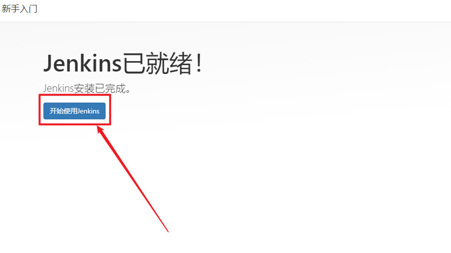

进入到Jenkins控制面板，则说明jenkins安装启动成功

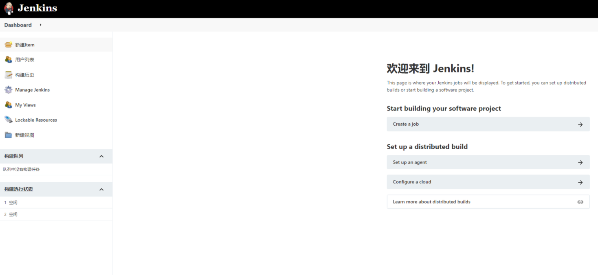

## 配置镜像源

在管理页面依次进入: Jenkins->Manage Jenkins->Manage Plugins

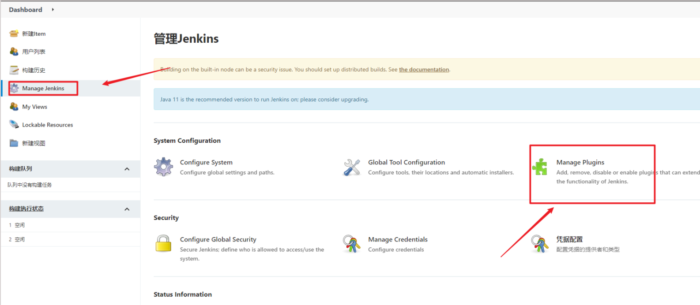

点击【高级】

链接: https://mirrors.tuna.tsinghua.edu.cn/jenkins/updates/update-center.json

最后重启jekins

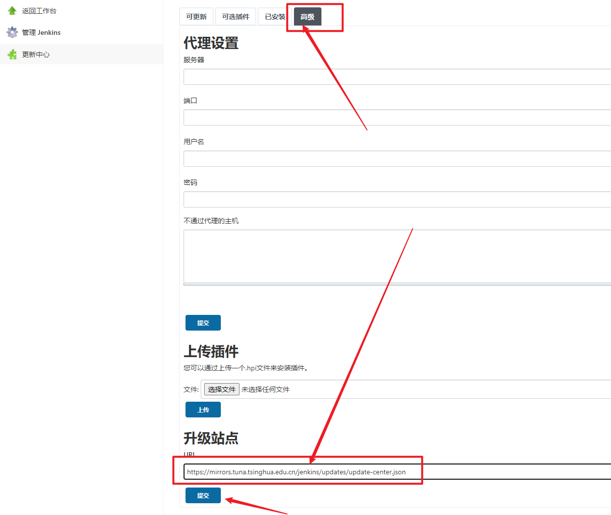
