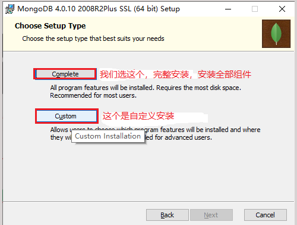
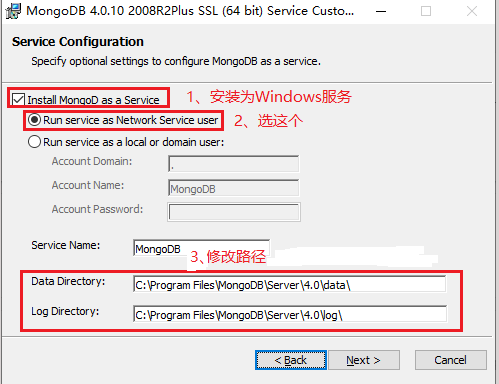
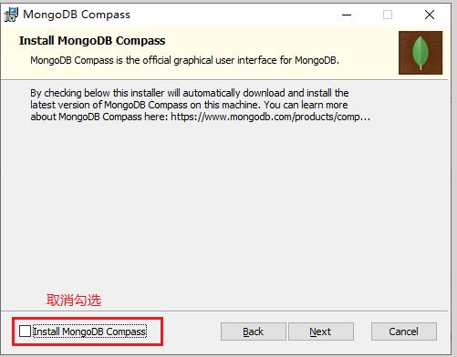
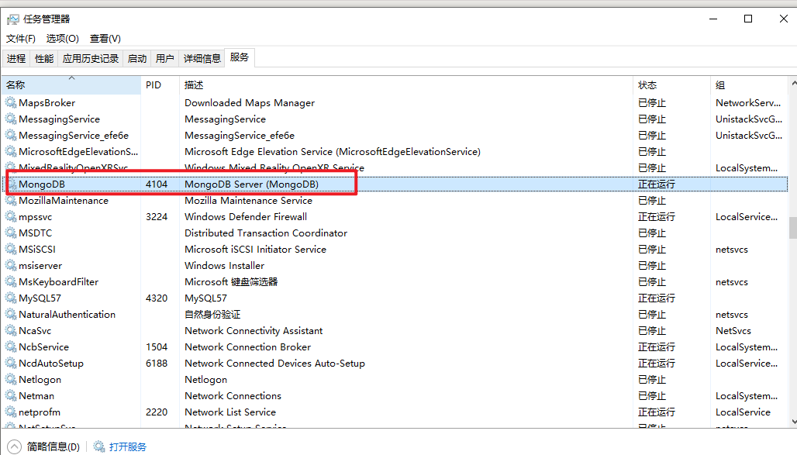
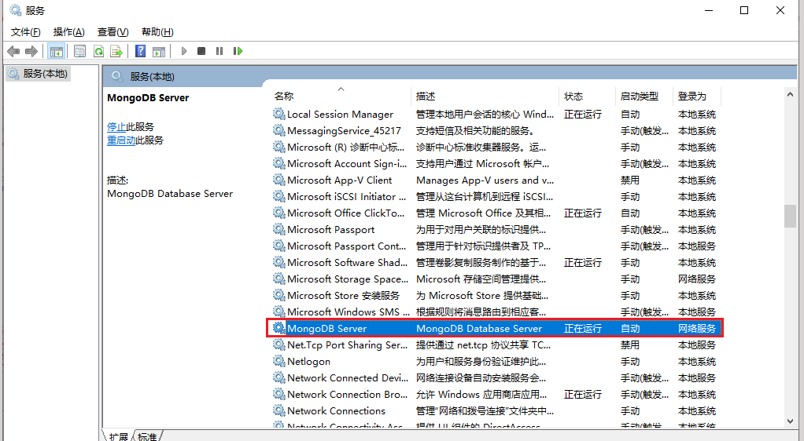
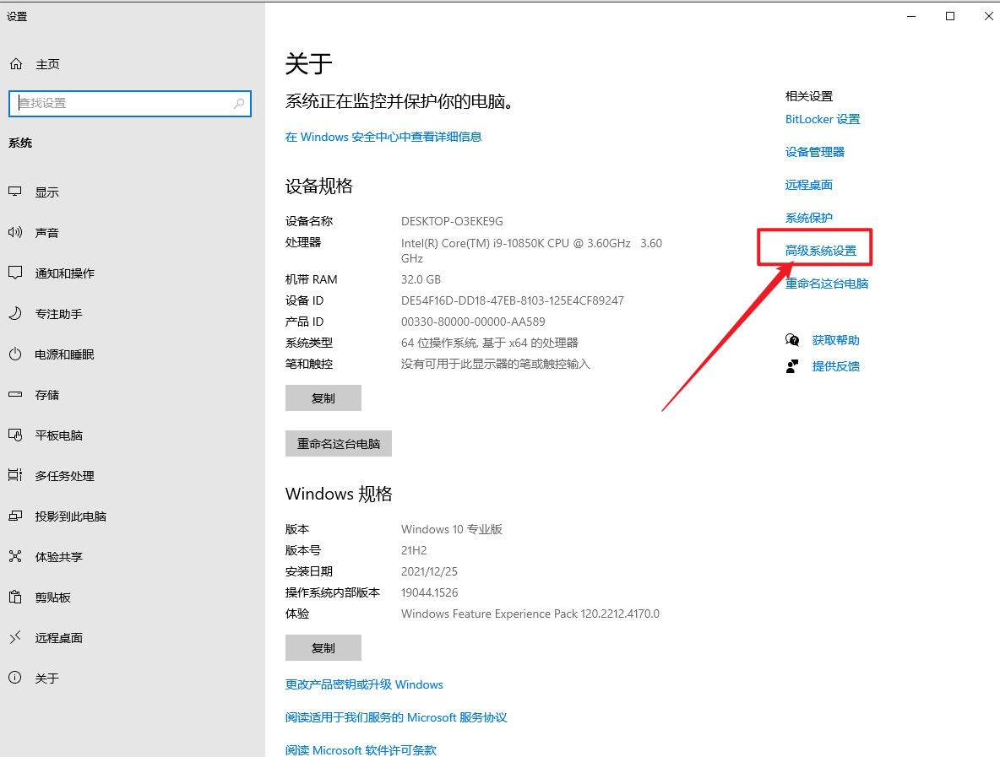
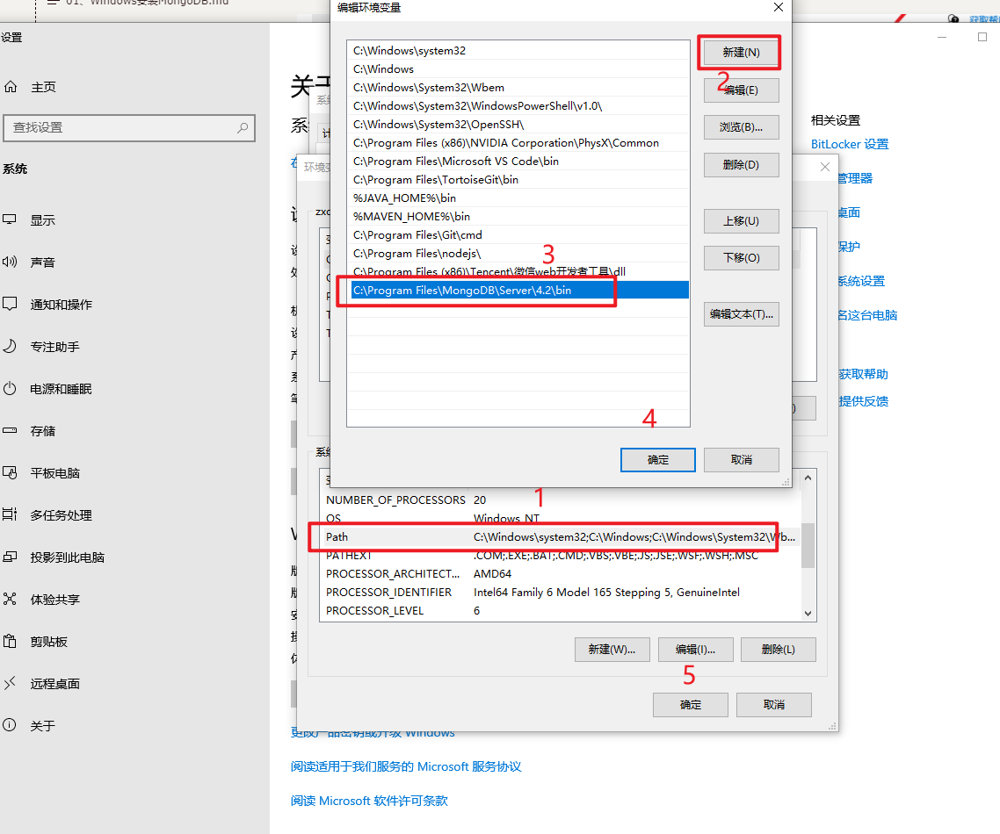
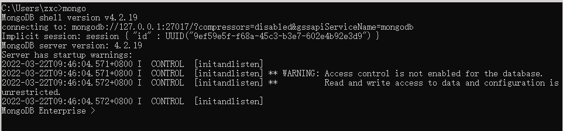

## 01、下载mongodb

- 官网：https://www.mongodb.com/
- 下载地址：https://www.mongodb.com/try/download
- Linux下载地址：[Linux MongoDB下载地址](https://downloads.mongodb.com/linux/mongodb-linux-x86_64-enterprise-rhel70-4.2.19.tgz)
- Windows下载地址：[Windows MongoDB下载地址](https://downloads.mongodb.com/win32/mongodb-win32-x86_64-enterprise-windows-64-4.2.19-signed.msi)

## 02、进行安装mongodb

1、选择complete，完整安装（安装全部组件）。complete，完整的、完全的。



当然也可以选自定义安装，影响不大。

2、安装mongodb指定目录


- data目录是数据存储目录，数据库中的数据就存储在这个目录中。
- log是日志文件的输出目录。



 

ok，安装完成。

3、查看安装以后mongodb服务

我们打开服务，MongoDB已安装为WIndwos服务，并自动开启：




 默认端口：27017


## 03、配置MongoDB的环境变量

1、找到系统设置



2、配置mongodbpath即可



3、cmd查看mongodb

```shell
C:\Users\zxc>mongo -version

MongoDB shell version v4.2.19
git version: e68a7d47305e14e090cba9ce3d92533053299996
allocator: tcmalloc
modules: enterprise
build environment:
    distmod: windows-64
    distarch: x86_64
    target_arch: x86_64
```

4、获取mongodb的控制台

```shell
mongo
```



## 总结

> [!tip]注意
> 7版本以上的MongoDB的bin目录下，不会提供`mongo`命令，需要额外去官网下载`mongosh`脚本，用于连接MongoDB Server服务
>
> mongosh脚本的下载地址：[mongosh下载地址](https://www.mongodb.com/try/download/shell)