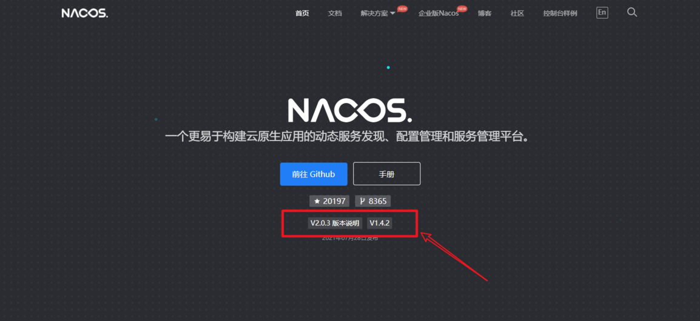
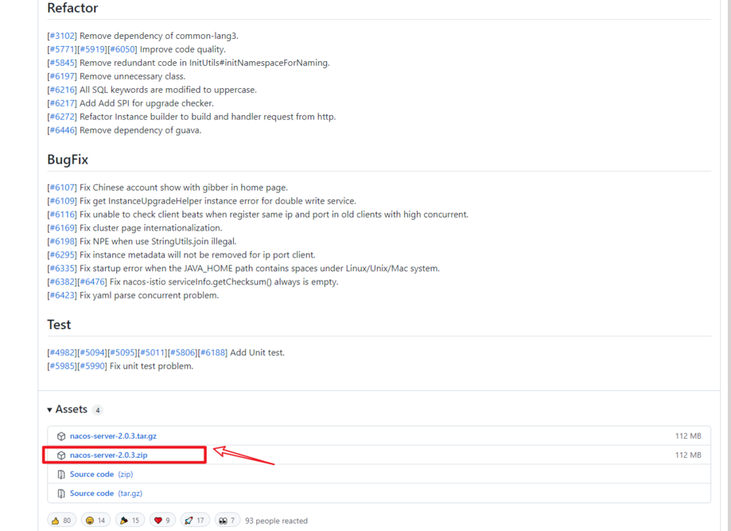
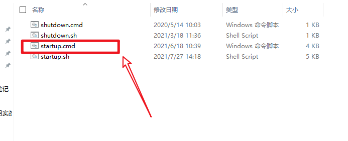
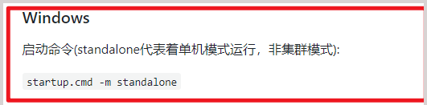
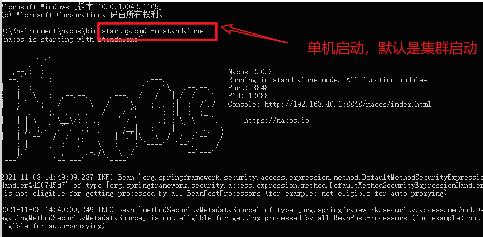
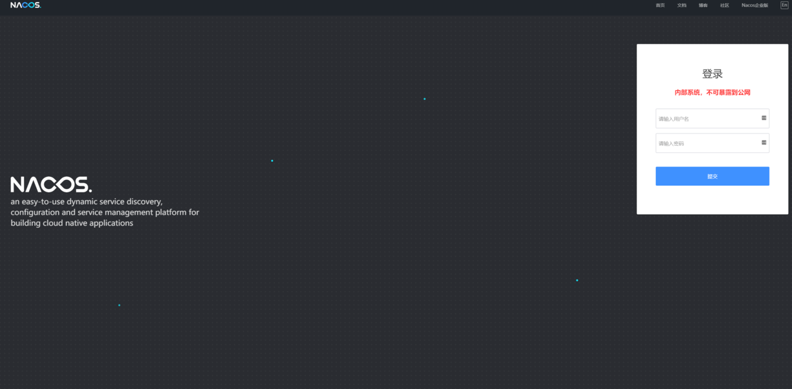
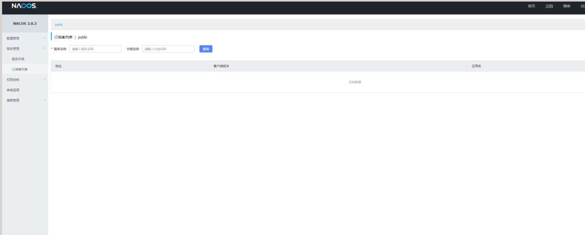

## 1、打开Nacos的官网进行下载

官网地址：[https://nacos.io/zh-cn/index.html](https://nacos.io/zh-cn/index.html) ，跳转到github，选择对应的版本进行下载即可。





## 2、下载完成之后，解压安装Nacos即可

在解压下载成功的文件夹之后，进入`bin`目录，启动`startup.cmd -m standalone`文件



## 3、启动服务



```sh
startup.cmd -m standalone
```



## 4、启动成功之后在浏览器访问地址

输入`http://localhost:8848/nacos`，出现如下界面，即nacos安装并运行成功。



使用默认的账号和密码`nacos`，进行登录

