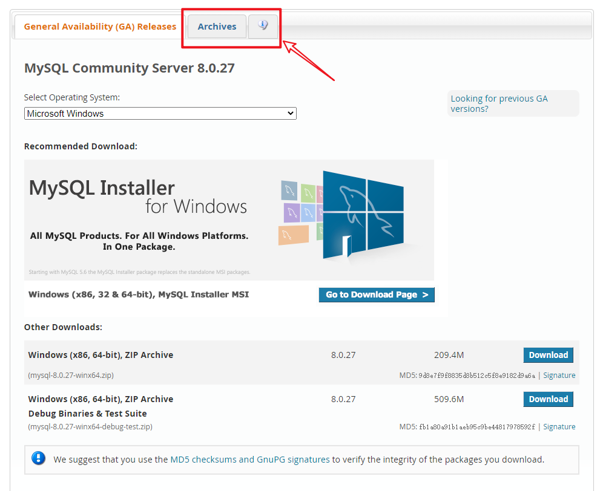
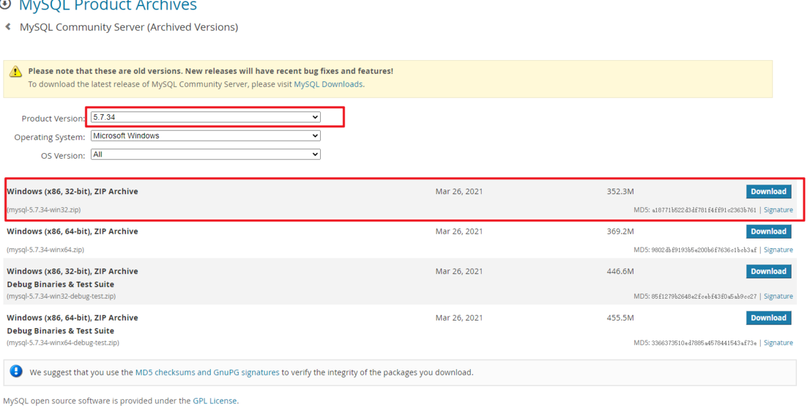
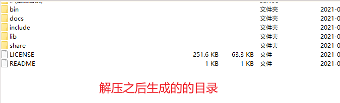
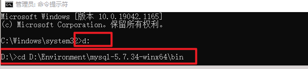
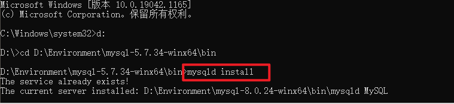
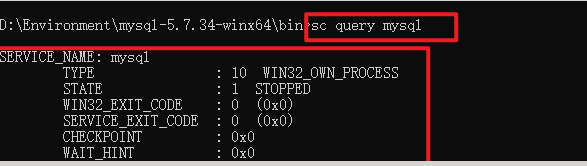
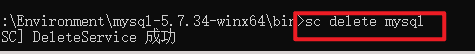
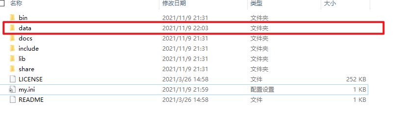
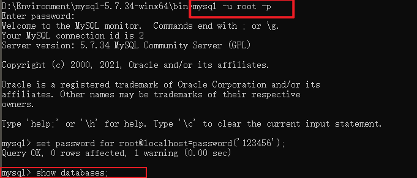
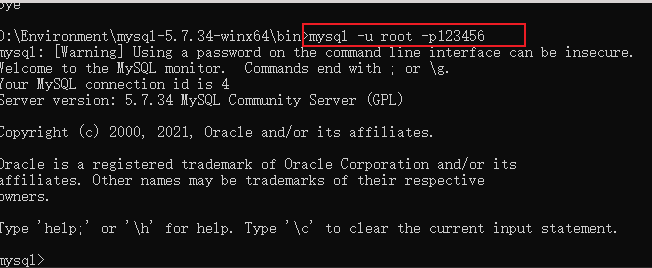

## 1、去MYSQL官网下载对应的版本。

官网：[官网下载地址](https://dev.mysql.com/downloads/mysql/)



选择对对应的mysql版本



## 2、下载成功之后，解压到对应的安装目录



## 3、新建my.ini配置文件

解压完成之后，在目录下，新建一个my.ini文件。文件中写入如下内容，之后保存

```properties
[mysql]
# 设置mysql客户端默认字符集
default-character-set=utf8
[mysqld]
#设置3306端口
port = 3306
# 设置mysql的安装目录，你安装mysql的路径
basedir=D:\Environment\mysql-5.7.34-winx64   
# 设置mysql数据库的数据的存放目录
datadir=D:\Environment\mysql-5.7.34-winx64\data 
# 允许最大连接数
max_connections=800
# 服务端使用的字符集默认为8比特编码的latin1字符集
character-set-server=utf8
# 创建新表时将使用的默认存储引擎
default-storage-engine=INNODB
```

## 4、进入对应目录

完成之后使用管理员运行cmd，然后进入mysql解压之后的bin目录



## 5、安装MySQL服务

执行mysqld install 命令进行安装mysql服务

 

>[!waring]注意
>这里报了一个错误，说我的服务已存在。确实我之前装过mysql，现在没有卸载干净。
>使用win+r输入`regedit`进入注册表,删除如下目录中的MYSQL文件夹

```properties
HKEY_LOCAL_MACHINE\SYSTEM\ControlSet001\Services\Eventlog\Application\MySQL
HKEY_LOCAL_MACHINE\SYSTEM\ControlSet002\Services\Eventlog\Application\MySQL
HKEY_LOCAL_MACHINE\SYSTEM\CurrentControlSet\Services\Eventlog\Application\MySQL
```

在注册表中找到上述的文件夹中的MYSQL文件夹，进行删除即可。

输入`sc query mysql`，查看一下名为mysql的服务：



输入`sc delete mysql`，删除该mysql



如果之前没有安装过mysql可以直接调到下一步

## 6、生成对应目录

使用命令 mysqld --initialize-insecure，在安装目录下生成 data 目录




## 7、启动MySQL服务

使用 net start mysql 启动mysql服务


## 8、登录连接MySQL服务

使用命令 mysql -uroot –p 登录进mysql服务

cmd窗口输入：mysql -uroot –p，回车。出现enter password后，再回车。因为在安装时，未设置用户名和密码，所以默认的登录的用户名为root，密码为空。



登录进mysql数据库成功。

## 9、初始化数据库密码

在root用户登录mysql状态下，输入

```sh
set password for root@localhost=password(‘你的密码’);
```

>[!danger]注意
> 1. 单引号中的xxxxxx代表你设置的密码，可以自己更改
> 2. 语句后面的分号也需要输入，如果第一次没有输入，在回车之后，接着再输入分号也可以



参考博客：https://www.it610.com/article/1289884077217882112.htm