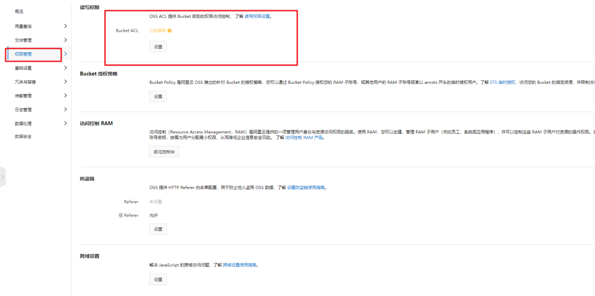

在阿里云购买了oss存储之后，然后去尝试一下文件上传。首先我是测试图片上传，然后就遇到巨坑了。

## 图片上传成功，不能预览只能下载

在网上看了很多博客，很多都说如下权限问题



默认是私有，我将此改成了如图所示。复制图片地址在浏览器打开还是只能下载，还是不能预览图片。

最后终于还是搞出来了，说说具体原因

阿里云oss默认上传图片的Content-Type的格式默认为jpeg，如下图


手动的设置格式为Content-Type为jpg，在浏览器复制图片地址便可进行图片预览。

但是这样存在一个问题，这是我们用阿里云oss手动方式进行上传，如果是用java代码上传的图片这么设置呢？在图片上传时，设置为Content-Type为 image/jpg

## 图片上传时，设置Content-Type

官网教程：[官网教程](https://help.aliyun.com/document_detail/84781.html)

只要在图片上传的时候，设置Conteny-Type即可

```java
public  String uploadfile(MultipartFile multipartFile, String dir) {
    // yourEndpoint填写Bucket所在地域对应的Endpoint。以华东1（杭州）为例，Endpoint填写为https://oss-cn-hangzhou.aliyuncs.com。
    String endpoint = AliyunOssConstant.endpoint;
    // 阿里云账号AccessKey拥有所有API的访问权限，风险很高。强烈建议您创建并使用RAM用户进行API访问或日常运维，请登录RAM控制台创建RAM用户。
    String accessKeyId = AliyunOssConstant.accessKeyId;
    String accessKeySecret =  AliyunOssConstant.accessKeySecret;
    // 填写Bucket名称，例如examplebucket。
    String bucketName = AliyunOssConstant.bucketName;
    OSS ossClient = null;
    try {
        // 创建OSSClient实例。
        ossClient = new OSSClientBuilder().build(endpoint, accessKeyId, accessKeySecret);

        //设置Content-Type
        ObjectMetadata meta = new ObjectMetadata();
        meta.setContentType("image/jpg");

        // 2: 获取文件上传的流
        InputStream inputStream = multipartFile.getInputStream();
        // 3：构建日期目录
        SimpleDateFormat dateFormat = new SimpleDateFormat("yyyy/MM/dd");
        String datePath = dateFormat.format(new Date());// 日期目录：2021/10/27
        // 4: 获取文件名
        String originname = multipartFile.getOriginalFilename();
        String filename = UUID.randomUUID().toString();
        String suffix = originname.substring(originname.lastIndexOf("."));
        String newName = filename + suffix;
        String fileUrl = dir+"/"+datePath + "/" + newName;
        //5：文件上传到阿里云服务器,将设置的meta在添加进去
        ossClient.putObject(bucketName, fileUrl, inputStream,meta);
        //返回图片在oss上的路径
        return "https://" + bucketName + "." + endpoint + "/" + fileUrl;
    } catch (Exception e) {
        e.printStackTrace();
        return "fail";
    } finally {
        //关闭
        ossClient.shutdown();
    }

}
```